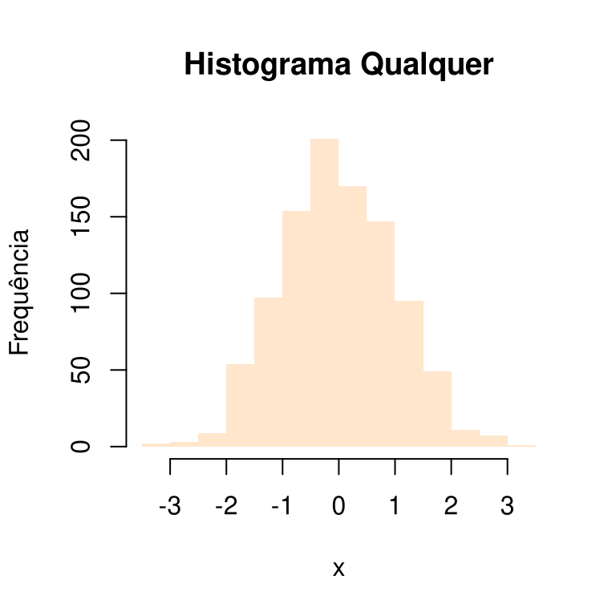
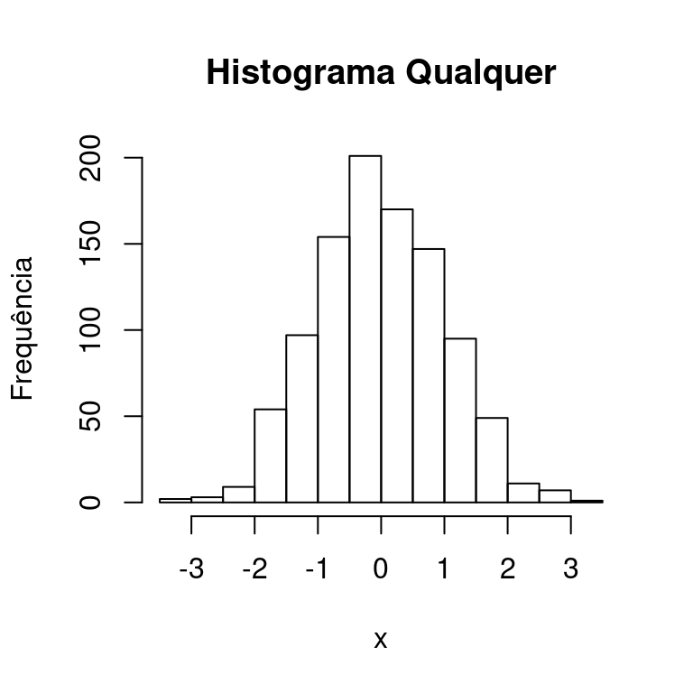
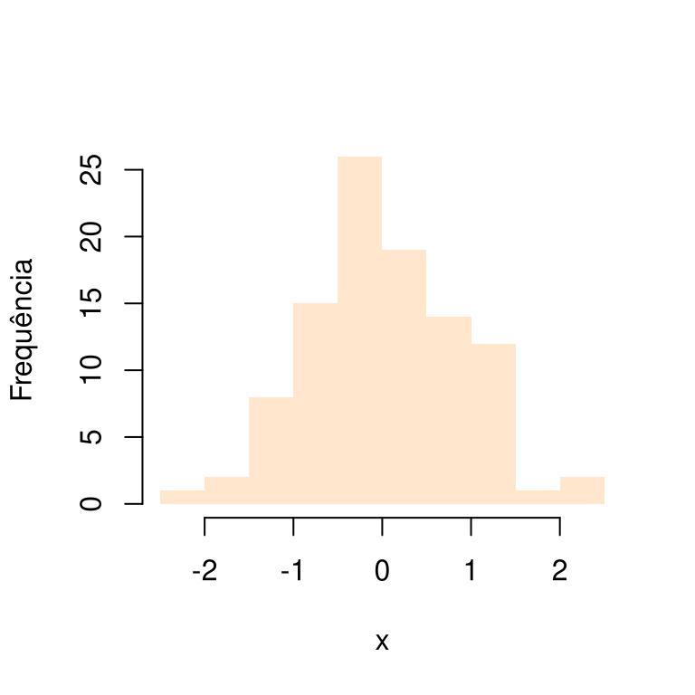

# R - miscelânea e tópicos avançados

Nesse ponto será assumido que você realizou os passos de [**revisão**][Sugestões de passos para revisão da linguagem R] da linguagem R sugeridos, bem como resolveu os [**exercícios propostos**][Exercícios propostos]. Considerá-los é de grande importância para que você consiga assimilar os conceitos apresentados nesse [**Capítulo**][R - miscelânea e tópicos avançados].

Esse [**Capítulo**][R - miscelânea e tópicos avançados] visa apresentar algumas miscelâneas a respeito da linguagem de programação R, bem como, alguns tópicos mais avançados de programação em R. O termo "**avançado**" utilizado aqui não necessariamente tem correlação com dificuldade de entendimento. Aqui utilizo esse termo para abordar assuntos que normalmente eram pouco discutidos em livros mais antigos da linguagem R e que atualmente vem ganhando destaques em livros e discussões mais recentes na internet. Na verdade, a maioria dos conceitos que serão abordados são de fácil compreensão, porẽm ajudarão os programadores em R a construir códigos mais robustos e mais flexíveis. Alguns desses assuntos que serão abordados e divididos em subseções são:

  1. Pipe %>%
  
  2. Funções: 
    
     - Funcionais
    
     - Closures
    
     - dot-dot-dot, ..1 e etc
     
     - Orientação à objeto por função genérica (sistema S3)
     
   3. Regex
   
   4. Tópicos em metaprogramação
   
   5. Paralelismo
   
   6. Empacotando funções
   

## Operador %>% - Pipe   
   
    
Para que possamos entender a utilidade dos operadores pipe, em especial do operador `%>%`, vamos fazer um pão de queijo. Adiante, você encontrará a receita com 7 passos enumerados que deverão serem seguidos para que possamos fazer o nosso pão de queijo.

**Nota**:

\BeginKnitrBlock{rmdnote}<div class="rmdnote"><div class=text-justify>
Esse material não garante que você terá sucesso, caso seja curioso e tente fazer a receita. Foque apenas no código. E se você for de Minas Gerais e saiba fazer pão de queijo, desconsidere qualquer inconsistência na receita. =)
</div></div>\EndKnitrBlock{rmdnote}

**Ingredientes**: 2 copos americanos de leite, 1 copo americano de água, 1/3 de um copo americano de óleo, 1 colher de sopa de sal, 500g de povilho doce, queijo ralado a gosto, 3 ovos.

**Passos do Preparo**:

   1. **Ferva** o leite com a água e o óleo;

   2. Em uma vasilha **misture** o polvilho e o sal;
   
   3. **Jogue** o liquido fervido e **misture** com uma colher grande;
   
   4. **Espere** esfriar (30 minutos) e **despeje** o queijo ralado e os ovos;
   
   5. **Misture** a massa com a mão **amassando** até ficar homogênea;
   
   6. **Faça** bolinhas do tamanho que preferir;
   
   7. **Sirva** quentinho;
   
Assuma, por absurdo, que poderemos fazer nossos pães de queijo no R que que os verbos destacados nos passos acima são funções que implementamos em R. Dessa forma, forma, pelo que sabemos de R, poderemos fazer nossos pães de queijo de forma que segue:

```r
sirva(fazer(misture(despeje(esperar(misture(ingredientes = c(povilho, sal), add = ferver(c(leite, óleo),
      add_agua = TRUE), colher_grande = TRUE), tempo = 30), homogenea = TRUE),
      modo = "amassando"), formato = "bolinha"), modo = "quentinho")
```

Perceba que o código acima poderá ser um pouco confuso, uma vez que envolve muitas composições de funções. Porém, nada impede que você esteja salvando os resultados intermediários em objetos, de modo a facilitar a leitura do código ao relacionar esses objetos intermediários. Fazer isso funciona bem e eu particularmente utilizo muito. Porém, você também poderá fazer uso de pipes (operador `%>%`) que poderá, nessas situações, deixar a leitura do código mais fácil, lógica e consequentimente mais compreensível., como veremos adiante.
O operador de tubo `%>%` foi implementando no pacote [**magrittr**](https://github.com/tidyverse/magrittr) por [**Stefan Milton Bache**](https://github.com/smbache) e atualmente recebe a colaboração de diversas pessoas, incluindo programadores da [**RStudio, Inc**](https://www.rstudio.com/). Atualmente, o pacote não recebe muitas atualizações, muito provavelmente por já está estável e cumprindo bem o seu papel. 

O nome **magrittr** muito provavelmente faz alusão à [**René Magritte**](https://pt.wikipedia.org/wiki/Ren%C3%A9_Magritte), um dos principais pintores surrealista belga, em que a letra **r**, ao final, obviamente faz referências à linguagem R. É possível inferir isso com base no logo do pacote, apresentado logo abaixo:

<div class="figure" style="text-align: center">

<p class="caption">(\#fig:unnamed-chunk-2)Logo do pacote [**magrittr**](https://github.com/tidyverse/magrittr) com frase ***Ceci n'est pas une pipe*** ([**ouça a pronuncia**](files/audio_magrittr.ogg), mesmo frase que acompanha pintura ***La trahison des images*** de [**René Magritte**](https://pt.wikipedia.org/wiki/Ren%C3%A9_Magritte).</p>
</div>

Voltemos à algo mais interessante, ao preparo de pães de queijo. O preparo, "em R", poderia ser quase tão saboroso quanto comer os pães de queijo, se fossem "preparados" utilizando o operador `%>%`, na forma que segue:


```r
# Fazendo pão de queijo utilizando o operador pipe, isto é,
# utilizando o operador %>%.

ferver(ingradientes = c(leite,  água,  óleo)) %>%
   misturar(colher_grande = TRUE) %>%
   esperar(tempo = 30) %>% despejar(ingredientes = c("queijo", "ovos")) %>%
   amassar(forma = "mãos") %>% fazer_bolinhas(volume = 1) %>%
   sirvir(froma = "quentinho")
```

É possível observar que o código acima é consideravelmente mais legível que o código apresentado mais acima desta subseção. O código acima é mais legível, por que os verbos/funções são encadeadas na sequência lógica do preparo e não lidos de dentro para fora, como no primeiro exemplo. Olhando rapidamente para cada um dos códigos, percebemos que o código que faz uso do operador `%>%` fornece mais informações a respeito do que se está à fazer. 

**Importante**:

\BeginKnitrBlock{rmdimportant}<div class="rmdimportant">Apesar de ser um operador útil, não exagere no uso de `%>%`, principalmente quando se tem um conjunto de passos demasiadamente grande. Nessas situações, procure atribuir parte do código à objetos intermediários e depois componha esses objetos. Além disso, as funções envolvidas possuem diversas entradas e saídas, pode ser que o uso do operador `%>%` não seja interessante.

No RStudio, você poderá utilizar o atalho **Ctrl + Shift + M** como atalho para escrever mais rapidamente o operador `%>%`.</div>\EndKnitrBlock{rmdimportant}


**Nota**:

\BeginKnitrBlock{rmdnote}<div class="rmdnote">Como curiosidade, o recurso de pipes estão disponíveis em outras linguagens de programação, como [**F\#**](https://pt.wikipedia.org/wiki/F_Sharp), e os pielines de sistemas ***nix** que usa pipes para a [**comunicação entre os processos**](https://en.wikipedia.org/wiki/Pipeline_(Unix)) utilizando passagem de mensagens.
</div></div>\EndKnitrBlock{rmdnote}

Você poderá instalar o [**magrittr**](https://github.com/tidyverse/magrittr) diretamente pelo CRAN ou por meio do repositório GitHub do pacote, ou seja, por meio de um dos comandos abaixo:


```r
# Instalando o pacote magrittr disponível
# nos repositórios do CRAN.
library(magrittr)

# ou

# Para instalar pacotes diretamente do GitHub,
# você de deve ter instalado o pacote
# devtools para poder fazer uso da função
# install_github().

# Instalando o repositório magrittr do usuário/organização de
# nome tidyverse do GitHub.
devtools::install_github("tidyverse/magrittr", ref = "master") 
```

**Nota**:

\BeginKnitrBlock{rmdnote}<div class="rmdnote"><div class=text-justify>
Há pontos positivos e negativos ao considerar a instalação de um pacote diretamente do epositório do pacote no GitHub ou em qualquer outro sistema de hospedagem de código. Mencionarei apenas GitHub, mas o comentário se extende à outros sistemas de hospedagem de códigos, como, por exemplo, o GitLab.

Basicamente, o ponto positivo refere-se à possibilidade de estarmos instalando uma versão mais recente do pacote, porém, em alguns casos, o pacote poderá apresentar alguns bugs, muito embora os códigos no ***branch master*** são normalmente estáveis e possuem códigos iguais aos que temos no CRAN. 

Instalar diretamente um pacote que está sendo mantido no GitHub dará a possibilidade de instalar versões mais recentes do pacote que ainda não encontram-se no CRAN. Pelo GitHub, você também terá a vantagem de instalar versões mais antigas do pacote. Por exemplo, no repositório do [**magrittr**](https://github.com/tidyverse/magrittr), no GitHub, você verá que, em ***Branch***, haverá diversas versões versionadas do pacote, em que uma delas chama-se **dev**. Fazer `devtools::install_github("tidyverse/magrittr", ref = "dev")` fará com que você instale a versão de desenvolvimento do pacote. Dessa forma, aconselho que sempre considere a instalação da versão no ***branch master*** de qualquer pacote que venha instalar diretamente do GitHub. Assim, haverá menos possibilidade de você deparar-se com códigos que ainda não funcionam ou que possuam algum(s) bug(s).
</div></div>\EndKnitrBlock{rmdnote}

Para um entendimento geral do operador `%>%`, considere a existência dos objetos `x`, `y`e `f`. Então,

```{r},
x %>% f(y)
```

irá atribuir o objeto `x` à `f`, como **primeiro argumento** da função `f`, ou seja, será equivalente à fazer `f(x, y)`.

Porém, nem sempre desejamos introduzir o que está a esquerda do operador `%>%` como primeiro agumento daquilo que está à sua direita. Para isso, poderemos fazer uso do caracter `.` (ponto). Esse caracter irá designar em qual posição será introduzido o objeto à esquerda de `%>%` na função à sua direita. Por exemplo, a expressão `x %>% f(a, b = .)` fará com que `x` à esqueda de `%>%` seja substituído no lugar do caracter `.`, ou seja, `x` é passado como argumento à `b`, segundo argumento de `f`.

**Exemplo**: Uso do caracter `.` em um contexto de bloco de instrução. Esse exemplo mostra que o que está a direita do operador `%>%` não necessariamente precisa ser uma função. Nesses casos, o caracter `.` é de grande importância para que o operador saiba substituir corretamente o objeto `x` no bloco de instruções.


```r
library(magrittr)
x <- mtcars
x %>% {
  if (is.data.frame(.) || is.matrix(.)){
    cat("A dimensão dos dados é", dim(.))
  } else {
    cat("Objeto não é uma matriz ou um data frame")
  }
}
```

```
## A dimensão dos dados é 32 11
```
**Nota**:

\BeginKnitrBlock{rmdnote}<div class="rmdnote"><div class=text-justify>
Observe que, por exemplo, fazer `x %>% f(., y = 1)`  equivale a fazer `x %>% f(y = 1)`, uma vez que por padrão, o objeto que está à esquerda de `%>%`sempre será substituído como primeiro argumento da função que está mais a sua direta, caso não seja utilizado o caractere `.` para indicar o lugar do substituição. 
</div></div>\EndKnitrBlock{rmdnote}


Um outro operador útil disponível no pacote [**magrittr**](https://github.com/tidyverse/magrittr) é o operator ***tee***, denotado por `%T>%`. Esse operador funciona de forma muito parecida com o operador `%>%`, exceto pelo fato de que ele irá retornar o conteúdo do lado esquedo e **não** o resultado da operação do seu lado diretio. 

O uso do operador `%T>%` não é tão comum. Normalmente a frequência de uso do operador `%>%` é muito maior. Porém, veja que não é possível resolver o exemplo que segue utilizando apenas o operador `%>%`.

**Exemplo**: Pelo que entendemos do operador `%>%`, não faz nenhum sentido o código abaixo:


```r
# Fixando uma semente.
set.seed(0) 
rnorm(1000L) %>% hist(., main = "Histograma Qualquer", xlab = "x",
                      ylab = "Frequência") %>% mean 
```

```
## Warning in mean.default(.): argumento não é numérico nem lógico: retornando
## NA
```



```
## [1] NA
```
Nesse exemplo, observamos que o histograma foi construído, porém, não faz nenhum sentido passar um gráfico à função `mean`. Muito provavelmente o desejo de quem viria escrever um código como esse seria tirar a média do vetor resultante do código `rnorm(1000L)`. Nessas situações, poderemos fazer uso do operador `%T>%` (operador ***tee***).


**Exemplo**: Aqui temos um típico uso do operador `%T>%`. Perceba que utilizando o perador `%T>%`, foi possível passar `rnorm(1000L)` como argumento à função `hist`, assim como seria possível utilizando o operador `%>%`. Porém, com o operador `%T>%`, conseguimos passar `rnorm(1000L)` à função `mean` e não à função `hist`, que seria esperado se utilizássemos o operador `%>%`.


```r
# Fixando uma semente.
set.seed(0) 
rnorm(1000L) %T>% hist(., main = "Histograma Qualquer", xlab = "x",
                       ylab = "Frequência") %>% mean 
```



```
## [1] -0.01582957
```

Um outro operador pipe que é bastante útil é o perador de exposição, denotado por `%$%`. Trata-se de um operador que é bastante útil quando estamos trabalhando com (quadro de dados) data frames ou matrizes, onde temos variáveis dispostas em suas colunas. Com esse operador, poderemos tornar visíveis as variáveis do objeto à sua esquerda nas funções à sua direita. Considere o exemplo que segue:

**Exemplo**: No código que segue, estamos tornando visíveis as variáveis do objeto `mtcars` na função `cor`. Dessa forma, poderemos calcular a correlação entre as variáveis **cyl** e **hp** do data frame **mtcars**.


```r
mtcars %$% cor(cyl, hp)
```

```
## [1] 0.8324475
```

**Nota**:

\BeginKnitrBlock{rmdnote}<div class="rmdnote"><div class=text-justify>
Normalmente esse operador é útil quando a função a direita não possui argumento de dados. Por exemplo, se o objetivo fosse calcular uma regressão linear simples com essas variáveis, poderíamos fazer:
</div>\EndKnitrBlock{rmdnote}

```r
mtcars %>% lm(cyl ~ hp, data = .)
```

```
## 
## Call:
## lm(formula = cyl ~ hp, data = .)
## 
## Coefficients:
## (Intercept)           hp  
##     3.00680      0.02168
```
uma vez que a função `lm` já possui um argumento para o conjunto de dados a ser utilizado. Ao passar o conjunto de dados para a função `lm`, todas as variáveis de **mtcars** estarão visíveis no interior da função `lm`.
</div>

Por fim e não menos importante, existe o operador de pipe compostos, denotado por `%<>%`. Esse operador é útil quando queremos realizar uma operação e atribuir essa modificação ao objeto à esquerda do operador. Considere um exemplo de uso do operador de pipe composto:

**Exemplo**: Utilizando o operador `%<>%` para alterar o conteúdo da variável **disp** do data frame **mtcars**. Perceba que ao chamar mtcars, a variável **disp** agora é do tipo inteiro.


```r
mtcars$disp %<>% as.integer()
str(mtcars)
```

```
## 'data.frame':	32 obs. of  11 variables:
##  $ mpg : num  21 21 22.8 21.4 18.7 18.1 14.3 24.4 22.8 19.2 ...
##  $ cyl : num  6 6 4 6 8 6 8 4 4 6 ...
##  $ disp: int  160 160 108 258 360 225 360 146 140 167 ...
##  $ hp  : num  110 110 93 110 175 105 245 62 95 123 ...
##  $ drat: num  3.9 3.9 3.85 3.08 3.15 2.76 3.21 3.69 3.92 3.92 ...
##  $ wt  : num  2.62 2.88 2.32 3.21 3.44 ...
##  $ qsec: num  16.5 17 18.6 19.4 17 ...
##  $ vs  : num  0 0 1 1 0 1 0 1 1 1 ...
##  $ am  : num  1 1 1 0 0 0 0 0 0 0 ...
##  $ gear: num  4 4 4 3 3 3 3 4 4 4 ...
##  $ carb: num  4 4 1 1 2 1 4 2 2 4 ...
```

**Observação**:

\BeginKnitrBlock{rmdobservation}<div class="rmdobservation"><div class=text-justify>
Alguns pacotes de R possuem vinhetas que facilitam o entendimento das funções empacotadas. Não necessariamente as vinhetas irão dissertar sobre todas as funções implementadas. Porém, essas vinhetas normalmente focam no que há de mais importante no pacote. Você poderá encontrar a vinheta do pacote [**magrittr**](https://github.com/tidyverse/magrittr) [**aqui**](https://cran.r-project.org/web/packages/magrittr/vignettes/magrittr.html). Normalmente essas vinhetas são mais fáceis de serem lidas do que as documentações dos pacotes. Porém, consultar a documentação é o caminho correto para encontrar as respostas mais difícies e que muitas vezes não são abordadas nas vinhetas.
</div></div>\EndKnitrBlock{rmdobservation}

### Exercícios {-}

Resolva os exercícios que seguem. Os operadores pipes que você utilizará para resolver os exercícios não necessariamente irão produzir as melhores soluções. Porém, esses exercícios farão você pensar a respeito do emprego dos operadores e, aqui, é isso o que importará.

1. Resolva os itens abaixo utilizando o operador `%>%` do pacote [**magrittr**](https://github.com/tidyverse/magrittr): 

   - `as.character(log(cos(sin(pi))))`

   - `round(var(seq(from = 1, to = 10, by = 0.5)), digits = 1)`
  
   - `summary(anova(lm(mpg ~ wt, data = mtcars)))`
  
   - `summary(lm(dist ~ log(accel), data = na.omit(attenu)))`
   
2. Sem salvar objetos intermediários, utilize operadore(s) pipe(s) para reescrever o código abaixo:

   
   ```r
      dados <- subset(iris, Sepal.Length > mean(Sepal.Length))
      cor(dados$Sepal.Length, dados$Sepal.Width)
   ```

3. Sem salvar objetos intermediários, utilize operadore(s) pipe(s) para reescrever o código abaixo:

   
   ```r
      vetor <- 1:10
      plot(matrix(data = vetor, ncol = 5, nrow = 5))
      quantil <- quantile(vetor)
      print(quantil)
   ```
4. Sem fazer uso dos operadores de atribuições `<-` ou `=`, reescreva o código abaixo usando operadore(s) pipe(s):

   
   ```r
      mtcars <- transform(mtcars, cyl = cyl * 2)
   ```


5. Considere o código abaixo que faz uso do operador `%>%`. **Dica**: busque nas documentações do pacote [**magrittr**](https://github.com/tidyverse/magrittr), o uso das funções `subtract` e `divide_by`. O que esse código faz? Reescreva-o sem fazer uso do operador `%>%`.

   
   ```r
       vetor <- c(1.7, 2.74, 5.66, 8.13, 4.04)
       vetor %<>% subtract(., mean(.)) 
       vetor %>% divide_by(., sd(.))
   ```

6. Considere o código abaixo e reescreva-o utilizando o operador `%>%` sem utilizar de passos intermediários. **Dica**: Procure identificar o uso da função `extract` do pacote [**magrittr**](https://github.com/tidyverse/magrittr).

   
   ```r
      # Essa função não deverá entrar no pipe.
      set.seed(0) 
      
      x <- runif(n = 100, min = 0, max = 100)
      x <- x[x > 10 & x < 30]
      round(mean(x), digits = 1)
   ```

7. Reescreva o código abaixo utilizando o operador pipe `%>%`.

   
   ```r
      dados <- subset(iris, Sepal.Length > 5) 
      aggregate(Sepal.Length ~ Species, dados, FUN = mean)
   ```

   Tente reescrever o código apenas utilizando o operador `%>%`e depois modifique-o para utilizar o operador de exposição `%$%`. **Dica**: procure entender o emprego das funções `subset` e `aggregate`, funções dos pacotes **base** e **stats**, respectivamente.
   
8. Estude a vinheta do pacote [**magrittr**](https://github.com/tidyverse/magrittr). Acesse a vinheta [**aqui**](https://cran.r-project.org/web/packages/magrittr/vignettes/magrittr.html).

9. Explique o que o código abaixo faz:

   
   ```r
      f <- . %>% subtract(., mean(.)) %>% divide_by(., sd(.))
   ```

10. Use o que aprendeu ao resolver o exercício anterior para reescrever o código abaixo usando pipes:

    
    ```r
      vetor <- c(1.7, 2.74, 5.66, 8.13, 4.04)
      sum(x - mean(x))/sd(x)
    ```

## Funções

Como já sabemos, uma vez que você deve ter utilizado bastante o confeito de funções ao resolver os [**exercícios sugeridos**][Exercícios propostos], funções são objetos que recebe uma ou algumas entradas, as processas em seu interior e te retorna uma ou mais saída(s). O diagrama \@ref(fig:diagramafuncao) mostra um comportamento genérico de uma função qualquer (**function**) que recebe uma quantidade arbitrária de argumentos, com estruturas de dados distintas, e retorna também uma quantidade arbitrária de informações, objetos com estruturas de dados distintas:

<div class="figure" style="text-align: center">
<!--html_preserve--><div id="htmlwidget-192e9aee0e22115d0314" style="width:770px;height:350px;" class="DiagrammeR html-widget"></div>
<script type="application/json" data-for="htmlwidget-192e9aee0e22115d0314">{"x":{"diagram":"\ngraph TD\n\nA(arg_1)\nB(arg_2)\nC(arg_3)\nD(...)\nE(arg_n)\nF(arg_n+1)\nG(...)\nH((function))\n\nA-->|vector|H\nB-->|matrix|H\nC-->|data frame|H\nD-->|...|H\nE-->|list|H\nF-->|factor|H\nG-->|new structure|H\n\nH-->|matrix|I(out_1)\nH-->|list|J(out_2)\nH-->|vector|K(out_3)\nH-->|...|L(...)\nH-->|factor|M(out_n)\nH-->|data frame|N(out_n+1)\nH-->|new structure|O(...)\n\nstyle A fill:#ffe5cc\nstyle B fill:#ffe5cc\nstyle C fill:#ffe5cc\nstyle D fill:#ffe5cc\nstyle E fill:#ffe5cc\nstyle F fill:#ffe5cc\nstyle G fill:#ffe5cc\nstyle H fill:#ff8900\nstyle I fill:#ffe5cc\nstyle J fill:#ffe5cc\nstyle K fill:#ffe5cc\nstyle L fill:#ffe5cc\nstyle M fill:#ffe5cc\nstyle N fill:#ffe5cc\nstyle O fill:#ffe5cc\n"},"evals":[],"jsHooks":[]}</script><!--/html_preserve-->
<p class="caption">(\#fig:diagramafuncao)Comportamento genérico da função de nome **function** que recebe diversos argumentos com estruturas de dados distintas e retorna diversos diversos objetos com estuturas de dados distintas. Note que ***new structure***, no diagrama, deixa claro que o programador poderá criar suas novas estruturas de dados que poderão ser passadas e/ou retornadas por uma função.</p>
</div>

**Importante**:

\BeginKnitrBlock{rmdimportant}<div class="rmdimportant"><div class=text-justify>
Algo que torma uma função bastante flexível é a capacidade de podermos passar funções como argumentos à outras funções. Muito embora esse fato não esteja destacado no diagrama acima, nunca se esqueça que, em R, você facilmente poderá passar uma função como argumento de uma outra função.

**Exemplo**: `round(sum(c(1.73, 2.47, 7.21, 8.74, NA), na.rm = TRUE), digits = 1)`
</div></div>\EndKnitrBlock{rmdimportant}

Uma função em R é dividida em três partes:

  1. **Lista de Argumentos**: Conjunto de argumentos, podendo ter as mais variadas estruras de dados que pode inclusive alterar                               o comportamento da função.

  2. **Corpo**: Código no interior da função que será capas de processar e tomar decisões de acordo com sua lista de argumentos.
  
  3. **Ambiente**: Os ambientes (***environment***) de reconhecimentos de objetos no interior da função. Isso permite que possamos ter objetos com o mesmo nome referindo-se à conteúdos distintos na memória do computador.
  
Como já sabemos, mas irei repetir, a forma geral de implementação de uma função é:


```r
f <- function(argumentos){
   # Aqui é onde as coisas acontecem.
   corpo
} # Fim da função.
```

Poderemos identificar essas três partes de uma função utilizando as funções `formals()`, `body()` e `environment()`. Por exemplo, considere a função abaixo:


```r
f <- function(x, y){
   `+`(x,y)
}

# Lista de argumentos.
formals(f)
```

```
## $x
## 
## 
## $y
```

```r
# Corpo da função.
body(f)
```

```
## {
##     x + y
## }
```

```r
# Ambiente que a função foi definida.
environment(f)
```

```
## <environment: R_GlobalEnv>
```

Além disso, lembre-se que funções podem ter argumentos com valores já pré-definidos, como é o caso de `f()` no código que segue:


```r
f <- function(x = 1, y = 2){
   x + y
}
f(5)
```

```
## [1] 7
```

```r
f(2,4)
```

```
## [1] 6
```

### Passando atributos

Uma função em R é um objeto qualquer. Dessa forma, assim como qualquer objeto, uma função poderá carregar consigo uma quantidade qualquer de atributos que podem ser recuperados e utilizados a qualquer momento. Considere os códigos que seguem:


```r
# Vetor com valores inteiros em memória de 1 à 10.
x <- 1L:10L

# Introduzindo dois argumentos ao objeto x.
# Primeiro argumento: desc, que apresenta uma pequena descrição do objeto x.
# Segundo argumento: M, uma matriz qualquer que poderia vir a ser útil guardar.
attr(x = x, which = "desc") <- "vetor com valores inteiros"
attr(x = x, which = "M") <- matrix(data = c(1, 7, 3, 8), ncol = 2, nrow = 2)
```

Note que agora o objeto `x` carrega não apenas os valores inteiros de 1 a 10. Foram acrescentados dois argumentos à `x`, são eles, `desc` que contém uma string descrevendo o que é o objeto `x`. Perceba que os atributos não afetam as operações que realizamos com `x`, mas poderemos, se desejarmos, acessar os atributos e trabalharmos com eles, como postra o trecho de código abaixo:


```r
# Os atributos não irão afetar as operações realizadas 
# considerando o objeto x.
sum(x + 1)
```

```
## [1] 65
```

```r
# Listando os atributos do objeto x:
attributes(x)
```

```
## $desc
## [1] "vetor com valores inteiros"
## 
## $M
##      [,1] [,2]
## [1,]    1    3
## [2,]    7    8
```

```r
# Acessando o atributo de nome M (uma matriz) 
# e invertendo.
solve(attr(x, "M"))
```

```
##            [,1]        [,2]
## [1,] -0.6153846  0.23076923
## [2,]  0.5384615 -0.07692308
```

Como é possível introduzir atributos à qualquer objeto em R, e funções são objetos, então considerre o trecho de código que segue, em que é introduzido o atributo `M` do objeto `x` como atributo da função `f()` abaixo:


```r
# Retorna os caracteres "-", "0", "+"
# a depender do valor informado.
f <- function(x){
   # x é um objeto numérico.
   
   if (x == 0) "0"
   else ifelse(x > 0, "+", "-")
}

# Introduzindo o atributo de nome desc que contém uma breve descrição da
# função f():
attr(f, "desc") <- "retorna -, 0 ou +, a depender do valor passado à x"

# Acessando o conteúdo do atributo desc:
attr(f, "desc")
```

```
## [1] "retorna -, 0 ou +, a depender do valor passado à x"
```

Sabemos que o uso da função `body()` permete-nos acessar o corpo de uma função (código da função). Porém, você apenas irá visualizar as partes do código que foram implementadas estritamente em R. Por exemplo, no trecho de código abaixo é apresentado o sudo da função `body()` sobre uma função implementada em R e outra função que tem o seu código implementado em uma linguagem de mais baixo nível:
   
   
 
 ```r
     # Acessando o corpo da fução rm():
     body(ls)
     
     # Tentando acessar o corpo da função sum():
     body(sum)
 ```

Note que foi possível acessar parte do conteúdo, implementado em R, da função `rm()`. Porém, no caso da função `sum()` o retorno foi `NULL`, uma vez que essa função é por completo implementada em uma linguagem de mais baixo nível. Isso se deve ao fato de que essas funções foram escritas em linguagens compiladas como o caso de C/C++, camhando assim um código objeto e não um código fonte.

Em muitas situações desejamos passar uma função como argumento à outra função. O trecho de código abaixo cria duas simples funções, `f()` e `g()`, em que passamos `f()` como argumento à função `g()`:


```r
# As funções não necessariamente necessitam ter argumentos.
f <- function(){
   "Olá"
}

g <- function(func){
   paste(func, "mundo", sep = " ")
}

# Passando a função f() como argumento da função g():
g(func = f())
```

```
## [1] "Olá mundo"
```

```r
# Compondo as funçoes nchar(), g() e f().
# A função nchar() retorna a quantidade de caracteres 
# na estring retornada por g().
nchar(g(func = f()))
```

```
## [1] 9
```

### Funções anônimas

Algo que é bastante útil quando estamos trabalhando com funções é a possibilidade de não nomear uma função. Essa estratégia é interessante quando temos funções curtas que não queremos nos dar o trabalho de pensarmos em um nome. Normalmente, aplica-se à casos de funções curtas que são passadas como argumento à outras funções. O trecho de código que segue apresenta o uso de uma função anônima passada como argumento à função `integrate()` de R:


```r
# Passando a função anônima function(x) x ^ 2 como argumento da 
# função integrate().
integrate(function(x) x ^ 2, lower = 0, upper = 2)$value
```

```
## [1] 2.666667
```

Não esqueça que, em muitos casos, compor funções utilizando o operador `%>%` pode ser interessante. As composições acimas poderiam ser realizadas da forma que segue:


```r
# Primeira composição utilizando o operador %>%: 
f %>% g %>% nchar

# Segunda composição utulizando os operadores pipes %>%  e %$%:
(function(x) x^2) %>% integrate(lower = 0, upper = 2) %$% value
```

**Nota**:

\BeginKnitrBlock{rmdnote}<div class="rmdnote"><div class=text-justify>
Utilizar os operadores pipes pode ser interessante quando estamos a fazer uma análise de dados, em que queremos deixar claro uma sequência lógica de operações. Porém, note que pipes não irão tornar o seu código mais eficientes do ponto de vista computacional, nem o contrário, ou seja, utilizar pipes não irão tornar os seus códigos menos eficientes.
</div></div>\EndKnitrBlock{rmdnote}

### Escopo léxico

Em computação, o escopo é o que delimita a relação de objetos e expressões, ou seja, em que partes do código um ou mais objetos são reconhecidos por uma dada expressão ou conjunto de expressões. Na maioria das linguagens de programção o escopo é léxico, também chamado de escopo estático, uma vez que podem ser delimitados estaticamente, antes da execução do programa por meio da sintaxe da linguagem, ou seja, por meio da estrutura léxica da linguagem.

A linguagem R tem escopo léxico, assim como diversas outras linguagens de programação. Trata-se de tipo de escopo comum em linguagens como Pascal, C, C++, Ada, Go, Haskell, R, Julia, Python, Ruby, entre diversas outras. Considere o exemplo apresentado no código abaixo:


```r
x <- "fora"
f <- function(){
   x <- "dentro"
   x
}; f()
```

```
## [1] "dentro"
```

Para quem já programa um pouco em R, o retorno da função `f()` era esperado, uma vez que olhando para o código, entendemos facilmente qual a saída, uma vez que a sintaxe nos acusa (escopo léxico). Na verdade, o termo vem de ***lexing***, que refere-se ao processo de conversão de partes significativas do código intendíveis para o interpretador. 

Existem linguagens que fazem uso de [**escopo dinâmico**](https://pt.wikipedia.org/wiki/Escopo_(computa%C3%A7%C3%A3o)#Escopo_din%C3%A2mico), como é o caso do Emacs Lisp, shell Bash, LaTeX (linguagem de marcação), entre outras. Como esse não é o caso da linguagem R que frequentemente nos deparamos em R, aqui não é o lugar para dissertar em relação à esse assunto. 

No código acima, perceba que havia um objeto `x` definido no interior da função. Dessa forma, o retorno da função buscará por referências à `x` no mesmo escopo da função, isto é, irá considerar `x` definido por `x <- "dentro"`. Porém, considere a simples modificação do código na forma que segue:


```r
x <- "fora"
f <- function(){
   x
}; f()
```

```
## [1] "fora"
```

No código acima, a função `f()` não pode encontrar referências ao objeto `x` no interior da função. Dessa forma, R considerar-a o objeto `x` no respectivo escopo mais externo, que nesse caso é o objeto `x` definido por `x <- "fora"`. Esse comportamento é válido se consideramos estruturas mais aninhadas, como a que é apresentada no código que segue:


```r
x <- "estou fora de f"
f <- function(){

   # Podemos definir funções dentro de funções.
   g <- function(){
      x
   } # fim da função interna
   list(g = g(), x = x)
} # fim da função externa

f()
```

```
## $g
## [1] "estou fora de f"
## 
## $x
## [1] "estou fora de f"
```

Perceba que tanto o retorno da função `g()` quando o objeto `x` da função `f()` referem-se ao valor de `x` definido fora do escopo da função `f()`. Isso se deve ao fato da linguagem R procurar um objeto de nome `x` de froma sucessivas, partindo do escopo ao qual o objeto é invocado à escopos em níveis mais externos. No código acima, tanto `g()` definida dentro de `f()` quanto a prórpia função `f()` apenas encontrará referência à `x` no ambiente mais externo, isto é, será considerado o objeto `x` definido por `x <- "estou fora de f"`. 

Algo interessante de se observar é que muito embora o R procure em escopos mais externos a primeira referência ao objeto que invocamos em um escopo mais interno, escopo este em que não há nenhuma referência à este objeto, em futuras invocações da função, a partir da segunda chamada, o objeto `x` já encontra-se definido no interior da função `f()`.


```r
x <- 0
f <- function(){
   # x encontra-se definido no escopo externo na primeira chamada à
   # função f.
   x <- x + 1 
   x
}
f()
```

```
## [1] 1
```

```r
f()
```

```
## [1] 1
```

Observe que mesmo que você chame por diversas vezes consecutivas a função `f()` o retorno sempre será `1`. Para ser possível obter somas em 1 iterativas, uma solução para esse problema seria fazer uso do operador de atribuição profunda, denotado por `<<-`. Esse operador permite que as alterações no objeto `x` ocorra no primeiro escopo mais abrangente que faz referência à um objeto `x`. Considere o trecho de código que segue:


```r
x <- 0
f <- function(){
   # x encontra-se definido no escopo externo na primeira chamada à
   # função f.
   x <<- x + 1 # Operador de atribuição profunda.
   x
}
f()
```

```
## [1] 1
```

```r
f()
```

```
## [1] 2
```

Porém, perceba o resultado que segue:


```r
x <- 0
f <- function(){
   x = 7
   x <<- x + 1 # Operador de atribuição profunda.
   x
}
f()
```

```
## [1] 7
```

```r
x
```

```
## [1] 8
```
Note no código acima que o valor retornado pela função é `7` (sempre) e não `8`, como alguns poderiam esperar. Perceba que isso se deve ao fato de que no interior de `f()`, sempre teremos que `x` ao lado direito do operador `<<-` será `7`, uma vez que em todas as chamadas, há dentro da função `f()` a definição de `x = 7`. Isso também implicará que o valor de `x` do lado esquerdo do operador `<<-` sempre será atualizado para `8`, em todas as chamadas. Veja que `x` ao lado esquerdo de `<<-` refere-se ao objeto `x` no escopo mais extero ao escopo de `x` no interior da função.

**Observação**:

\BeginKnitrBlock{rmdobservation}<div class="rmdobservation"><div class=text-justify>
Em R, os operadores `<-` e `<<-` também informam o sentido da atribuição, que normalmente é da direita para a esquerda, assim como ocorre ao considerar o operador `=`. Quase sempre as atribuições são da esquerda para a direita, com exceção das situações em que invertemos os sentidos dos operadores `<-` e `<<-`, isto é, quando consideramos as variantes `-> ` e `->>`, respectivamente.
</div></div>\EndKnitrBlock{rmdobservation}

**Exemplo**: 


```r
f <- function(){
   2 -> x
   x * 2 ->> x
   x
}

f(); x
```

```
## [1] 2
```

```
## [1] 4
```

### Avaliação preguiçosa

Tecnicamente, os argumentos de uma função são promessas [***promises***](https://cran.r-project.org/doc/manuals/R-lang.html#Promise-objects) e fazem parte do mecanismo de (***lazy avaluation***). Quando uma função é chamada, cada um de seus argumentos formais são vinculados à uma promessa. Dessa forma, cada promessa, para cada um dos argumentos, armazenam a expressão do argumento e um ponteiro para o ambiente ao qual a função foi chamada. Tais promessas não armazenam nenhum valor, até o momento em que o argumento seja necessário para a função. Sendo assim, (***promises***) trata-se de uma estrutura de dados. ***Promisses*** possuem:

   * Um **ambiente**: ambiente em que uma função é avaliada/invocada. 
   * Uma **expressão**: uma expressão válida passada para um argumento de uma função;
   * Um **valor**: resultado da avaliação de uma expressão em um ambiente específico.

Em R, os argumentos de uma função são avaliados de forma preguiçosa (***lazy avaluation***), são apenas promessas, ou seja, só serão avaliados na necessidade de uso do parâmetro. Em outras palavras, um parâmetro poderá eventualmente nunca ser avaliado quando uma função é executada. Considere o código que segue:


```r
# A função f() tem o argumento x que
# não é utilizado.
f <- function(x){
   y <- 1
   y
}
f()
```

```
## [1] 1
```

Como é possível observar, a função `f()` possui `x` como argumento, argumento este que em nenhum momento é utilizado. Dessa forma, mesmo que `x` não esteja definido, não teremos como retorno um erro ao executar `f()`. Isso se deve ao fato de que argumentos de funções, em R, são avaliados de forma preguiçosa. 

Um dos grandes benefícios da avaliação preguiçosa é a possibilidade que temos de atrasar a computação, de modo que um dos argumentos poderá conter cálculos intensivos que só será avaliado se necessário. Dessa forma, devido a possibilidade de uma função matemática poder ser passado como argumento à uma funçãom, que ventualmente pode ser algo custoso do ponto de vista computacional, [***lazy avaluation***](https://en.wikipedia.org/wiki/Lazy_evaluation) é o padrão da linguagem. 


**Importante**:

\BeginKnitrBlock{rmdimportant}<div class="rmdimportant"><div class=text-justify>
Como estamos a falar de argumeto de funções, destaco algo importante da linguagem R. Ao se utilizar o operador `<-` para realizar uma atribuição em uma chamada de função, a variável é ligada fora da função, ou seja, no ambiente em que a função é chamada, como mostra o exemplo que segue:
   
   **Exemplo**: 
</div>\EndKnitrBlock{rmdimportant}

```r
y <- 0
f <- function(x){
   y <- 2
   x + 1
}
f(y <- 7)
```

```
## [1] 8
```

```r
y
```

```
## [1] 7
```

Perceba que fazer `f(y = 7)` retornará um erro, uma vez que R entende que estamos passando o valor `7` à um argumento `y` que não existe em `f()`. Note que `f(y <- 7)` é equivalente a escrever `f(x = y <- 7)` ou `f(x = (y = 7))`. Porém, ao utilizarmos o operador `<-`, além de passarmos os argumentos à `f()` estamos também criando os objetos à esquerda do operador fora da função.
</div>

### varargs: ... (dot-dot-dot)

Algo bastante útil e que torna flexível uma linguagem de programação é a possibilidade de escrever funções com quantidade variádicas de argumentos, isto é, funções [**varargs**](https://en.wikipedia.org/wiki/Variadic_function). Em R isso é possível especificando o argumento especial `...` (***dot-dot-dot***), ou **ponto-ponto-ponto**, em português.

Um uso comum do operador `...` é a possibilidade de passarmos argumentos adicionais para uma função que utilizamos em nossa implementação. Por exmeplo, considere o código abaixo:


```r
# Fixando uma semente para gerarmos sempre a mesma amostra.
set.seed(0) 

# Gerando um conjunto de dados com distribuição normal padrão.
data <- rnorm(n = 100, mean = 0, sd = 1)
myhist <- function(x = data, ...){
  # Perceba o uso de ... em hist():   
  result <- hist(x, ...)
  list(n = length(result$counts), counts = result$counts)
}

# A função myhist() não possuia a definição dos argumentos col,
# main, ylab e border.
myhist(x = data, col = rgb(1, 0.9, 0.8), main = "", 
       ylab = "Frequências", border = NA)
```



```
## $n
## [1] 10
## 
## $counts
##  [1]  1  2  8 15 26 19 14 12  1  2
```

A função `myhist()`, implementada acima, constroi um histograma com base em um vetor de dados passado como argumento à `x`, retornando uma lista com o número de classes e a quantidade de observações da amostra, em cada uma das classes. Note que `myhist()` possui apenas dois argumentos, `x` e `...`, respectivamente. O argumento especial `...` permite que `myhist()` herde todos argumentos da função `hist()`. Asim, muito embora a função `myhist()` não possui os argumentos `col`, `main`, `ylab`e `border` definidos formalmente, poderemos ascessar esses e os demais argumentos de `hist()` mesmo sem defini-los.

Nas situações em que desejarmos acessar os elementos passados à `...` por suas posições, poderemos fazer uso da notação especial `..1`, `..2`, etc. Considere o trecho de código que segue:


```r
f <- function(...){
   
   n <- ...length()
   if (n != 3) 
      stop("A função deve ter exatamente 3 argumentos.")
   else
      for(i in 1:...length()){
         cat("O elemento ", i, " de \"...\" é: ", ...elt(i), "\n")
      }
   
   return(..1 * ..2 + ..3)
}
f(2, 3, 1)
```

```
## O elemento  1  de "..." é:  2 
## O elemento  2  de "..." é:  3 
## O elemento  3  de "..." é:  1
```

```
## [1] 7
```

Note que a função `f()` retorna o produto do primeiro com o segundo argumento e soma com o terceiro. Além disso, foram utilizadas as funções `...length()` que retorna o tamanho de `...` e `...elt(i)` que equivale à `..i`. A função `...elt(i)` nada mais é do que fazer `eval(paste0("..", n))`.

Como dito, uma das grandes vantagens do uso de `...` é a possibilidade de passarmos argumento de outras funções que estão sendo utilizadas pela função que estamos a implementar. O uso de funções **varargs** destacam-se também em situações em que fazemos uso de programação orientada à objeto por função genérica, sistema de orientação à objeto conhecido, em R, como sistema S3 de orientação à objeto e que estudaremos mais a frente. Considerando o sistema S3 de orientação à objeto, note que funções como `summary()` e `print()` podem ser utilizadas em diversas situações e que muito provavelmente terão argumentos distintos em cada uma dessas circunstâncias. A capacidade de uma função ter várias formas e se adequar a cada uma delas está fortemente relacionada com a definição de funções [**polimórficas**](https://en.wikipedia.org/wiki/Polymorphism_(computer_science)), uma das principais características do paradigma de programação orientada à objeto e que está intimamente relacionadas com funções **varargs**, principalmente no sistema S3.

Perceba que diversas funções R são **varargs**, por exemplos, a função `sum()`. Note, no trecho de código abaixo, que a característica de ***lazy avaluation*** quando associada à uma função com um número arbitrário de argumentos poderá retornar algo equivocado e nenhum erro é dado para nos alertarmos de um possível problema:


```r
   sum(1:5, NA, narm = TRUE)
```

```
## [1] NA
```

Para o código acima, gostaríamos que o equívoco a respeito do nome correto do argumento (`na.rm`) não tivesse ocorrido. Aqui, nosso interesse seria fazer:


```r
   sum(1:5, NA, na.rm = TRUE)
```

```
## [1] 15
```


**Nota**:

\BeginKnitrBlock{rmdnote}<div class="rmdnote"><div class=text-justify>
Um outro inconveniente de construir funções **varargs** além dos equívocos desarpesebidos quando erramos algum de seus arugmentos é que essas funções normalmente são um pouco mais complicadas de serem documentadas, visto que devemos ter um grande cuidado ao deixar claro como os argumentos serão substituídos e utilizados.

Esses problemas não são suficientes justificar um desaconselho do uso de funções **varargs**. Na verdade é muito importante a construção de funções **varargs** e você deve utilizar, sempre que puder e na medida da necessidade, uma vez que isto tornará suas funções bastante flexíveis.
</div></div>\EndKnitrBlock{rmdnote}

### Funções infixas

Para começarmos a falar de funções infixas (***infix***), os slogans abaixo, traduzidos para o português, poderão ser úteis para um melhor entendimento:

> "Para entender a computação em R, dois slogans são úteis:

> * Tudo o que existe é um objeto.
> * Tudo o que acontece é uma chamada de função."

> --- [**John M. Chambers**](https://en.wikipedia.org/wiki/John_Chambers_(statistician)), no artigo intitulado [***Object-Oriented Programming, Functional Programming and R***](https://projecteuclid.org/download/pdfview_1/euclid.ss/1408368569), *Statistical Science*, Vol. 29, 2014, p. 170.

Nas situações de funções que possuem dois argumentos, construir um operador infixo pode ser de grande utilidade. O exemplo abaixo mostra duas formas de somarmos dois termos utilizando a função \`+\` e o operador infixo `+`, respectivamente. Perceba que a segunda forma é mais conveniente que a primeira:


```r
x <- y <- 1

# Forma 1 (prefix):
`+`(x, y)
```

```
## [1] 2
```

```r
# Forma 2 (infix):
x + y
```

```
## [1] 2
```

Além dos operadores matemáticos `+`, `-`, `*` e `/` serem funções infixas, podendo também chamar de operadores infixos ou ***infix***, diversas outras funções são infixas, como por exemplo, `^`, `::`, `&`, `|`, `&&`, `||`, `<=`, `>=`, `<`, `>`, `==`, `!=`, `$`, `%%`, `%*%`, `%in%`, `<-`, `<<-`, entre diversas outras funções. O exemplo abaixo apreseta o uso de algumas dessas funções na forma prefixa:


```r
`<=`(1,3)
```

```
## [1] TRUE
```

```r
`^`(2,3)
```

```
## [1] 8
```

```r
x <- list(a = 1, b = 2)
`$`(x, a)
```

```
## [1] 1
```

Assim como existem diversas funções infixas em R previamente implementadas, também poderemos construir nossas funções infixas. Para tanto, basta considerarmos a notação `%nome%`, em que `nome` deverá ser substituído por um nome válido de função. Considere o código abaixo:


```r
`%+%` <- function(x, n){
   rep(x, times = n)
}

# Forma prefixa:
`%+%`("infix", 4)
```

```
## [1] "infix" "infix" "infix" "infix"
```

```r
# Forma infixa:
"infix" %+% 4
```

```
## [1] "infix" "infix" "infix" "infix"
```

### Função de substituição

Você muito provavelmente já deve ter feito uso de funções de substituição, como por exemplo, `names()`, `colnames()`, `rownames()`, entre outras funções. Essas são chamadas de funções de substituição devido ao comportamento que é expresso no código que segue:


```r
vetor <- c(1,2,3)
names(vetor) <- c("a", "b", "c")
x
```

```
## $a
## [1] 1
## 
## $b
## [1] 2
```

A função `names()`, para produzir o mesmo resultado do código acima, poderia ser invocada na foma que segue:


```r
vetor <- c(1,2,3) 
`names<-`(x = vetor, value = c("a", "b", "c"))
```

```
## a b c 
## 1 2 3
```

Pelo código acima podemos perceber que as funções de substituição nada mais são que funções de dois argumentos, a saber `x` e `value`, respectivamente. Dessa forma, os valores passados à `value` modificam o objeto `x` que nesse caso são os nomes do objeto `vetor`.

**Exemplo**: Implementação da função de substituição `samenames()` que atribui o mesmo nome à todos elementos do vetor `x`.


```r
`samenames<-` <- function(x, value){
   if (length(value) != 1) stop("Um vetor de comprimento 1 deverá ser atribuído.")
   else{
      names(x) <- rep(value, times = length(x))
   }
   x
}
x <- 1L:10L
samenames(x) <- "a"
x
```

```
##  a  a  a  a  a  a  a  a  a  a 
##  1  2  3  4  5  6  7  8  9 10
```

Em situações em que a função de substituição necessita de mais argumentos além dos argumentos obrigatórios `x` e `value`, deveremos colocá-los entre os argumentos `x` e `value`. No exemplo do código abaixo introduzimos o argumento `rm.id` em que, se desejarmos, poderemos omitir algumas posições do vetor `x`:


```r
`samenames<-` <- function(x, rm.id = NULL, value){
  
  if (length(value) != 1) stop("Um vetor de comprimento 1 deverá ser atribuído.")
  else if (!is.null(rm.id) && is.numeric(rm.id)){
    x <- x[-rm.id]
    names(x) <- rep(value, times = length(x))
  }else{
    names(x) <- rep(value, times = length(x))
  }
  x
}
x <- 1L:10L
samenames(x) <- "a"
# Removendo a primeira e a décima posição de x.
samenames(x, c(1,10)) <- "a"
x
```

```
## a a a a a a a a 
## 2 3 4 5 6 7 8 9
```

**Observação**:

\BeginKnitrBlock{rmdobservation}<div class="rmdobservation"><div class=text-justify>
A linguagem R possui diversos outros recursos, escritos em forma especial, que também são funções. Abaixo pontuarei alguns desses recursos, para que você tenha uma ideia, porém, existem mais:
   
   * `(x)` com representação prefixa dada por `` `(`(x) ``;
   * `x[i]` com representação prefixa dada por `` `[`(x, i) ``;
   * `x[[i]]` com representação prefixa dada por `` `[[`(x, i) ``;
   * `{x}` com representação prefixa dada por  `` `{`(x) ``;
   * `if(condicao)` com representação prefixa dada por `` `if`(condicao, se_verdade, se_falso) ``;
   * `for(variável in conjunto) ação` com representação prefixa dada por `` `for`(variável, conjunto, ação) ``;
   * `while(condição) ação`  com representação prefixa dada por `` `while`(cond, action) ``.
</div></div>\EndKnitrBlock{rmdobservation}

### Closures

Como já sabemos, um uso comum de funções anônimas é criar pequenas funções em que não vale a pena nomear. Normalmente são funções pequenas que são passadas como argumento à outras funções, fornecendo assim menos ruídos visuais no código e nos livrando da necessidade de pensarmos em um bom nome para a função. 

Um outro uso comum e importantes para funções anônimas é quando desejamos criar [**closures**](https://en.wikipedia.org/wiki/Closure_(computer_programming)).

### Exercícios {-} 

1. Quais são os três componentes de uma função?

2. Contrua o objeto `y` que retorne a saída abaixo:

    
    ```
    ##  [1]  1  2  3  4  5  6  7  8  9 10
    ## attr(,"att_1")
    ## [1] "Isso é um atributo"
    ```

3. Remova o atributo `att_1` do objeto `y` acima. 

4. O que o código abaixo retorna? Explique. **Dica**: para certificar-se que esteja entendendo, tente prever sem executar a função.

    
    ```r
    f <- function(x){
       f <- function(x){
          f <- function(x){
             x * 3
          }
          f(x) * 2
       }
       f(x) + 1
    }
    f(7)
    ```

5. O que o código abaixo retorna? Explique. **Dica**: para certificar-se que esteja entendendo, tente prever sem executar a função.

    
    ```r
       x <- 1
       f <- function() {
          x <- 0
          x <<- x + 1
          x
       }
       f(); x
    ```


6. O que o código abaixo retorna? **Dica**: para certificar-se que esteja entendendo, tente prever sem executar a função.

    
    ```r
    f <- function(){
       y <- 0
       g <- function(){
          y <<- y + 1
       }
       list(rep(x = g(), times = y), rep(x = g(), times = y), rep(x = g(), times = y))
    }
    ```

7. Implemente a função `%+%` que concatena duas strings. Permita que, por meio do uso prefixo da função, o usuário possa informar o caractere que separa as duas strings. Abaixo encontra-se um exemplo do uso infixo da função.

    ```
    "Estatística" %+% "Computacional" 
    
    ## [1] "Estatística Computacional"
    ```

8. Implemente a função segundo que trabalhe da seguinte forma:

    ```
       x <- 1:10
       segundo(x) <- 5
       x
       
       ## [1] 1 5 3 4 5 6 7 8 9 10
    ```
    
9. Implemente a função `troca()` que trabalhe da forma abaixo:

    ```
       x <- 1:10
       troca(x, 2) <- 7
       x

       ## [1] 1 7 3 4 5 6 7 8 9 10
    ```

<!-- 9. Qual o retorno da função abaixo? Explique. -->

<!--     ```{r, eval = FALSE} -->
<!--     f <- function(y) { -->
<!--         function(x) { -->
<!--            x + y -->
<!--         } -->
<!--     } -->
<!--     g <- f(1) -->
<!--     g(x = 2) -->
<!--     ``` -->


## Funcionais

## Sistema S3
