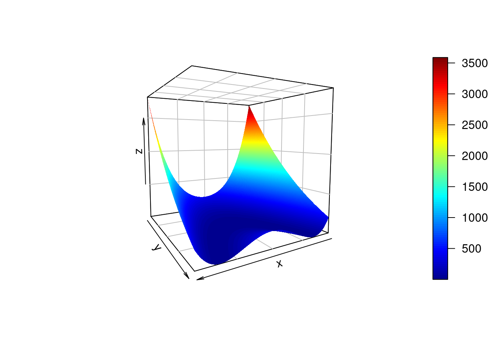
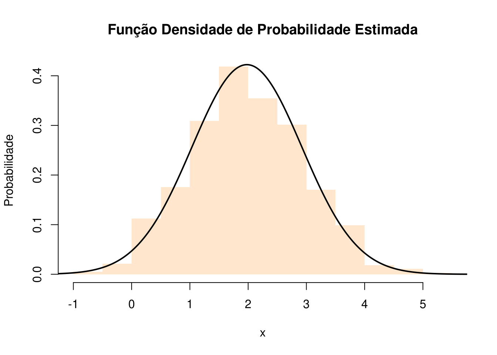
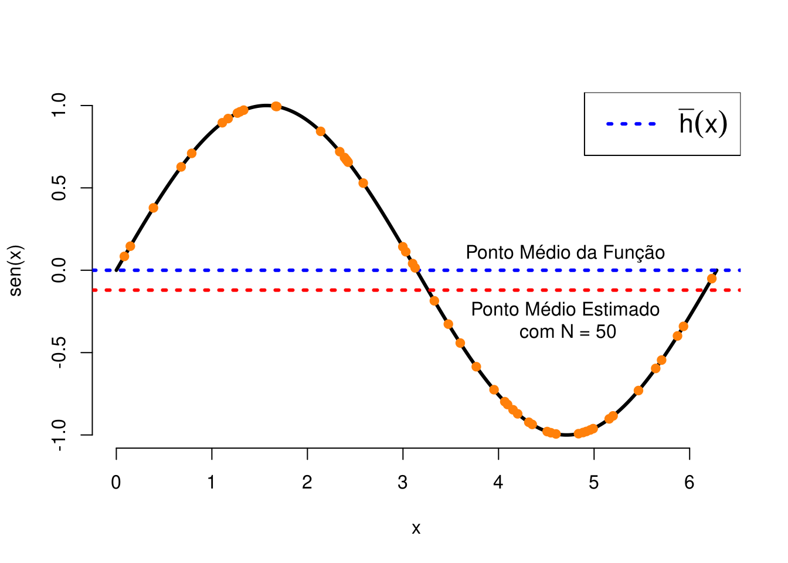
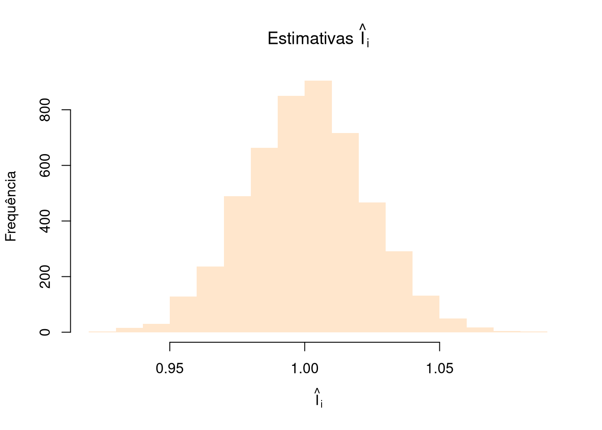
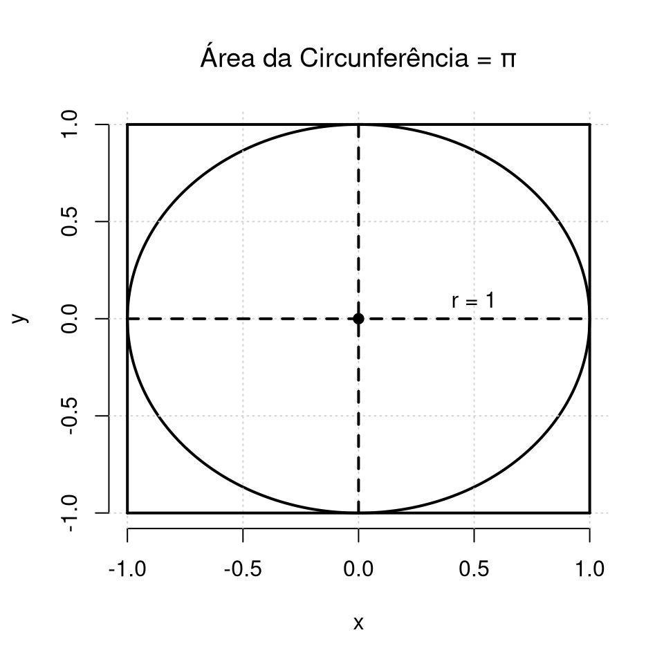
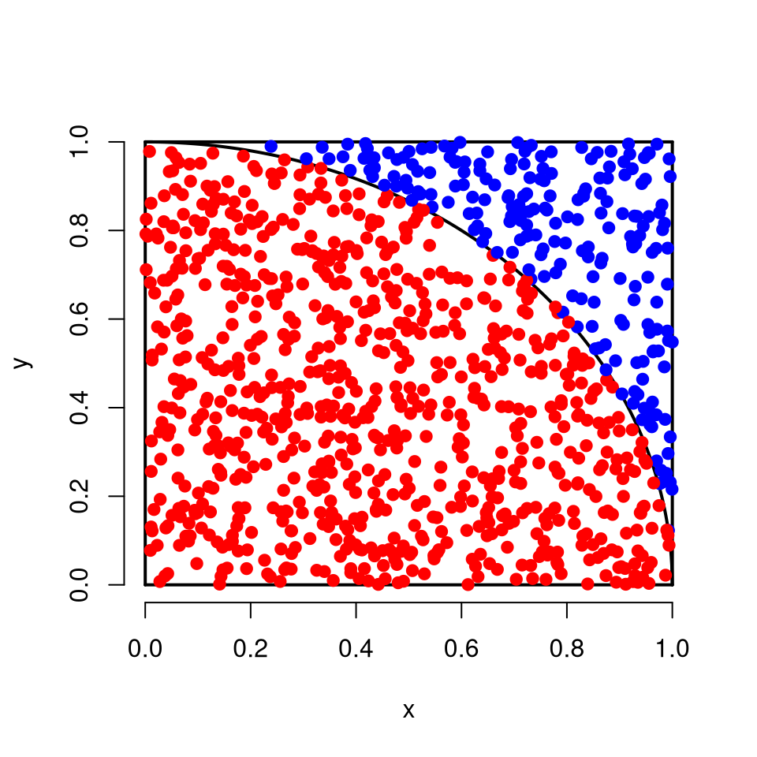
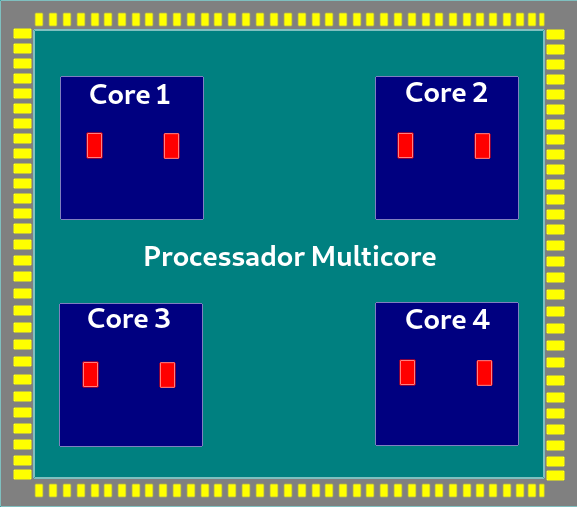
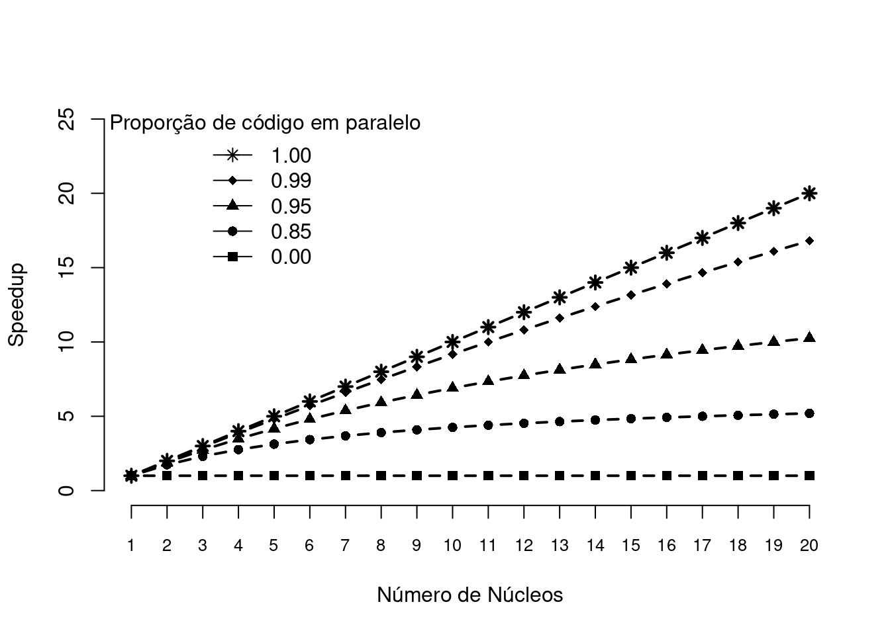

# Tópicos em Estatística Computacional

## Geração de Números Pseudo-Aleatórios

O conteúdo para esse tópico entra-se em PDF e poderá ser acessado [**aqui**](files/computacional.pdf). Em um futuro próximo, essa seção será reescrita e fará parte do corpo deste HTML.

### Método da Transformação Inversa (Caso Discreto)

O método da transformação inversa também poderá ser aplicado também para gerar observações de v.a.'s discretas. Seja $X$ uma v.a. discreta, tal que

$$... < x_{i-1} < x_i < x_{i+1} <\, ...\,.$$
As observações acima são pontos de descontinuidade de $F_X(x)$. Então, a transformação inversa é $F_X^{-1} = x_i$, quando $F_X(x_{i-1}) < u \leq F_X(x_i)$. O algoritmo que segue poderá ser utilizado para gerar observações de $X$.

**Algoritmo**:

  1. Gere um número pseudo-leatório $u$ de uma v.a. $U \sim \mathcal{U}(0,1)$;
  2. Retorne $x_i$ como observação de $X$, tal que $F(x_{i-1}) < u \leq F(x_i)$.

Em outras palavras, gere $u$ de uma v.a. $U \sim \mathcal{U}(0,1)$ e compare na sequência:

  1. Se $u < p_0$, faça $X = x_0$ e pare;
  2. Se $p_0 \leq u < p_0 + p_1$, faça $X = x_1$ e pare;
  3. Se $p_0 + p_1\leq u < p_0 + p_1 + p_2$, faça $X = x_2$ e pare;
  4. ...
  5. Se $\sum_{i = 0}^{j-1} p_i \leq u < \sum_{i=0}^j p_i$, faça $X = x_j$ e pare;
  6. ...
  
em que $p_j = P(X = j)$.

**Exemplo**: Implemente, em R, uma função que retorna a quantidade de observações de uma v.a. $X$ com função de probabilidade:

$$P(X = 1) = 0.3, P(X = 2) = 0.2, P(X = 3) = 0.35, P(X = 4) = 0.15.$$

```r
random <- function(n = 1L){
  x <- 1L:4L
  probs <- c(0.3, 0.2, 0.35, 0.15)
  
  u <- runif(n = n, min = 0, max = 1)
  
  # Criando uma função para ser passada à um funcional.
  comp <- function(u){
    # Retorna a primeira ocorrência de TRUE
    match(TRUE, u < cumsum(probs))
  }
  
  purrr::map_dbl(.x = u, .f = ~ comp(.x))
  
}
set.seed(0)
random(n = 10L)
```

```
##  [1] 4 1 2 3 4 1 4 4 3 3
```

Em um estudo de simulação, poderemos ter interesse em gerar observações equiprováveis, em que a v.a. $X$ assume um número finito de observações, tal forma que:

$$P(X = j) = \frac{1}{n}, \,\, j = 1, 2, \ldots, n.$$
Porém, note que para esse caso, não precisaremos fazer muitas comparações, uma vez que sabemos que $x = j$ quando $u \leq \frac{j-1}{n}$. Sendo assim, tomamos $x = j$ quando $nu \leq j - 1$. 

Note que fazer $x = j$ quando $nu \leq j - 1$ equivale a fazer $x = \mathrm{Int}(nu) + 1$, em que $\mathrm{Int}(\cdot)$ aqui irá retornar o maior inteiro de um número. 

**Exemplo**: Seja $X \sim Bernoulli(p)$, em que $P(X = 0) = 1 - p$ e $P(X = 1) = p$, com $0\leq p \leq 1$. A função `rbernoulli(n = 1L, p)` retorna possíveis observações de $X$.


```r
rbernoulli <- function(n = 1L, p){
  u <- runif(n = n, min = 0, max = 1)
  cond <- (u < 1 - p)
  comp <- function(x){
    ifelse(x < 1 - p, 0L, 1L)
  }
  purrr::map_int(.x = u, .f = ~ comp(.x))
}
set.seed(0) # Fixando uma semente.
n <- 1e4 # Número de observações.
result <- rbernoulli(n = n, p = 0.6) # prob.  de sucesso = 0.6.
# Probabilidade de sucesso aproximada.
sum(result == 1)/n
```

```
## [1] 0.5973
```

### Método da aceitação e rejeição

Em situações em que não podemos fazer uso do método da inversão (impossível obter a função quantílica) e nem conhecemos uma transformação que envolve uma variável aleatória ao qual sebemos gerar observações, poderemos fazer uso do **método a aceitação e rejeição**.

Suponha que $X$ e $Y$ são variáveis aleatórias com função densidade de probabilidade (fdp) ou função de probabilidade (fp) $f$ e $g$, respectivamente. Além disso, suponha que existe uma constante $c$ de tal forma que

$$\frac{f(t)}{g(t)} \leq c,$$
para todo valor de $t$, com $f(t) > 0$. Para utilizar o método a aceitação e rejeição para gerar observações da v.a. $X$, utilizando o algoritmo mais abaixo, antes, encontre uma v.a. $Y$ com pdf ou fp $g$, tal que satisfaça a condição acima.

**Importante**:

\BeginKnitrBlock{rmdimportant}<div class="rmdimportant"><div class=text-justify>
É importante que a v.a. $Y$ escolhida seja de tal forma que você consiga gerar facilmente suas observações. Isso se deve ao fato do método da aceitação e rejeição ser computacionalmente mais intensivo que métodos mais diretos como o método da transformação ou o método da inversão que exige apenas a regração de números pseudo-aleatórios com distribuição uniforme.
</div></div>\EndKnitrBlock{rmdimportant}

**Algoritmo do Método da Aceitação e Rejeição**:

1 - Gere uma observação $y$ proveniente de uma v.a. $Y$ com fdp/fp $g$;

2 - Gere uma observação $u$ de uma v.a. $U\sim \mathcal{U} (0, 1)$;

3 - Se $u < \frac{f(y)}{cg(y)}$ aceite $x = y$; caso contrário rejeite $y$ como observação da v.a. $X$ e volte para o passo anterior.

**Prova**: Consideremos o caso discreto, ou seja, que $X$ e $Y$ são v.a.s com fp's $f$ e $g$, respectivamente. Pelo passo 3 do algoritmo acima, temos que $\{aceitar\} =  \{x = y\} = u < \frac{f(y)}{cg(y)}$. Isto é,

$$P(aceitar | Y = y) = \frac{P(aceitar \cap \{Y = y\})}{g(y)} = \frac{P(U \leq f(y)/cg(y)) \times g(y)}{g(y)} = \frac{f(y)}{cg(y)}.$$
Daí, pelo [**Teorema da Probabilidade Total**](https://pt.wikipedia.org/wiki/Lei_da_probabilidade_total), temos que:

$$P(aceitar) = \sum_y P(aceitar|Y=y)\times P(Y=y) = \sum_y \frac{f(y)}{cg(y)}\times g(y) = \frac{1}{c}.$$
Portanto, pelo método da aceitação e rejeição aceitamos ocorrência de $Y$ como sendo uma ocorrência de $X$ com probabilidade $1/c$. Além disso, pelo Teorema de Bayes, temos que

$$P(Y = y | aceitar) = \frac{P(aceitar|Y = y)\times g(y)}{P(aceitar)} = \frac{[f(y)/cg(y)] \times g(y)}{1/c} = f(y).$$
O resultado logo acima, mostra que aceitar $x = y$ pelo procedimento do algoritmo equivale a aceitar um valor proveniente de $X$ que tem fp $f$. Para o caso contínuo, a demonstração é similar.

**Importante**:

\BeginKnitrBlock{rmdimportant}<div class="rmdimportant"><div class=text-justify>
Perceba que para reduzir o custo computacional do método, deveremos escolher $c$ de tal forma que possamos maximizar $P(aceitar)$. Sendo assim, escolher um valor exageradamente grande da constante $c$ irá reduzir a probabilidade de aceitar uma observação de $Y$ como sendo observação da v.a. $X$.
</div></div>\EndKnitrBlock{rmdimportant}

**Nota**:

\BeginKnitrBlock{rmdnote}<div class="rmdnote"><div class=text-justify>
Computacionalmente, é conveniente considerar $Y$ como sendo uma v.a. com distribuição uniforme no suporte de $f$, uma vez que gerar observações de uma distribuição uniforme é algo simples em qualquer computador. Para o caso discreto, considerar $Y$ com distribuição uniforme discreta poderá ser uma boa alternativa.
</div></div>\EndKnitrBlock{rmdnote}

## Exercício {-}

1. Quais as propriedades de um bom gerador de números pseudo-aleatórios? Disserte sobre cada uma delas.

2. Implemente o gerador **Midsquare** idealizado pelo matemático John von Neumann. Por que o gerador **Midsquare** não é um bom gerador? Explique.

3. Defina matematicamente o gerador congruencial linear. Implemente uma função em R que implementa esse gerador.

4. O gerador **Randu** é definido por $x_{i + 1} = 65539 \times x_i\,\mathrm{mod}\,31$. O **Randu** é um gerador congruencial misto ou multiplicativo?

5. Por que o gerador **Randu** é um dos peiores geradores de números pseudo-aleatório já criado? Explique.

6. Defina um gerador congruencial de período completo para geração de números pseudo-aleatórios com distribuição uniforme no intervalo $(0,1)$

7. Explique o método da transformação para geração de números pseudo aleatório. Apresente um exemplo.

8. Defina o método da inversão para geração de números pseudo-aleatórios. Sempre será possível utilizar esse método? Explique.

9. Implemente uma função para geração de números pseudo-aleatórios com distribuição normal padrão. A função deverá implementar o método de Box-Müller e o método polar. Ao final obtenha um histograma com os números gerados (mil valores) e realize um teste de normalidade. Realize um teste de normalidade.

10. Seja $X$ uma variável aleatória em um espaço de probabilidade $(\Omega, \mathcal{A},\mathcal{P})$ e suponha que $X \sim \mathcal{U}(0,1)$. Obtenha a distribuição de $Y = -\log(X)$.

11. Com base na distribuição da variável aleatória (v.a.) $Y$ do exercício acima, implemente uma função em R que gere observações de $Y$.

12. Conhecendo a distribuição da v.a. $X$, implemente para cada um dos itens que seguem, uma função para geração de observações da v.a. $Y$:

    * $X \sim \mathrm{Exp}(\lambda),$ com $x \geq 0$ e $\lambda > 0$ e  $Y = \sum_{i = 1}^n X_i \sim \Gamma(n, \lambda)$;

    * $X \sim \mathrm{Exp}(\lambda)$, com $x \geq 0$ e $\lambda>0$ e $Y = \mu - \beta\log(\lambda X) \sim \mathrm{Gumbel}(\mu,\beta)$, com $\mu \in \Bbb{R}$ e $\beta>0$;

    * $X \sim \mathcal{U}(0,1)$ (contínua) e $Y = m + s[-\log(X)]^{-1/\alpha} \sim$ Fréchet$(\alpha,s,m)$, com $x, \alpha,s > 0$ e $m \in  \Bbb{R}$.

13. Cite algumas das propriedades do gerador **Mersenne Twister**. Qual o seu período de ocorrência?

14. Explique o algoritmo do método da aceitação e rejeição.

15. Utilizando o método da aceitação e rejeição, implemente uma função que gere valores aleatório provenientes da distribuição da v.a. $X$ tal que

$$P(X = 1) = 0.3, P(X = 2) = 0.2, P(X = 3) = 0.35, P(X = 4) = 0.15.$$

16. Implemente duas funções que geram observações da v.a. $X$ utilizando o método da transformação para v.a. discretas e pelo método da aceitação e rejeição. Qual método é mais eficiente computacionalmente? Por que?

\begin{eqnarray}
P(X = 0) &=& 0.01, P(X = 1) = 0.04, P(X = 2) = 0.12,\nonumber\\
P(X = 3) &=& 0.27, P(X = 4) = 0.44, P(X = 5) = 0.62, \nonumber\\
P(X = 6) &=& 0.76, P(X = 7) = 0.87, P(X = 8) = 0.93, \nonumber\\
P(X = 9) &=& 0.97, P(X = 10) = 0.99, P(X = 11) = 0.99, \nonumber\\
P(X = 12) &=& 1.\nonumber
\end{eqnarray}

17. Implemente a função `rdisc(n = 1L, x, probs)` que retorna números pseudo-aleatórios de uma v.a. discreta $X$ que assume uma quantidade finita de observações. Os argumentos de `rdisc` estão especificados abaixo:
  
    * `n`: número de observações a serem geradas;
    
    * `x`: vetor com as possíveis observações da v.a. $X$;
    
    * `probs`: vetor com as probabilidades das observações passadas à `x`.
  
18. Implemente uma função para o método da aceitação e rejeição (`ar_fp(n, x, prob)`), para o caso em que deseja-se gerar observações de uma v.a. $X$ discreta. O argumento `n` refere-se à quantidade de observações a serem geradas, `x` é um vetor de valores assumidos por $X$ e `prob` é um vetor de probabilidades de cada observação de $X$. A função `ar_fp(n, x, prob)` deverá escolher um valor adequado para $c$.

19. Seja $X$ uma v.a. contínua com fdp $f(x) = 6x(x-1)$, com $0 < x < 1$. Implemente a função `rf(n, c = 1.5)` que gera números pseudo-aleatórios como observações de $X$, pelo método da aceitação e rejeição, em que `n` é a quantidade de números a serem gerados e `c` é o valor da constante (0.5 por padrão) no algoritmo do método da aceitação e rejeição. **Dica**: considere $Y \sim \mathcal{U}(0,1)$.

<!-- rf <- function(n = 1L, c = 6){ -->
<!--   f <- function(x) 6 * x * (1 - x) -->
<!--   i <- 1L -->
<!--   n_rejeicao <- 0L -->
<!--   vetor <- numeric(n) -->
<!--   while (i < n){ -->
<!--     u <- runif(n = 1L, min = 0, max = 1) -->
<!--     y <- runif(n = 1L, min = 0, max = 1) -->
<!--     if (u <= f(y)/c){ -->
<!--       vetor[i] <- y -->
<!--       i <- i + 1L -->
<!--     }  -->
<!--     else{ -->
<!--       n_rejeicao <- n_rejeicao + 1L -->
<!--     } -->
<!--   } -->

<!--   list(valores = vetor, rejeicao = n_rejeicao) -->
<!-- } -->

<!-- set.seed(0) -->
<!-- n <- 2e4 -->
<!-- c <- 20 -->
<!-- result <- rf(n = n, c = c) -->

<!-- # Probabilidade de aceitar: -->
<!-- 1/c -->

<!-- # Aproximacao da probabilidade de aceitar: -->
<!-- 1 - result$rejeicao/(n + result$rejeicao) -->

20. Considerando a função `rf(n, c)` implementada no exercício anterior, quantos passos serão necessários para que possamos gerar 10 mil observações proveniente da distribuição de $X$, considerando `c = 6`? Respectivamente, quantos passos serão necessários para serem gerados a mesma quantidade de observações de $X$ considerando `c = 0.5`? **Dica**: antes de chamar a função implementada, fixe a semente fazendo `set.seed(0)`.

## Otimização Não-Linear

Na estatísticas, em muitas simtuações práticas, temos o interesse de maximizar ou minimizar uma função objetivo. Por exemplo, na inferência esatística, é comum o nosso interesse na obtenção dos estimadores de máxima verossimilhança de parâmetros que indexam modelos ou distribuições de probabilidade. Um outro problema comum na estatística, mais precisamente na área de regressão é o de minimizar a soma dos quadrados de um conjunto de erros, em um modelo de regressão não-linear, por meio de mínimos quadrados não-lineares.

**Nota**:

\BeginKnitrBlock{rmdnote}<div class="rmdnote"><div class=text-justify>
Aqui, o termo **otimizar** estará se referindo à **minimiar** ou **maximizar** uma função objetivo. Dessa forma, por meio do contexto em que o termo esteja sendo utilizado, a ideia estará implícita. Além disso, por uma simples modificação na função objetivo, um algoritmo utilizado para maximizar uma função poderá ser convertido em um algoritmo para minimização de uma função.
</div></div>\EndKnitrBlock{rmdnote}

Suponha que temos interesse em maximizar uma função objetivo, seja ela $\psi(\pmb{\Theta}): \pmb{\Theta} \rightarrow  \mathbb{R}$, em que $\pmb{\Theta}$ é um subspaço do $\mathbb{R}^p$. Dessa forma, queremos encontrar o vetor $\pmb{\theta}$ ($p \times 1$) que maximiza a função objetivo $\psi(\cdot)$. Ou seja, queremos encontar

$$ \underset{\pmb{\theta}\, \in\, \pmb{\Theta}}{\mathrm{arg\,max}}\,\psi(\pmb{\theta}).$$

A maioria das situações práticas nos levam à problemas com a condição de primeira ordem,

$$\frac{\partial\,\psi(\pmb{\theta})}{\partial\,\pmb{\theta}} = \pmb{0},$$

resulta em um sistema de equações não-lineares que não apresenta solução em forma fechada. Nesses casos, a solução do problema de minimizar $\psi(\pmb{\theta})$ é obtida utilizando-se de métodos/algoritmos iterativos. 

### Metódos Gradiente

A classe de métodos mais utilizadas em situações em que a condição de primeira ordem resulta em um sistema não-lineare que não possue forma fechada é denominada de **classe de métodos gradiente**. Nessa classe de métodos, a atualização de $\pmb{\theta}$ para um vetor que mais se aproxima do ponto que minimiza $\psi(\cdot)$ (função objetivo) é dada de forma iterativa. Dessa forma, seja $\pmb{\theta}_0$ o ponto inicial (chute inicial) na $t$-ésima iteração. Se o valor de $\pmb{\theta}$ que maximiza globalmente a função $\psi(\cdot)$ não tiver sido alcançado, calcula-se o vetor direcional (vetor gradiente) de $\psi(\cdot)$, denotado aqui por $\pmb\Delta_t$ ($p \times 1$) e o "tamanho do passo" $\lambda_t$. Assim, o próximo valor de $\pmb\theta$ será atualizado para:

$$\pmb\theta_{t+1} = \pmb\theta_t + \lambda_t \pmb \Delta_t.$$

**Importante**:

\BeginKnitrBlock{rmdimportant}<div class="rmdimportant"><div class=text-justify>
O vetor gradiente fornece a direção e o sentido de deslocamento, apartir de um ponto especificado, de subida que fornece um incremento em uma grandeza. No nosso caso, $\pmb\Delta_t$ ($p \times 1$) irá indicar o sentido de subida, em que poderemos atualizar o valor de $\pmb \theta$ para um ponto que maximiza $\psi(\cdot)$. Dessa forma, $-\pmb\Delta_t$ fornecerá a direção e o sentido de atualização de $\pmb\theta$ que nos levam à pontos que minimizam $\psi(\cdot)$.
</div></div>\EndKnitrBlock{rmdimportant}

Note também que, em cada iteração do algoritmo, temos $\pmb \theta_t$ e $\pmb \Delta_t$ são conhecidos, uma vez que $\pmb \theta_t$ é o ponto $\pmb \theta$ atualizado na iteração $t-1$ e $\pmb \Delta_t$ é o vetor gradiente da função objetivo avaliado em $\pmb \theta_t$. 

Dado o conhecimento dessas quantidade, perceba que precisamos obter o "tamanho do passo" $\lambda_t$. Assim, iremos recair em um problema de otimização secundário, denominado de **procura em linha**. Sendo assim, busca-se $\lambda_t$ de tal forma que

$$\frac{\partial \pmb\,\psi(\pmb \theta_t + \lambda_t\pmb\Delta_t)}{\partial \lambda_t} = \delta(\pmb \theta_t + \lambda_t\pmb\Delta_t)^{'}\pmb \Delta_t = 0,$$
em que  $\delta(\pmb \theta_t + \lambda_t\pmb\Delta_t)^{'}$ é o vetor gradiente tansposto ($1 \times p$) da função objetivo avaliado no ponto $\pmb \theta_t + \lambda_t\pmb\Delta_t.$    

<div class="figure" style="text-align: center">

<p class="caption">(\#fig:unnamed-chunk-8)Poblema de **procura em linha**, em que a função objetivo é função penas do tamanho do passo.</p>
</div>


**Observação**:

\BeginKnitrBlock{rmdobservation}<div class="rmdobservation"><div class=text-justify>
É importante observar que o processo de busca em linha em um algoritmo de otimização não-linear tornará esse algoritmo computacionalmente intensivo. Dessa forma, muitos algoritmos adotam um conjunto de regras *ad hoc* que são computacionalmente menos custosas. Essa classe de algoritmos é o que denominamos de **classe de métodos gradiente**.
</div></div>\EndKnitrBlock{rmdobservation}

Na classe de métodos gradiente, fazemos

$$\pmb \Delta_t = M_t\delta_t,$$
em que $M_t$ ($p \times p$) é uma matriz positiva-definida e $\delta_t$ ($p \times 1$) é o gradiente de $\pmb\psi$, ambos na $t$-ésima iteração. Para deixar claro, temos que $\delta_t$ = $\delta_t(\pmb \theta_t) = \partial \, \psi(\pmb \theta_t)/\partial\, \pmb \theta_t$. 

A motivação por trás dos métodos gradientes, ao em tomar $\pmb \Delta_t = M_t\delta_t$, poderá ser entendida ao considerar uma aproximação para $\psi(\pmb \theta_t + \lambda_t\pmb\Delta_t)$ por uma [**série de Taylor**](https://pt.wikipedia.org/wiki/S%C3%A9rie_de_Taylor) de primeira ordem, em torno do ponto $\lambda_t = 0$. Assim, temos que,

$$\psi(\pmb \theta_t + \lambda_t\pmb\Delta_t) \approx \psi(\pmb \theta_t) + \lambda_t \delta_t^{'}\pmb \Delta_t,$$
em que $\delta_t^{'}$ é o vetor gradiente transposto ($1 \times p$). Para reduzir a notação, tome $\psi(\pmb \theta_t + \lambda_t\pmb\Delta_t) = \psi_{t+1}$. Assim, temos que 

$$\psi_{t+1} - \psi_{t} \approx \lambda_t \delta_t^{'}\pmb \Delta_t.$$

Assim, considerando $\pmb \Delta_t = M_t\delta_t$, temos que

$$\psi_{t+1} - \psi_{t} \approx \lambda_t \delta_t^{'}M_t\delta_t.$$

Para $\delta_t$ diferente de zero e $\lambda_t$ suficientemente pequeno, se $\psi(\pmb\theta)$ não assume o valor máximo da função, podemos sempre encontrar um tamanho de passo tal que uma iteração adicional no algoritmo irá incrementar o valor da função, ou seja, se aproximará um pouco mais do máximo global da função objetivo.

Perceba que sempre temos que $\psi_{t+1} - \psi_{t} \geq 0$. Isso sempre será verdade, uma vez que $M_t$ é uma matriz positiva-definida, o que implica que $\delta_t^{'}M_t\delta_t > 0$. Além disso, na situação de $\psi(\pmb\theta)$ não encontar-se no ponto máximo, como mencionado no parágrafo anterior, sempre haverá um tamanho de passo $\lambda_t$, por menor que ele seja.

#### Steepest Ascent

O algoritmo **steepest ascent** ("subida mais inclinada") é o mais simples dos métodos gradientes. A ideia do algoritmo **steepest ascent** é considerar 

$$M_t = I,$$
em que $I$ é a matriz identidade ($p \times p$). Dessa forma, temos que $\pmb \Delta_t = \delta_t$, em todos os passos iterativos. Daí, a atualização de $\pmb \theta$ é dada por:

$$\pmb \theta_{t+1} = \theta + \lambda_t\delta_t.$$

**Nota**:

\BeginKnitrBlock{rmdnote}<div class="rmdnote"><div class=text-justify>
Esse algoritmo tende a ser pouco utilizado na prática, uma vez que apresenta convergência lenta. Esse método é muito semelhante ao algoritmo gradiente descendente [**steepest descent**](https://en.wikipedia.org/wiki/Gradient_descent), utilizado para minimização. Não confunda **steepest descent** citado aqui com um método de aproximação de integrais que leva o mesmo nome.
</div></div>\EndKnitrBlock{rmdnote}

#### Newton-Raphson

O método de **Newton-Raphson**, muitas vezes apenas chamado de método de **Newton**, considera a atualização de $\pmb \theta$ na forma 

$$\pmb \theta_{t+1} = \pmb \theta_t -H_t^{-1}\delta_t,$$
em que 

$$H = H(\theta) = \frac{\partial^2 \psi(\pmb \theta)}{\partial \pmb \theta \partial \pmb \theta^{'}},$$
ou seja, temos que $H$ é a matriz [**hessiana**](https://pt.wikipedia.org/wiki/Hessiano). No método de **Newton-Rapshon**, temos que $\lambda_t = 1$ e $M_t = -H_t^{-1}$, em todas iterações.

**Observação**:

\BeginKnitrBlock{rmdobservation}<div class="rmdobservation"><div class=text-justify>
A matriz hessiana nos permite identificar a concavidade de uma função multiparamétrica, desde que estas sejam duplamente diferenciável. Em um problema de maximização de uma função objetivo, temos que a matriz hessiana é negativa definida em uma região muito próxima ao ponto que maximiza a função. Dessa forma, $-H^{-1}$ é uma matriz positiva definida na mesma região, isto é, se $\pmb a$ é um vetor qualquer ($p \times 1$) e $H^{-1}$ é uma matriz ($p \times p$), então $-\pmb a^{'} H^{-1} \pmb a < 0$. 

Seja $H$ uma matriz hessiana como apresentada acima. Abaixo estão listadas algumas propriedades da de $H$. Dessa forma,  Então

   * $\pmb a^{'} H \pmb a > 0$ (positiva-definida): A função é estritamente convexa;
   
   * $\pmb a^{'} H \pmb a < 0$ (negativa-definida): A função é estritiamente concava. Essa é a propriedade que estamos considerando, visto que estamos em um problema de maximização de uma função objetivo;
   
   * $\pmb a^{'} H \pmb a \geq 0$ (positiva-definida): A função é parcialmente convexa;

   * $\pmb a^{'} H \pmb a \leq 0$ (positiva-definida): A função é parcialmente concava;
   
   * $H$ é uma matriz simétrica;
   
   * A inversa de uma matriz positiva-definida é também uma matriz positiva-definida;
   
   * Você poderá entender a matriz hessiana como a primeira derivada do vetor gradiente da função objetivo.
</div></div>\EndKnitrBlock{rmdobservation}

O método de **Newton-Raphson** normalmente é utilizado para encontar os zeros de uma função. Quando aplicado sobre a condição de primeira ordem, o método de **Newton-Raphson** nos conduzirá aos pontos críticos da função. Como fazemos uso do vetor gradiente, estaremos sempre a caminhar para os pontos de máximo de $\psi(\cdot)$. Dessa forma, os pontos críticos são os pontos de máximo da função objetivo.

Para que possamos entender melhor a ideia do método, considere uma [**expansão de Taylor**](https://pt.wikipedia.org/wiki/S%C3%A9rie_de_Taylor) da condição de primeira ordem em torno de um ponto qualquer $\pmb \theta_0$. Assim, temos que 

$$\frac{\partial\,\psi(\pmb \theta)}{\partial\, \pmb \theta} \approx f(\pmb \theta_0) + H(\pmb \theta_0) (\pmb \theta - \pmb\theta_0).$$

Resolvendo o sistema para $\pmb\theta$ e fazendo $\pmb \theta = \pmb \theta_{t+1}$ e $\pmb \theta_0 = \pmb \theta_t$, obteremos o esquema iterativo do algoritmo apresentado ascima.

A forma mais usual do algoritmo de **Newton-Rapshon** introduz o mecanismo de "procura em linha". Dessa forma, o esquema iterativo é dada por 

$$\pmb \theta_{t+1} = \pmb \theta_t -\lambda_tH_t^{-1}\delta_t.$$
**Nota**:

\BeginKnitrBlock{rmdnote}<div class="rmdnote"><div class=text-justify>
O método de **Newton-Raphson** apesar de funcionar bem em diversas situações, poderá fornecer estimativas ruins em alguns casos. Por exemplo, um problema comum é quando $\pmb \theta_t$ é um ponto distante do ponto que maximiza $\psi(\cdot)$, uma vez que nesses pontos, a matriz $M_t = -H^{-1}$ pode não ser positiva-definida.
</div></div>\EndKnitrBlock{rmdnote}

#### BHHH

O método **BHHH** (**B**erndt-**H**all-**H**all-**H**ausman), foi proposto no artigo Berndt, E. R., Hall, B. H., Hall, R. E., & Hausman, J. A. (1974). **Estimation and inference in nonlinear structural models**. In Annals of Economic and Social Measurement, Volume 3, p. 653-665. O método é muito semelhante ao método de Newton-Raphson, com a diferença que trocamos a matriz $H_t$ pelo auto produto dos vetores gradientes $\delta_t\delta_t^{'}$

**Nota**:

\BeginKnitrBlock{rmdnote}<div class="rmdnote"><div class=text-justify>
A vantagem do método **BHHH** está no fato de não necessitarmos calcular segundas derivadas. Trata-se de um método muito utilizado em aplicações ecnonométricas. O método **BHHH** poderá enfrentar o mesmo problema de convergência que o método de **Newton-Raphson**. 
</div></div>\EndKnitrBlock{rmdnote}

#### Métodos quasi-Newton

A classe de algoritmos quasi-Newton é composta por algoritmos que são bastante eficientes do ponto de vista de convergência e também do ponto de vista computacional, visto que esses algoritmos não requerem o cálculo de segundas derivadas. Nessa classe de algoritmos, é utilizado uma sequência de matrizes tal que

$$M_{t+1} = M_{t} + N_t,$$
sendo $N_t$ uma matriz positiva-definida. Assim, se $M_0$ é positiva-definida, $M_t$ na $t$-ésima iteração sempre será positiva-definida. A ideia básica desses métodos é construir uma aproximação para $-H(\pmb \theta)^{-1}$, de tal forma que 

$$\lim_{t \to \infty} M_t = -H^{-1}.$$

Há diversos algoritmos que pertencem à classe de métodos quasi-Newton. Por exemplo, o método **DFP** (**D**avidon, **F**letcher e **P**owell) atualiza $M_{t+1}$ fazendo


$$M_{t+1} = M_{t} + \frac{\pmb \gamma_t \pmb \gamma_t^{'}}{\pmb \gamma_t^{'}\kappa_t} + \frac{M_t\kappa_t\kappa_t^{'}M_t}{\kappa_t^{'}M_t\pmb \gamma_t},$$

em que $\pmb \gamma_t = \pmb \theta_{t+1} - \pmb \theta_t$ (diferença de pontos) e $\kappa_t = \delta(\pmb \theta_{t+1}) - \delta(\pmb \theta_t)$ (diferenças de gradientes avaliados em pontos). 

O algoritmo quasi-Newton mais utilizado é o **BFGS** (**B**royden-**F**letcher-**G**oldfarb-**S**hanno). O algoritmo **BFGS** tem a atualização semelhante ao **DFP**, com a diferença que é subtraído o termo $a_tb_tb_t^{'}$, em que $a_t =  \kappa_t^{'}M_t\kappa_t$ e 

$$b_t = \frac{\pmb\gamma_t}{\pmb\gamma_t^{'}\kappa_t} - \frac{M_t\kappa_t}{\kappa_t^{'}M_t \kappa_t}.$$

Sendo assim, temos que no método **BFGS**, a atualização de $M_t$ de dará por:

$$M_{t+1} = M_{t} + \frac{\pmb \gamma_t \pmb \gamma_t^{'}}{\pmb \gamma_t^{'}\kappa_t} + \frac{M_t\kappa_t\kappa_t^{'}M_t}{\kappa_t^{'}M_t\pmb \gamma_t} - a_tb_tb_t^{'}.$$

**Nota**:

\BeginKnitrBlock{rmdnote}<div class="rmdnote"><div class=text-justify>
O termo quasi-Newton é empregado para se referir ao fato de que esses métodos não fazem uso da matriz hessiana. Porém, esses métodos utilizam uma aproximação iterativa de uma matriz $M_t$ que converge para a matriz de segundas derivadas. Dessa forma, não entenda o termo quasi-Newton como se esses métodos fossem inferiores aos métodos de **Newton-Raphson**. Na verdade, os métodos quasi-Newton normalmente apresentam desempenho superior.
</div></div>\EndKnitrBlock{rmdnote}

#### Otimização não-linear no R

Em  R, é comum minimizar uma função objetivo utilizando a função `optim()` do pacote **stats** que está disponível em qualquer instalação básica da linguagem. A forma geral de uso da função `optim()` é:


```r
optim(par, fn, gr = NULL, ...,
      method = c("Nelder-Mead", "BFGS", "CG", "L-BFGS-B", "SANN",
                 "Brent"),
      lower = -Inf, upper = Inf,
      hessian = FALSE)
```
em que:

   1. `par` é um vetor de chutes inicias;
   2. `fn` é a função objetivo a ser **minimizada**;
   3. `gr` é a função gradiente da função `fn`;
   4. `method` é o método escolhido par minimizar `fn`. É possível escolher os métodos de Nelder-Mead, BFGS, CG, L-BFGS-B, SANN (Simulated Annealing) e Brent;
   4. `...` é o operador dot-dot-dot que poderá receber argumentos que por ventura possam existir nas funções `fn` e `gr`;
   5. `lower` é um vetor que limita inferiormente os parâmetros a serem otimizados (por padrão é `-Inf`);
   6. `upper` é um vetor que limita superiormente os parâmetros a serem otimizados (por padrão é `Inf`);
   7. `hessian` recebe um valor lógico, em que por padrão `hessian = FALSE`. Se `hessian = TRUE`, será calculado uma estimativa da matriz hessiana avaliada na estimativa de ponto de mínimo global.


**Exemplo**: Utilizando a função `optim()` para minimizar a função [**Rosenbrock**](https://en.wikipedia.org/wiki/Rosenbrock_function) pelo método BFGS.

<div class="figure" style="text-align: center">

<p class="caption">(\#fig:unnamed-chunk-16)Gráfico da superfície da função Rosenbrock introduzida por Howard H. Rosenbrock em 1960.</p>
</div>


```r
# Função Rosenbrock
f_objetivo <- function(x, a = 2, b = 40) {
    x1 <- x[1]
    x2 <- x[2]
    (a - x1) ^ 2 + b * (x2 - x1 ^ 2) ^ 2
}
optim(par = c(2, 2), fn = f_objetivo, method = "BFGS")
```

```
## $par
## [1] 1.999998 3.999992
## 
## $value
## [1] 2.761362e-11
## 
## $counts
## function gradient 
##      128       45 
## 
## $convergence
## [1] 0
## 
## $message
## NULL
```

**Entendendo a saída (retorno da função)**:

  1. `par` é um vetor contendo as estimativas para $x_1$ e $x_2$;

  2. `value` é o valor da função avaliada nas estimativas obtidas;

  3. `counts` é a quantidade de chamadas da função a ser otimizada e do seu gradiente. Note que não passamos o gradiente da função de objetivo mas este teve que ser calculado numericamente;

  4. `convergence` é um vetor de uma única posição, em que 0 indica convergência. Qualquer número diferente de zero indica que houve problema de convergência no algoritmo escolhido para mininizar a função objetivo;

  5. `message` retorna alguma mensagem com informações adicionais, se necessário. Caso contrário, `NULL` será o retorno.

A função de Rosenbrock tem mínimo analítico no ponto $(a, a^2)$ (ponto ótimo), em que $f(a, a^2) = 0$. Dessa forma, um bom método de otimização nos trará uma estimativa próxima ao ponto $(2, 4)$, uma vez que foi considerado, no código acima, $a = 2$ e $b = 40$. Como pode-se observar, o método BFGS forneceu uma boa estimativa para ponto ótimo analítico.

**Nota**:

\BeginKnitrBlock{rmdnote}<div class="rmdnote"><div class=text-justify>
Para o exemplo acima, $x_1$ e $x_2$ são chamadas de **variáveis**, visto que a função de Rosenbrock é determinística. Porém, em problemas estatísticos, por exemplo, quando desejamos maximizar uma função de log-verossimilhança, a otimização é realizada em termos dos **parâmetros** que indexam o modelo estatístico. Nesse caso, cada ponto da função
</div></div>\EndKnitrBlock{rmdnote}

O argumento `...` é muito importante para nós que necessitamos frequentemente maximizar uma função de log-vessimilhança $\mathcal{l}(\pmb \theta)$. É por meio desse argumento que passamos a amostra para $\mathcal{l}(\pmb \theta)$. Sem ele, teríamos que implementa uma função de verossimilhança para cada tamanho de amostra, o que seria impraticável. Com a amostra especificada, poderemos proceder a minimização de $-\mathcal{l}(\pmb \theta)$ e obter o vetor $\pmb \theta$ com as estimativas de máxima verossimilhança dos parâmetros que indexam um modelo probablístico.


**Exemplo**: Considere o conjunto de dados obtido abaixo:


```r
set.seed(0L)
dados <- rnorm(n = 750L, mean = 2, sd = 1)
```
Seja $X_1, \ldots, X_n$ uma amostra aleatória (v.a.'s i.i.d), em que $X_i \sim \mathcal{N}(\mu = 2, \sigma^2 = 1)\, \forall i$. Obtenha pelo método BFGS os estimadores de máxima verossimilhança para $\mu$ e $\sigma^2$. Seja $\mathcal{l(\pmb\theta)}$ a função de verossimilhança para amostra e $\pmb \theta^{'} = (\mu, \sigma^2)$. Precisaremos implementar a função de verossmilhança e multiplica-la por -1, uma vez que minimizando $-\mathcal{l}(\pmb \theta)$ equivale à maximizar $\mathcal{l}(\pmb \theta)$.


```r
set.seed(0L)
dados <- rnorm(n = 750L, mean = 2, sd = 1)

# Função de log-verssimilhança da amostra aleatória.
loglikelihood_normal <- function(par, x){
  mu <- par[1]
  sigma2 <- par[2]
  -sum(log(dnorm(x, mean = mu, sd = sqrt(sigma2))))
}

# maximizando -log-likelihood da amostra aleatória.
resultado <- optim(par = c(1, 1), fn = loglikelihood_normal,
                   method = "BFGS", x = dados)

# Graficando a densidade estimada sobre os dados ----------------------------------

# Sequência no domínio da distribuição:
x <- seq(-5, 6, length.out = 1000L)
y <- dnorm(x = x, mean = resultado$par[1], resultado$par[2])
# Histograma das observações:
hist(x = dados, main = "Função Densidade de Probabilidade Estimada",
     ylab = "Probabilidade", xlab = "x", probability = TRUE,
     col = rgb(1, 0.9, 0.8), border = NA)
# Tracejando a densidade sobre o histograma:
lines(x, y, lwd = 2)
```



**Importante**:

\BeginKnitrBlock{rmdimportant}<div class="rmdimportant"><div class=text-justify>
Nunca esqueça que minimizar $-f$ é equivalente a maximizar $f$, sendo tabém verdadeira a recíproca. Além disso,  lembre-se também que a função `optim()` é implementada de forma a minimizar uma função objetivo.
</div></div>\EndKnitrBlock{rmdimportant}

## Exercício {-}

1. Defina matematicamente o método gradiente para maximização de uma função $\psi(\pmb{\theta}): \pmb{\Theta} \rightarrow  \mathbb{R}$, em que $\pmb{\Theta}$ é um subespaço do $\mathbb{R}^p$.

2. Qual a desvantagem do uso do processo de busca em linha em algoritmos de otimização não-linear?

3. Defina os métodos quasi-Newton e o que os diferenciam dos de Newton? Qual as vantagens que a maioria desses métodos apresentam com relação aos métodos de Newton?

4. Enuncie os métodos **Steepest Ascent**, **Newton-Raphson** e **BHHH**. Esses são métodos de Newton ou quasi-Newton? Explique.

5. Considere a função abaixo:

   $$f(\theta) = 6 + \theta ^ 2 \times \sin(14\theta),$$
   em que $-2.5 \leq \theta \leq 2.5$.  Obtenha uma estimativa para o ponto de máximo global dessa função. Houve convergência?       Explique. Além disso, construa um gráfico da função $f(\theta)$ destacando o ponto de máximo no gráfico da função.

6. Considere a [**Matyas function**](https://en.wikipedia.org/wiki/File:Matyas_function.pdf), função definida logo abaixo:

    $$f(x, y) = 0.26 \times (x^2 + y^2) - 0.48 \times xy,$$
    em que $0 \leq x, y ,\leq 10$. Qual o ponto de mínimo global da função? Obtenha uma estimativa, utilizando o método BFGS, para o ponto de mínimo global da função. Além disso, construa o gráfico da superfície obtida pela função e o gráfico com as curvas de níveis da função com a estimativa obtida indicada como um ponto nesse último gráfico. Interprete o resultado obtido. Houve convergência?

7. Considere a [**Himmelblau's function**](https://en.wikipedia.org/wiki/Test_functions_for_optimization#/media/File:Himmelblau_function.svg), função definida por:

   $$f(x, y) = (x^2 + y -11)^2 + (x + y^2 - 7)^2,$$

   com $-5 \leq x,y \leq 5$. Essa função possui quatro pontos de mínimo global, são eles:

   $$
   \mathrm{Min} = \left \{
   \begin{array}{rcc}
   f(3.0, 2.0) & = & 0.0 \\
   f(-2.805118, 3.131312) & = & 0.0 \\
   f(-3.779310, -3.283186) & = & 0.0 \\
   f(3.584428, -1.848126) & = & 0.0
   \end{array}
   \right.
   $$
   Obtenha uma estimativa, utilizando o método BFGS, para o ponto de mínimo global da função. Além disso, construa o gráfico da superfície obtida pela função e o gráfico com as curvas de níveis da função com a estimativa obtida indicada como um ponto nesse último gráfico. Interprete o resultado obtido. Houve convergência?
   
8. Considere a [**Earson function**](https://en.wikipedia.org/wiki/File:Easom_function.pdf), função definida abaixo:

   $$f(x,y) = -\cos(x)\cos(y)\exp\{-[(x-\pi)^2 + (y-\pi)^2]\},$$
   
   em que $-100 \leq x,y \leq 100$. Essa função possui mínimo global no ponto $(\pi,\pi)$, com $f(\pi,\pi) = -1$. Obtenha uma estimativa, utilizando o método BFGS, para o ponto de mínimo global da função. Além disso, construa o gráfico da superfície obtida pela função e o gráfico com as curvas de níveis da função com a estimativa obtida indicada como um ponto nesse último gráfico. Interprete o resultado obtido. Houve convergência? O que você observa variando os chutes iniciais?
   
9. Por que os métodos de Newton ou quasi-Newton apresentam dificuldades de otmizar uma função objetivo como a função do exercício logo acima? Explique.

10. Considere [**Hölder table function**](https://en.wikipedia.org/wiki/File:Holder_table_function.pdf), função definida como:

   $$f(x,y) = - \left| \sin(x) \cos(y) \exp \left( \left| 1 - \frac{\sqrt{x^2 + y^2}}{\pi}  \right|  \right)   \right|,$$
   em que $-10 \leq x,y \leq 10$. Essa função possui mínimos globais em:

   $$
   \mathrm{Min} = \left\{
   \begin{array}{ccc}
   f(8.05502,\, 9.66459) & = & -19.2085
   \\
   f(-8.05502,\, 9.66459) & = & -19.2085
   \\
   f(8.05502,\, -9.66459) & = & -19.2085
   \\
   f(-8.05502,\,-9.66459) & = & -19.2085
   \\
   \end{array}
   \right.
   $$
   Obtenha uma estimativa, utilizando o método BFGS, para o ponto de mínimo global da função. Além disso, construa o gráfico da      superfície obtida pela função e o gráfico com as curvas de níveis da função com a estimativa obtida indicada como um ponto        nesse último gráfico. Interprete o resultado obtido. Houve convergência?
   
11. Considere a [**Eggholder function**](https://en.wikipedia.org/wiki/File:Eggholder_function.pdf), função definida como:

    $$f(x,y) = -(y + 47)\sin \left(\sqrt{\left|\frac{x}{2} + (y + 47)\right|}\right) - x\sin(\left|x - (y + 47)\right|),$$
    em que $-512\leq x,y \leq 512$. Essa função possui mínimo global no ponto $(512, 404.2319)$,  assumiando o valor mínio, nesse     ponto, em $-959.6407$. Obtenha uma estimativa, utilizando o método BFGS, para o ponto de mínimo global. Além disso, construa o     gráfico da superfície e o gráfico com as curvas de níveis, em que este último deverá apresentar o ponto da estimativa obtida.     Houve convergência?
    
12. [**Nadarajah e Haghighi (2011)**](https://link.springer.com/article/10.1007/s10182-011-0154-5) propuseram a distribuição de probabilidade Nadarajah-Haghighi (NH), em que se $X$ é uma v.a. tal que $X \sim \mathrm{NH}(\alpha, \lambda)$, então a f.d.p. da v.a. $X$ é dada por:

    $$f_X(x) = \alpha \lambda (1 + \lambda x)^{\alpha - 1}\exp\{1 - (1 + \lambda x)^\alpha\},$$
    com $x > 0$ e $\alpha, \lambda > 0$. Perceba para $\alpha = 1$, obtemos a f.d.p. de uma v.a. com distribuição exponencial com     parâmetro $\lambda$. Considere o conjunto de dados: 1.7, 2.2, 14.4, 1.1, 0.4, 20.6, 5.3, 0.7, 1.9, 13.0, 12.0, 9.3, 1.4, 18.7,    8.5, 25.5, 11.6, 14.1, 22.1, 1.1, 2.5, 14.4, 1.7, 37.6, 0.6, 2.2, 39.0, 0.3, 15.0, 11.0, 7.3, 22.9, 1.7, 0.1, 1.1, 0.6, 9.0,      1.7, 7.0, 20.1, 0.4, 2.8, 14.1, 9.9, 10.4, 10.7, 30.0, 3.6, 5.6, 30.8, 13.3, 4.2, 25.5, 3.4, 11.9, 21.5, 27.6, 36.4, 2.7, 64.0,    1.5, 2.5, 27.4, 1.0, 27.1, 20.2, 16.8, 5.3, 9.7, 27.5, 2.5, 27.0. **1** - Obtenha as estimativas de máxima verossimilhança,       pelo método BFGS, para os parâmetros $\alpha$ e $\lambda$ que indexam $f_X(x)$.  **2** - Construa o histograma dos dados e        sobreponha a f.d.p. estimada sobre o histograma. **3** - A densidade estimada parece ajusta-se bem ao conjunto de dados? **4**    - Houve convergência do método BFGS? **5** - Em caso de haver convergência, ela é suficiente para garantir de a $f_X(x)$ irá      modelar o conjunto de dados? Explique. 
   
13. Refaça o exercício acima considerando o conjunto de dados: 0.08, 2.09, 3.48, 4.87, 6.94, 8.66, 13.11, 23.63, 0.20, 2.23, 3.52, 4.98, 6.97, 9.02, 13.29, 0.40, 2.26, 3.57, 5.06, 7.09, 9.22, 13.80, 25.74, 0.50, 2.46, 3.64, 5.09, 7.26, 9.47, 14.24, 25.82, 0.51, 2.54, 3.70, 5.17, 7.28, 9.74, 14.76, 26.31, 0.81, 2.62, 3.82, 5.32, 7.32, 10.06, 14.77, 32.15, 2.64, 3.88, 5.32, 7.39, 10.34, 14.83, 34.26, 0.90, 2.69, 4.18, 5.34, 7.59, 10.66, 15.96, 36.66, 1.05, 2.69, 4.23, 5.41, 7.62, 10.75, 16.62, 43.01, 1.19, 2.75, 4.26, 5.41, 7.63, 17.12, 46.12, 1.26, 2.83, 4.33, 5.49, 7.66, 11.25, 17.14, 79.05, 1.35, 2.87, 5.62, 7.87, 11.64, 17.36, 1.40, 3.02, 4.34, 5.71, 7.93, 11.79, 18.10, 1.46, 4.40, 5.85, 8.26, 11.98, 19.13, 1.76, 3.25, 4.50, 6.25, 8.37, 12.02, 2.02, 3.31, 4.51, 6.54, 8.53, 12.03, 20.28, 2.02, 3.36, 6.76, 12.07, 21.73, 2.07, 3.36, 6.93, 8.65, 12.63, 22.69.

## Monte Carlo

### Um breve histórico

Os métodos de Monte Carlo (MC) é uma classe de metodologias bastante utilizada na estatística moderna. De um modo geral, tais metodologias calculam quantidades sob amostras aleatórias que são gerada/obtidas de forma iterativa, em que ao final obtem-se estatísticas de interesse com base nos resultados armazenados. Os métodos de MC, por exemplo, poderão ser utilizado para estimar parâmetros da distribuição amostral de uma estatística e para o cálculo do erro quadrático médio (EQM). Estudos de MC podem ser projetados para avaliar a probabilidade de cobertura para a confinaça de um intervalo aleatório ou para avaliação do Erro Tipo I em um procedimento de teste de hipóteses. Esses são apenas alguns exemplo do uso dos métodos de MC. 

Os métodos de MC auxiliam muito os estatísticos no processo de compararem modelos/estatísticas, em que cada um(a) desses modelos/estatísticas serão submetidos à amostras com "características" prefixadas. Normalmente essas comparações serão realizadas em situações em que evidências analíticas não são possíveis de serem obtidas devido à complexidade dos modelos/estatísticas envolvidas. 
Além da estatística, os métodos de MC são bastante utilizados por profissionais em campos díspares como finanças, engenheria, física, biologia, entre outros.

**Nota**:

\BeginKnitrBlock{rmdnote}<div class="rmdnote"><div class=text-justify>
Para implementar um método de MC é necessário ter uma fonte de geração de números pseudo-aleatórios além da capacidade de controlarmos a sequência de números gerados. No R, como vimos anteriormente, teremos a nossa disposição diversas funções para a geração de números pseudo-aleatórios uniforme e não-uniformes e poderemos controlar a sequência gerada utilizando a função `set.seed()`.
</div>   </div>\EndKnitrBlock{rmdnote}

De acordo com Hammersley, no livro [**Monte Carlo Methods**](https://www.springer.com/gp/book/9789400958210), 1964, o nome "Monte Carlo" surgiu durante o projeto Manhattan na época da Segunda Guerra Mundial. O Projeto Manhattan foi liderado pelos Estados Unidos com o apoio do Reino Unido e Canadá. O projeto tinha como objetivo desenvolver pesquisas para a produção das primeiras bombas atômicas durante o período de guerra. O projeto foi uma das maiores colaborações científicas já realizadas que deram origem a inúmeras novas tecnologias, indo muito além do aproveitamente da fissão nuclear. 

<div class="figure" style="text-align: center">

<p class="caption">(\#fig:unnamed-chunk-23)Primeiro teste nuclear (nome de código **Trinity**), uma das três bombas atômicas produzidas pelo Projeto Manhattan. Teste realizado em 16 de julho de 1945. Com apenas 0.025 segundos após a detonação, o impacto já tomava conta de uma região com 100 metros de diâmetro.</p>
</div>

O Projeto Manhattan foi conduzido no Laboratório Nacional de Los Alamos, construído para desenvolver as primeiras bombas atômicas utilizadas na Segunda Guerra Mundial. À época, tratava-se de um centro secreto das forças [**aliadas**](https://pt.wikipedia.org/wiki/Aliados) para o desenvolvimento de armas nucleares conhecido por **Site Y**. Atualmente o laboratório trata-se de uma das maiores instituições científicas multidisciplinares.

<div class="figure" style="text-align: center">

<p class="caption">(\#fig:unnamed-chunk-24)Laboratório de Los Alamos,  laboratório federal pertencente ao Departamento de Energia dos Estados Unidos (DOE), gerido pela Universidade da Califórnia, localizado em Los Alamos, Novo México.</p>
</div>

O Laboratório Nacional de Los Alamos, em toda sua história, reuniu diversos cientistas catedráticos e ganhadores de prêmios importantes como, por exemplo, o Prêmio Nobel. Na época da Segunda Guerra, diversos cientisticas de grande importância para o desenvolvimento científico e tecnológico atual faziam parte do projeto como [**Stanislaw Ulam**](https://en.wikipedia.org/wiki/Stanislaw_Ulam), [**Richard Feynman**](https://pt.wikipedia.org/wiki/Richard_Feynman) e [**John von Neumann**](https://pt.wikipedia.org/wiki/John_von_Neumann). 


<div class="figure" style="text-align: center">

<p class="caption">(\#fig:unnamed-chunk-25)John von Neumann, Richard Feynman e Stanislaus Ulam em Los Alamos durante o Projeto Manhattan (da direita para a esquerda).</p>
</div>

No ano de 1946, enquanto se recuperava de uma encefalite, o matemático Stanislaw Ulam jovava paciência. Ele tentou calcular as probabilidades de alguns eventos no jogo utilizando análise combinatória. Porém, percebeu que uma alternativa mais prática seria realizar inúmeras jogadas e contar quantas vezes cada resultado ocorria, ou seja, utilizar a teoria frequentista de probabilidade. Detalhes sobre essa história poderá ser encontrada em [**Stam Ulam, John Von Neumann, and the Monte Carlo method, Los Alamos Science n. 15, pg 131 (1987)**](https://permalink.lanl.gov/object/tr?what=info:lanl-repo/lareport/LA-UR-88-9068), artigo livre e disponibilizado pela [**Los Alamos National Laboratory Research Library**](https://www.lanl.gov/library). Nesse artigo é apresentado trechos de cartas trocadas entre John von Neuman e Stanislau Ulam. O documento também apresenta uma descrição de 1983 que ajudou a entender a origem dos métodos de Monte Carlo realizada por Stanislaw Ulam, um ano antes do seu falecimento. Abaixo segue uma tradução aproximada do que foi dito:

> "Os primeiros pensamentos e tentativas que fiz para praticar [o método de Monte Carlo] foram sugeridos por uma questão que me ocorreu em 1946, quando eu estava convalescendo de uma doença e jogando paciência. A questão é quais são as chances de um jogador sair com sucesso em um jogo de paciência com 52 cartas? Depois de passar muito tempo tentando estimar, por puro cálculo de combinação, eu me perguntei se um método mais prático que o pensamento abstrato não seria expor cem vezes e simplesmente contar o número de jogadas bem-sucedidas.  Isso já foi possível prever com o início da nova era de computadores rápidos, e eu imediatamente pensei em problemas de difusão de nêutrons e outras questões de física/matemática, e mais genericamente como mudar processos descritos por certas equações diferenciais em uma forma equivalente interpretável
como uma sucessão de operações aleatórias. Mais tarde, ... [em 1946, eu] descrevi a ideia
à John von Neumann e começamos a planejar cálculos reais."

> --- Stanislaw Ulam.

Ulam entendia que as técnicas de amostragem não eram muito utilizadas por envolverem cálculos extremamente demorados, tediósos e sujeito à erros, em uma época em que utilizavam-se dispositivos meânicos para realização de cálculos. Porém, nessa época surgiu o primeiro computador eletrônico, o [**ENIAC**](https://pt.wikipedia.org/wiki/ENIAC). Embora muito mais lento que os computadores atuais, o ENIAC impressionou Ulam que sugeriu o uso de técnicas de amostragem estatística e da teoria frequentista de probabilidade para simular a difusão de nêutrons em materiais sujeitos à fissão nuclear.

O físico [**Nicholas Metropolis**](https://pt.wikipedia.org/wiki/Nicholas_Metropolis), que também participou do Projeto Manhattan sugeriu o nome **Monte Carlo** para o método estatístico. O nome foi inspirado em um tio de Ulam que sempre tomava dinheiro emprestado com parentes para ir jogar no [**cassino de Monte Carlo**](https://pt.wikipedia.org/wiki/Casino_de_Monte_Carlo), no distrito de Monte Carlo, em Mônaco. 

<div class="figure" style="text-align: center">

<p class="caption">(\#fig:unnamed-chunk-26)[**Le Casino de Monte-Carlo**](https://pt.wikipedia.org/wiki/Casino_de_Monte_Carlo), complexo de jogos e entretenimento localizado no distrito de Monte Carlo, Mônaco.</p>
</div>

Esse fato pode ser lido no artigo [**The Beginning of the Monte Carlo Method, escrito por Nicholas Metropolis, Los Alamos, 1987**](https://la-science.lanl.gov/cgi-bin/getfile?00326866.pdf), um outro artigo livre e também disponibilizado pela [**Los Alamos National Laboratory Research Library**](https://www.lanl.gov/library). Nicholas Metropolis é também responsável pelo desenvolvimento de trabalhos que deram origem ao algoritmo de [**Mepropolis-Hastings**](https://en.wikipedia.org/wiki/Metropolis%E2%80%93Hastings_algorithm), método de MC muito utilizado na geração de números pseudo-aleatórios de distribuições multidimensionais, especialmente quando o número de dimensões é alto.

### Métodos de Monte Carlo

Nos dias atuais, é muito mais fácil codificar uma simulação de MC para obetenção de aproximações que poderiam ser complicadas de serem obtidas analiticamente. Porém, os procedimentos de MC podem ser utilizados para resolver um problema deterministo. Por exemplo, é possível construir um procedimento de MC para aproximar o valor médio de uma função, bem como para calcular uma integral definida de uma função contínua em um intervalo $[a, b]$, sendo estes exemplos notoriamente determinísticos. Porém, os procedimentos de MC são procedimentos que fazem uso de amostragem aleatória massiva para a obtenção de resultados numéricos aproximados. Por exemplo, o [**método da aceitação e rejeição**][Método da aceitação e rejeição], apresentado em seções anteriores, é um típico procedimento de MC, uma vez que o método é iterativo e em suas iterações faz uso de geração de observações de uma sequência de variáveis aleatórias. O exemplo que segue mostra a construção de um procedimento simples de MC para o cálculo aproximado do valor médio de uma função.

**Exemplo**: Calculando o ponto médio de uma função determinística utilizando simulações de MC. Seja $h(x) = \mathrm{sen}(x)$, tal que $x \in [0, 2\pi]$. Então, analiticamente, o ponto médio da função $h(x)$ é dado por:

$$\overline{h} = \frac{1}{2\pi} \int_0^{2\pi} \mathrm{sen}(x) dx = \frac{1}{2\pi}[-\cos(x)] \Big|_0^{2\pi} = -\frac{1}{2\pi}[\cos(2\pi) - \cos(0)] = -\frac{1}{2\pi}\times 0 = 0.$$
**Lembre-se**: O ponto médio de uma função diferenciável no intervalo $[a,b]$ é dado por

$$\overline{h} = \frac{1}{b-a} \int_a^b h(x) dx.$$
Para a função em questão, sob um olhar gráfico, temos que:

<div class="figure" style="text-align: center">

<p class="caption">(\#fig:unnamed-chunk-27)Função seno(x), em que a reta azul destaca o ponto médio analítico da função.</p>
</div>

Caso não desejássemos calcular a integral acima, o que não justifica-se, uma vez que a integral é bastante simples, poderemos aproximar o valor médio da função $h(x)$ utilizando uma simples simulação de MC. Para tanto, deveremos selecionar aleatoriamente diversos pontos da função e tirar uma média aritmética. Quanto mais pontos gearmos, melhor será a nossa aproximiação.


```r
# Número de réplicas de Monte Carlo (MC):
N <- 50L
# Fixando uma semente.
set.seed(1L) 
# Média dos valores da função:
mean_est <- mean(sin(runif(n = N, min = 0, max = 2 * pi)))
```

<div class="figure" style="text-align: center">

<p class="caption">(\#fig:unnamed-chunk-29)Função seno(x), em que a reta azul destaca o ponto médio analítico e a reta em vermelho destaca o ponto médio estimado para 50 réplicas de MC, com os pontos selecionados estão destacados.</p>
</div>

### Integração por Monte Carlo

O exercício anterior nos fornece tudo que precisaremos para desenvolver um método de MC para o cálculo aproximado de uma integral definida de uma função $h(x)$ com $x \in [a, b]$. Se

$$\overline{h} = \frac{1}{b-a}\int_a^b h(x) dx$$
e sabemos estimar $\overline{h}$ pelo método de MC, então saberemos caclular $\int_a^b h(x) dx$, uma vez que basta fazer:

$$\int_a^b h(x) dx = (b - a)\overline{h},$$
em que $\overline{h}$ é aproximado por MC.

**Observação**:

\BeginKnitrBlock{rmdobservation}<div class="rmdobservation"><div class=text-justify>
Para obtermos uma aproximação para a integral de uma função $h(x)$ com $x \in [a, b]$, precisamos apenas calcular o ponto médio da função e multiplicar por $(b-a)$. Dessa forma, estimando o ponto médio de uma função por MC nos conduz diretamente ao método de MC para obter $\int_a^b h(x) dx$.
</div></div>\EndKnitrBlock{rmdobservation}

**Exemplo**: Seja $X$ uma v.a. tal que $X \sim Weibull(\alpha, \beta)$, com $\alpha, \beta > 0$ e $x \geq 0$. Implemente a função `intmc(N = 1e3L, fun, lower = NULL, upper = NULL, ...)`, que aproxima por MC a integral de uma função, em que `N` é o número de réplicas de MC, `fun` é a função que desejamos integrar, `lower` é o limite inferior de integração, `upper` é o limite superior de integração e `...` é o operador dot-dot-dot. Por meio da função `intmc()` e da função `integrate()`, obtenha uma aproximação para $P(X \leq 2)$.  


```r
fdp_weibull <- function(x, alpha, beta) dweibull(x, shape = alpha, scale = beta)

intmc <- function(N = 1e3L, fun, lower = NULL, upper = NULL, ...){
  if (missing(fun)) stop ("The function has been omitted.")
  if (is.null(lower) || is.null(upper)) stop ("Integration limits must be specified.")
  
  # Gerando valores uniformes no suporte da função:
  u <- runif(n = N, min = lower, max = upper)
  
  # Valor aproximado da integral:
  (upper - lower) * mean(fun(x = u, ...)) 
}

# P(X < 2):
round(pweibull(q = 2, shape = 1.5, scale = 1.2), digits = 4L)
```

```
## [1] 0.8837
```

```r
set.seed(1L)
# P(X < 2) por MC:
round(intmc(N = 5e6, fun = fdp_weibull, lower = 0, upper = 2,
      alpha = 1.5, beta = 1.2), digits = 4L)
```

```
## [1] 0.8837
```

O método de integraçao de MC poderá ser entendido também por meio de uma interpretação estatística. Seja $h(x)$ uma função, com $x \in [a, b]$ e suponha que desejamos obter uma estimativa para 

$$I = \int_a^b h(x) dx.$$

Note que a integral acima poderá ser reescrita, sem alterar o seu resultado, como:

$$I = (b - a) \int_a^b h(x) \frac{1}{b-a}dx.$$
Perceba também que se $X$ é uma v.a., tal que $X \sim \mathcal{U}(a, b)$, então, $f_X(x) = \frac{1}{b-a}$, com $a \leq x \leq b$ é a f.d.p. de $X$. Dessa forma,

\begin{eqnarray}
I & = & (b - a) \int_a^b h(x) \frac{1}{b-a}dx = (b - a) \int_a^b h(x) f_X(x)dx = (b - a) \times \mathrm{E}[h(X)]\\
  & = & (b - a) \times \mu.
\end{eqnarray}

Assim, perceba que o problema de calcular $I$ recai sobre o problema de calcular um valor esperado, isto é, calcular $\mu$. Dessa forma, precisaremos de um $\hat{\mu}$ que nos forneça uma boa estimativa para $\mu$. Consideremos 

$$\hat{\mu} = n^{-1}\sum_{i=1}^n h(X_i),$$
um estimador para $\mu$. Dessa forma, temos especificado um estimador para $I$ que é dado por:

$$\hat{I} = (b - a)\hat{\mu}.$$
Perceba que $\hat{\mu}$ é um estimador não-viesado para $\mu$. Isso implica que $\hat{I}$ também será um estimador não-viesado para $I$. Mais importante, temos que $\hat{\mu}$ é um estimador consistente para $\mu$. Isso é verdade, uma vez que se $X_i, \ldots, X_n$ é uma sequência de v.a.'s i.i.d. em um mesmo espaço de probabilidade, então

$$P\Big(|S_n - n\mu| \geq n\varepsilon\Big) \leq \frac{\mathrm{Var}(S_n)}{\varepsilon^2 n^2},$$
pela desigualdade de Chebychev, em que $S_n = \sum_{i=1}^n h(X_i)$. Como $X_i, \ldots, X_n$ é uma sequência de v.a.'s i.i.d., tal que $X_i \sim \mathcal{U}(a,b), \, \forall\, i$, então 

$$\mathrm{Var}(S_n) = n \mathrm{Var}[h(X_i)].$$
Logo, 

$$\lim_{n \to +\infty}P\Big(\Big|S_n - n\mu\Big| \geq n\varepsilon\Big) \leq \lim_{n \to +\infty}\frac{\mathrm{Var}[h(X_i)]}{n\varepsilon^2} = 0,$$
uma vez que $h(x)$ é uma função contínua no intervalo $[a, b]$, logo existe um $M$ tal que $|h(X_i)| \leq M, \forall\, i$. 

Assim, temos que $\hat{\mu}$ converge em probabilidade para $\mu$ ($\hat{\mu}$ é consistente para se estimar $\mu$) e denotamos por $\hat{\mu} \overset{p}{\to} \mu$. Sendo assim, temos que $\hat{I}$ é um estimador consistente para $I$. Isso garante que a medida que tomamos mais pontos, mais nos aproximamos do valor verdadeiro da integral, ou seja, mais nos aproximamos de $I$.

Note que a variância de $\hat{I}$ é dada por:

$$\mathrm{Var}(\hat{I}) = (b - a)^2 \mathrm{Var}(\hat{\mu}) = \frac{(b - a)^2}{n}\mathrm{Var}[h(X)].$$
Pela definição de variância, temos que


$$\sigma^2 = \mathrm{Var}(\hat{I}) =  \mathrm{E}\Big(\hat{I}^2\Big) - E^2(\hat{I}) = \gamma - \eta^2.$$
Assim, um estimador para $\mathrm{Var}(\hat{I})$ também poderá ser obtido utilizando um procedimento de MC, de tal forma que:

$$\widehat{\sigma}^2 = \widehat{\mathrm{Var}(\hat{I})} = \overline{\widehat{\gamma}} - \overline{\widehat{\eta}}^2,$$

em que $\overline{\widehat{\gamma}} = n^{-1} \sum_{i=1}^n \hat{I}_i^2$ e $\overline{\widehat{\eta}}^2 = \Big(n^{-1}\sum_{i=1}^n\hat{I}_i\Big)^2$. Perceba que $\hat{I}_i$ é obtido por um procedimento de MC para cada $i$, com $i = 1, \ldots, n$. Sendo assim, necessitamos de várias estimativas da integral para se obter uma estimativa de $\mathrm{Var}(\hat{I})$ que também é um procedimento de MC.


**Exemplo**: Abaixo é implementado a função `intvarmc(N = 1e3L, fun, lower = NULL, upper = NULL, ...)` que retona uma estimativa para a integral de uma função, a variância estimada por MC do estimador $\hat{I}$ e um vetor de estimativas $\hat{I}$ utilizados para o cálculo de $\widehat{\mathrm{Var}(\hat{I})}$ por MC. Em que

   + `N` é a quantidade de réplicas de MC. Por padrão `N = 1e3L`;
   
   + `fun` é a função contínua que desejamos integrar;
   
   + `lower` é o limite inferior de integração;
   
   + `upper` é o limite superior de integração;

   + `...` é o argumento dot-dot-dot (varargs) que será útil para passarmos outros argumentos à função que desejamos integrar.


```r
fdp_weibull <- function(x, alpha, beta) dweibull(x, shape = alpha,
                                                 scale = beta)

intmc <- function(N = 1e3L, fun, lower = NULL, upper = NULL, ...){
  if (missing(fun)) stop ("The function has been omitted.")
  if (is.null(lower) || is.null(upper)) stop ("Integration limits must be specified.")
  
  # Gerando valores uniformes no suporte da função:
  u <- runif(n = N, min = lower, max = upper)
  
  # Valor aproximado da integral:
  (upper - lower) * mean(fun(x = u, ...))
  
}

# Essa função retorna uma estimativa da integral de uma função h(x) por MC
# uma estimativa da da variância do estimador de MC para integral de h(x):
intvarmc <- function(N = 1e3L, fun, lower = NULL, upper = NULL, ...){

  intmc_map <- function(x, ...) intmc(N, fun, lower, upper, ...)
    
  i_hat <- purrr::map_dbl(.x = 1:N, .f = intmc_map, ...)
    
  var_hat <- mean(i_hat ^ 2) - mean(i_hat) ^ 2
    
  list(i_hat = i_hat[1], var_hat = var_hat, vec_ihat = i_hat)
}

set.seed(0L)
result <- intvarmc(N = 5e3L, fun = fdp_weibull, lower = 0, upper = 10,
                   alpha = 1.5, beta = 1.5)
str(result)
```

```
## List of 3
##  $ i_hat   : num 1.03
##  $ var_hat : num 0.000503
##  $ vec_ihat: num [1:5000] 1.029 0.975 0.999 1.005 1.031 ...
```

```r
# Realizando um teste de normalidade pelo
# teste de Shapiro-Wilk:
shapiro.test(result$vec_ihat)
```

```
## 
## 	Shapiro-Wilk normality test
## 
## data:  result$vec_ihat
## W = 0.99969, p-value = 0.6642
```

Uma vez que são médias, perceba que as estimativas obtidas por $\hat{I}_1, \ldots, \hat{I}_n$ aparentemente segue uma distribuição normal, em que $\hat{I}_i \sim \mathcal{N}(I, \sigma^2/n)$, o que é garantido pelo [**Teorema Central do Limite**](https://pt.wikipedia.org/wiki/Teorema_central_do_limite).

Construindo um histograma e realizando um teste de normalidade, temos:


```r
hist(result$vec_ihat, main = expression(paste("Estimativas ", hat(I)[i])), 
     xlab = expression(hat(I)[i]), ylab = "Frequência",
     border = NA, col = rgb(1, 0.9, 0.8))
```



**Observação**:

\BeginKnitrBlock{rmdobservation}<div class="rmdobservation"><div class=text-justify>
Note que a distribuição de $\hat{I}_i, \forall \, i$ é centrada no valor da integral que desejamos calcular. No caso do exercício acima, como a função é uma f.d.p, então a distribuição será centrada em 1.
</div></div>\EndKnitrBlock{rmdobservation}

### Aproximando o valor de $\pi$

Uma outra aplicação bastante conhecida dos métodos de MC é a obtenção de um valor aproximado para a constante $\pi$. O método para aproximação do valor de $\pi$ é construído considerando inicialmente uma circunferência de raio ($r = 1$) na seguinte forma:

<div class="figure" style="text-align: center">

<p class="caption">(\#fig:unnamed-chunk-35)Cicunferência centrada no ponton (0,0) de raio igual à 1 (um) e de área igual à constante de desejamos estimar.</p>
</div>

A estatégia por meio de um procedimento de MC é gerar massivamente (mil, 10 mil, 100 mil, ...) pontos no interior do quadrado de área 1. Dessa forma, deveremos contabilizar a quantidade de pontos que cairam no interior da circunferência e dividir pelo total de pontos, isto é, desejamos obter a proporção de pontos que cairam dentro da circunferência, onde teremos, assim, uma aproximação da área. Porém, perceba que poderemos nos restringir ao primeiro quadrante, com área igual à $\frac{\pi}{4}$. Dessa forma, considerando apenas o primerio quadrante, temos que a porporção de pontos que caem no interior da circunferência multiplicada por 4 irá fornecer uma aproximação para o valor de $\pi$.

**Exemplo**: Implemente a função `insideplot(x, y)` que recebe como argumentos dois vetores de mesmo comprimento. A função deverá construir um gráfico do primeiro quadrante da circunferência, em um quadrado unitário, com os pontos formados pelos valores dos vetores, par a par, destancando de vermelho os pontos no interior da circunferência e de azul àqueles que caem fora dela.


```r
insideplot <- function(x, y) {
  plot.new()
  plot.window(xlim = c(0, 1), ylim = c(0, 1))
  axis(1); axis(2)
  title(xlab = "x", ylab = "y")

  x_circ <- seq(0, 1, length.out = 1000L)
  y_circ <- sqrt(1 - x_circ ^ 2)

  test <- function(x, y){
    if ((x ^ 2 + y ^ 2) <= 1) points(x, y, col = "red", pch = 19)
    else points(x, y, col = "blue", pch = 19)
  }
  segments(0, 0, 1, 0, lwd = 2); segments(0, 0, 0, 1, lwd = 2)
  segments(0, 1, 1, 1, lwd = 2); segments(1, 0, 1, 1, lwd = 2)

  lines(x_circ, y_circ, lwd = 2L)
  invisible(mapply(FUN = test, x, y))
}
x <- c(0.42, 0.24, 0.81, 0.93)
y <- c(0.21, 0.47, 0.72, 0.85)
insideplot(x, y)
```

<div class="figure" style="text-align: center">

<p class="caption">(\#fig:unnamed-chunk-36)Resultado do uso da função insideplot() nos pontos (0.42, 0.21), (0.24, 0.47), (0.81, 0.72) e (0.93, 0.85), em que pontos vemelhos estão no interior da circunferência e pontos azuis fora dela.</p>
</div>

**Exemplo**: Implementando a função `mcpi(N = 1e3L)` que aproxima o valor da constante $\pi$ por meio de um procedimento de MC. A função `mcpi()` retornará o valor aproximado da constante $\pi$ e  construirá o gráfico com os pontos gerados utilizando a função `insideplot()`.


```r
# Aproximando o valor da constante pi por MC:
mcpi <- function(N = 1e3L){
  x <- runif(n = N, min = 0, max = 1)
  y <- runif(n = N, min = 0, max = 1)

  inside <- function(x, y) ifelse((x ^ 2 + y ^ 2) <= 1, TRUE, FALSE)

  insideplot(x, y)

  4 * sum(mapply(FUN = inside, x, y)) / N

  # ou sum(purrr::map2_lgl(.x = x, .y = y, .f = inside)) / N
}
# Fixando uma semente:
set.seed(1L)
# Aproximando o valor de pi (mil réplicas):
mcpi()
```



```
## [1] 3.148
```

### Paralelizando um procedimento de Monte Carlo

A classe de procedimentos de MC contemplam metodologias típias que podem ser paralelizadas, isto é, por se tratarem de procedimentos iterativos, cada iteração poderá ser realizada em paralelo. Porém, é importante deixar claro que nem todo o procedimento iterativo poderá ser paralelizado. Essa é uma restrição do ponto de vista matemático e não do ponto de vista de computação. Isso deve-se ao fato de que nem todos procedimentos iterativos são matematicamente independentes, isto é, nesses procedimentos, para realizarmos a iteração $t + 1$ necessariamente devemos esperar pelos cálculos realizados na $t$-ésima iteração. 

Tipicamente, os procedimentos de MC são matematicamente independentes. Embora a construção de tais procedimentos que produzem amostras com as propriedades desejadas geralmente não seja difícil, a tarefa de garantir a convergência a uma taxa compatível com os recursos computacionais atuais continua sendo um grande desafio. 

Nos dias atuais, é comum observarmos códigos passíveis de paralização sem fazer o devido aproveitamento de todos os recursos computacionais disponíveis em um dado computador. Em dias atuais, é comum processadores e GPUS (Graphics Processing Unit) com vários núcleos de processamento.

A linguagem R disponibiliza diversas bibliotecas para se trabalhar com computação paralela. Ente alguns pacotes importantes que viablizam o uso de computação paralela em R destaco o [**parallel**](https://stat.ethz.ch/R-manual/R-devel/library/parallel/doc/parallel.pdf) e o  [**snow**](https://cran.r-project.org/web/packages/snow) ("**S**imple **N**etwork of **W**orkstations). Tempos atrás, havia também o pacote [**multicore**](https://cran.r-project.org/web/packages/multicore) que foi removido do CRAN, sendo substituído pelo pacote [**parallel**](https://stat.ethz.ch/R-manual/R-devel/library/parallel/doc/parallel.pdf). 

Diversas funções do pacote **parallel** são derivadas do pacote **snow** e do antigo pacote **multicore**. O pacote **parallel** reúne as melhores características desses pacotes, com algumas modificações e características próprias. Além desses pacote, há diversas outas bibliotecas em R disponíveis para implementação de códigos paralelizados. Porém, a maioria dessas bibliotecas utilizam-se do **parallel** e **snow** como backend para suas implementações. Por exemplo, **foreach** + **doParallel** normalmente são utilizados em conjunto para a criação de loops com execução em paralelo, em que utiliza-se das funções `foreach()` + `%dopar%` do pacote **foreach**. Nesse exemplo, o pacote **doParallel** atuará como uma interface para o pacote **parallel** que é o verdadeiro responsável para efetuar a paralelização do loop.

Uma das vantagem do pacote [**parallel**](https://stat.ethz.ch/R-manual/R-devel/library/parallel/doc/parallel.pdf) está no fato dele ser distribuído em conjunto com a linguagem R. Mais precisamente, o pacote [**parallel**](https://stat.ethz.ch/R-manual/R-devel/library/parallel/doc/parallel.pdf) foi incluído, pela primeira vez, em 31 de Outubro de 2011, na versão 2.14.0 da linguagem R. Uma outra vantagem do pacote [**parallel**](https://stat.ethz.ch/R-manual/R-devel/library/parallel/doc/parallel.pdf) é que ele necessita de menos configurações iniciais para a utilização dos seus funcionais em um procedimento de paralização **multicore** em um mesmo processador.

A única desvantagem do pacote [**parallel**](https://stat.ethz.ch/R-manual/R-devel/library/parallel/doc/parallel.pdf) diz respeito aos usuários do sistema operacional (SO) Windows, em que alguns de seus funcionais não irão funcionar de forma paralela. Porém, o pacote [**parallel**](https://stat.ethz.ch/R-manual/R-devel/library/parallel/doc/parallel.pdf) dispõe de funcionais alternativos para a realização de computação paralela em Windows. A vantagem de utilizar-se um sistema **\*nix** é que os funcionais que funcionam em Windows também funcionarão em sistemas **\*nix**.

Aqui trataremos apenas da paralelização **multicore** de memória compartilhada em um único processador, isto é, em um mesmo chip, utilizando a linguagem R. Para os exemplos, utilizaremos os típicos procedimentos de MC que são passíveis de execução em paralelo. 

Processadores com múltiplos núcleos são muito comuns nos dias atuais. Também é comum estamos implementando nossas simulações em computadores pessoais que normalmente possue apenas um único processador com vários núcleos de processamento. A ideia é discutir como aproveitarmos todo o recurso computacional desses processadores e assim usufruirmos de um código com maior performance, uma vez que temos esses recursos a nossa disposição. Abaixo encontra-se uma representação típica de um processador com vários núcleos de processamento, mais precisamente, 4 (cores) destacados em azul e 8 (oito) threads destacados em vermelho.

<div class="figure" style="text-align: center">

<p class="caption">(\#fig:unnamed-chunk-38)Representação de um processador **multicore** (múltiplos núcleos), em que os retângulos vermelhos representam os pseudo-cores (hardware threads) e a parte cinza onde encontra-se o processador chamamos de soquete.</p>
</div>

Abaixo encontram-se listados alguns conceitos comumente utilizados em computação paralela. Entender essas nomenclaturas ajudará bastante a compreensão de textos em computação paralela.

   + **Nó**: um único computador que consiste basicamente de uma placa-mãe com uma memória e um processador;
   
   + **Processador**/**soquete**: a unidade física que contém um ou mais núcleos que fazem cálculos;
   
   + **Core**/**núcleo**: a menor unidade de computação do processador. Cada core é capaz de executar um único programa/tarefa;
   
   + **Thread** (hardware): também conhecido como core lógico, as threads, do ponto de vista de hardware, são unidades de computação dentro dos cores que poderá permitir que um core faça duas ou mais tarefas ao mesmo tempo. 
   
   + **Trabalhador**/**worker**: um processo independente que conduz o cálculo e fornece os resultados para o processo **mestre**/**master**. Alguns texto referem-se aos trabalhadores como threads (software), em que **thread mestre**/**thread master** é o processo mestre e as bifurcações geridas por esse processo principal em outros processos são chamados de **threads escravas**/**slave threads**.

**Importante**:

\BeginKnitrBlock{rmdimportant}<div class="rmdimportant"><div class=text-justify>
Com o pacote **parallel** é possível também fazer uso de computação paralela utilizando [**Message Passing Interface - MPI**](https://pt.wikipedia.org/wiki/Message_Passing_Interface) (um padrão de dados em computação paralela), quando temos a nossa disposição um cluster configurado com várias máquina (vários nós), cada um com vários processadores com múltiplos núcleos de processamento.

**Também é importante deixar destacar que nem sempre os custos que o computador tem em gerir diversos processos justifica a paralelização de um código. Por exemplo, é possível que um código funcione de forma mais eficiente quando executado de forma serial quando comparado ao seu análogo paralelo.** 
</div></div>\EndKnitrBlock{rmdimportant}

### Speedup

Uma forma de mensurar o ganho ou perda computacional ao executar um código em paralelo é utilizando a medida **speedup** que é definido como a relação de tempo gasto para executar uma terefa de forma serial com o tempo gasta para executar a mesma tarefa em $N$ threads. Ou seja, se $S$ é o **speedup**, então

$$S = \frac{T(1)}{T(n)},$$
em que $T(1)$ é o tempo serial e $T(n)$ é o tempo em paralelo ao considerar $N$ cores, em um processador que suporta essa quantidade de núcleos. Assim, quanto maior o **speedup**, maior será o ganho computacional ao se paralelizar um código.

**Lei de Amdahl**

Se o tempo de processamento de uma tarefa pode ser escalonado linearmente com o número de núcleos utilizados em paralelo, dizemos que o código em paralelo produz uma aceleração linear, sendo este o melhor dos cenários. Porém, na maioria dos problemas em que desejamos paralelizar, o tempo de computação atinge uma "parede assintótica", em que os benefícios de utilizar núcleos adicionais são compensados pelos custos adicionais de gerenciar o fluxo de informações entre tantos trabalhadores. Essa função assintótica **poderá** seguir a **Lei de Amdahl**, definida por [**Gene Myron Amdahl**](https://en.wikipedia.org/wiki/Gene_Amdahl), em uma conferência, em 1967. A lei diz que:

$$T(n) = T(1)\Big[s + \frac{1}{n}(1 - s)\Big],$$
em que $T(n)$ é o tempo que um algoritmo leva para ser executado de forma paralela utilizando $n$ núcleos e $s$ é a proporção do código que deve ser executado de forma serial, sendo $1 - s$ a proporção de código executado de forma paralela.

Sendo assim, o **speedup** teórico é dado por:

$$S(s) = \frac{T(1)}{T(n)} = \frac{T(1)}{T(1)\Big[s + \frac{1}{n}(1 - s)\Big]} = \frac{1}{s + \frac{1}{n}(1-s)}.$$
Perceba que, 

$$\lim_{n \to \infty} \frac{1}{s + \frac{1}{n}(1-s)} = \frac{1}{s},$$
é o **speedup** máximo alcançado, segundo essa lei.


<div class="figure" style="text-align: center">

<p class="caption">(\#fig:unnamed-chunk-40)Speedup estimado utilizando a Lei de Amdhal levando em consideração a quantidade de núcleos disponiveis e a proporção de código passível de paralelização de um algoritmo.</p>
</div>

**Nota**:

\BeginKnitrBlock{rmdnote}<div class="rmdnote"><div class=text-justify>
Existem diversas métricas para entender o comportamento de um aplicação paralela em face ao número de núcleos utilizados, em que todas elas tem suas limitações. A principal limitação da Lei de Amdahl é o fato dela ingnorar ao gerenciar-se diversos processos.

O que é mais importante para os nossos objetivos é a conciência da existência de uma barreira assintótica para o **speedup**. Na prática, essa barreira torna-se-á bastante frequênte devido aos custos computacionais relacionados ao transporte de dados entre os processos que será muito provavelmente diminuído com o passar dos anos.
</div></div>\EndKnitrBlock{rmdnote}


### Pacote parallel

O pacote **parallel** possui diversas funções úteis. Você poderá encontrar um tutorial do **parallel** clicando [**aqui**](https://stat.ethz.ch/R-manual/R-devel/library/parallel/doc/parallel.pdf). O pacote **parallel** possui diversas funções úteis, em que um vetor completo com o nome das funções pode ser obtido fazendo:


```r
library(parallel)
ls("package:parallel")
```

```
##  [1] "clusterApply"        "clusterApplyLB"      "clusterCall"        
##  [4] "clusterEvalQ"        "clusterExport"       "clusterMap"         
##  [7] "clusterSetRNGStream" "clusterSplit"        "detectCores"        
## [10] "getDefaultCluster"   "makeCluster"         "makeForkCluster"    
## [13] "makePSOCKcluster"    "mc.reset.stream"     "mcaffinity"         
## [16] "mccollect"           "mclapply"            "mcMap"              
## [19] "mcmapply"            "mcparallel"          "nextRNGStream"      
## [22] "nextRNGSubStream"    "parApply"            "parCapply"          
## [25] "parLapply"           "parLapplyLB"         "parRapply"          
## [28] "parSapply"           "parSapplyLB"         "pvec"               
## [31] "setDefaultCluster"   "splitIndices"        "stopCluster"
```

As funções que serão destacadas aqui e que nos ajudaram a paralelizar um procedimento de MC são as funções `mclapply()`, `mcmapply()`, `mcMap()` e `detectCores()`. Perceba que algumas funções iniciam-se com **mc**, o que faz alusão à expressão **multicore** (múltiplos núcleos). Dessa forma, `mclapply()` equivale ao funcional `lapply()`, porém trabalhando de forma paralela, `mcmapply()` é análogo paralelo do funcional `mapply()` e `mcMap()` é o analogo paralelo do funcional `Map()`.

As funções `mclapply()` e `mcmapply()` trabalham de forma **multicore**, ou seja, sobre um único processador com vários núcleos físicos e lógicos. Isso é feito utilizando o conceito de [**FORK**](https://en.wikipedia.org/wiki/Fork_(system_call)), sendo este um conceito de sistemas operacionais [**POSIX**](https://pt.wikipedia.org/wiki/POSIX) que está disponível em todas as plataformas R, exceto em Windows. O sistema [**FORK**](https://en.wikipedia.org/wiki/Fork_(system_call)) cria um novo processo de R tomando uma cópia completa do processo mestre, incluindo o espaço de trabalho e o estado de fluxo de números aleatórios. Porém, em um SO razoável, as cópias compartilham páginas de memória com o processo mestre até o momento em que o que é comum entre entre os processos seja modificado, permitindo assim que este procedimento de [**FORK**](https://en.wikipedia.org/wiki/Fork_(system_call)) seja eficiente.

**Exemplo**: Comparando a execução serial e paralela da função `intvarmc()`. Como é possível observar, optou-se em paralelizar a função `intmc()` que é utilizado pela função `intvarmc()` para o cálculo das integrais aproximadas por um procedimento de MC. É possível observar que paralelizar a execução da função `intvarmc()` contribuiu significativamente na melhoria da peformance da função `intvarmc()`. Observe as saídas dos tempos de execução das funções `intvarmc()` (função com execução serial) e `intvarmc_parallel()` (cópia paralelizada da função `intvarmc()`):

**Código Serial**:


```r
# Código Serial -----------------------------------------------------------
intvarmc <- function(N = 1e3L, fun, lower = NULL, upper = NULL, ...){

  intmc_map <- function(x, ...) intmc(N, fun, lower, upper, ...)
  
  i_hat <- purrr::map_dbl(.x = 1:N, .f = intmc_map, ...)
  
  var_hat <- mean(i_hat ^ 2) - mean(i_hat) ^ 2
  
  list(i_hat = i_hat[1], var_hat = var_hat, vec_ihat = i_hat)
}

set.seed(0L)
time_serial <- system.time(result_serial <- 
                             intvarmc(N = 5e3L, fun = fdp_weibull, 
                                      lower = 0, upper = 10,
                                      alpha = 1.5, beta = 1.5))
result_serial$i_hat
```

```
## [1] 1.028678
```

**Código Paralelizado**:


```r
# Código Paralelizado -----------------------------------------------------
intvarmc_parallel <- function(N = 1e3L, fun, lower = NULL, upper = NULL, ...){

  intmc_map <- function(x, ...) intmc(N, fun, lower, upper, ...)
  
  # Reescrita da função intmc() para que seja possível utilizar
  # em um funcional baseado no funcional lapply().
  i_hat <- unlist(parallel::mclapply(X = 1L:N, FUN = intmc_map, ...,
                                     mc.cores =  parallel::detectCores()))
  
  var_hat <- mean(i_hat ^ 2) - mean(i_hat) ^ 2
  
  list(i_hat = mean(i_hat), var_hat = var_hat, vec_ihat = i_hat)
}

set.seed(0L)
system.time(result_parallel <- intvarmc_parallel(N = 5e3L, fun = fdp_weibull,
                                                 lower = 0, upper = 10, 
                                                 alpha = 1.5, beta = 1.5))
```

```
##   usuário   sistema decorrido 
##     1.575     0.275     0.831
```

```r
result_parallel$i_hat
```

```
## [1] 0.9992813
```

**Importante**:

\BeginKnitrBlock{rmdimportant}<div class="rmdimportant"><div class=text-justify>
O código paralelizado no exemplo anterior irá verdadeiramente funcionar de forma paralela em sistemas ***nix** e não trabalhará corretamente em Windows. Isso se deve ao fato de muitas funções do pacote [**parallel**](https://stat.ethz.ch/R-manual/R-devel/library/parallel/doc/parallel.pdf) serem derivadas do pacote **multicore** e utilizarem [**FORK**](https://en.wikipedia.org/wiki/Fork_(system_call)) que uma chamada de sistema [**POSIX**](https://pt.wikipedia.org/wiki/POSIX) não compatível com o SO Windows. Essas funções, em que [**FORK**](https://en.wikipedia.org/wiki/Fork_(system_call)) é apenas uma delas, constroem uma interface entre um processo e o SO.

Em Windows, uma abordagem paralelizada também poderá ser implementada utilizando o pacote [**parallel**](https://stat.ethz.ch/R-manual/R-devel/library/parallel/doc/parallel.pdf), a custo de **um pouco mais** de passos, já que não há suporte à [**FORK**](https://en.wikipedia.org/wiki/Fork_(system_call)). Como função `mclapply()` e funções derivadas fazem uso de [**FORK**](https://en.wikipedia.org/wiki/Fork_(system_call)), deveremos considerar funções que não fazem uso de  [**FORK**](https://en.wikipedia.org/wiki/Fork_(system_call)).
</div></div>\EndKnitrBlock{rmdimportant}

**Exemplo**: Implementação da função `intvarmc_parallel()` para que funcione de forma paralelizada em Windows. Perceba que foi necessário incluir mais passos e substituir a função `mclapply()` pela função `parLapply()` que também está disponível no pacote [**parallel**](https://stat.ethz.ch/R-manual/R-devel/library/parallel/doc/parallel.pdf). 

Assim como o [**FORK**](https://en.wikipedia.org/wiki/Fork_(system_call)), o **PSOCK** é também uma chamada de sistema [**POSIX**](https://pt.wikipedia.org/wiki/POSIX) que define uma nova forma de transporte de dados e comunicação entre as threads e o processo mestre. O **PSOCK** faz algumas execuções do comando `Rscript`, conforme a quantidade de núcleos utilizados para realizar um trabalho. Nesse sistema, a comunicação das threads com o processo mestre se dá utilizando conecções de soquete. Sendo assim, quando deseja-se fazer uso de paralelismo **multicore**, em Windows, há a necessidade da criação de um cluster do tipo **PSOCK**.

**Nota**:

\BeginKnitrBlock{rmdnote}<div class="rmdnote"><div class=text-justify>
É sempre uma boa prática desligar as theads chamando a função `stopCluster()` ao final da execução da função em paralelo, muito embora em alguns tipos de clusters o encerramento é automático. Caso contrário, poderemos correr o risco de transbordar threads, por exemplo, se o tipo de cluster for alterado, o que poderá gerar diversos conflitos e inconsistências.
</div></div>\EndKnitrBlock{rmdnote}


```r
# No Windows --------------------------------------------------------------
# Atribuindo a quantidade de núcleos disponíveis.
cores <- getOption("mc.cores", parallel::detectCores())

# Criando um cluster do tipo PSOCK.
cl <- makeCluster(cores, type = "PSOCK")

# Exportando as funções intmc() e fdp_weibull() para que sejam reconhecidas
# em cada núcleo.
clusterExport(cl = cl, varlist = c("intmc", "fdp_weibull"), envir = environment())

intvarmc_parallel <- function(N = 1e3L, fun, lower = NULL, upper = NULL, ...){
  
  # Reescrita da função intmc() para que seja possível utilizar
  # em um funcional baseado no funcional lapply().
  intmc_map <- function(x, ...) intmc(N, fun, lower, upper, ...)
  
  i_hat <- unlist(parallel::parLapply(cl = cl, X = 1L:N, fun = intmc_map, ...))
 
  var_hat <- mean(i_hat ^ 2) - mean(i_hat) ^ 2
  
  list(i_hat = mean(i_hat), var_hat = var_hat, vec_ihat = i_hat)
}

set.seed(0L)
system.time(result_parallel <- intvarmc_parallel(N = 5e3L, fun = fdp_weibull,
                                                 lower = 0, upper = 10, 
                                                 alpha = 1.5, beta = 1.5))
stopCluster(cl)
result_parallel$i_hat
```

Tanto no exemplo de paralização em SO **\*nix** utilizando [**FORK**](https://en.wikipedia.org/wiki/Fork_(system_call)) quanto em Windows utilizando um cluster **PSOCK**, a função `intvarmc_parallel()` mostrou-se mais eficiente do sua implementação serial. Porém, nos deparamos com o problema de reprodutibilidade. Perceba que fazer `set.seed(0L)` antes da execução da função `intvarmc_parallel()` não é suficiente para garantir os mesmos resultados. Como é de responsabilidade do SO distribuir os processos entre as threads (hardware) disponíveis e o gerador de números pseudo-aleatórios toma estados distintos a depender da thread (hardware) ao qual um trabalhador foi alocado, sequências distintas muito provavelmente serão observadas entre execuções de uma função paralelizada.

O pacote [**parallel**](https://stat.ethz.ch/R-manual/R-devel/library/parallel/doc/parallel.pdf) contém uma implementação das ideias de L'Ecuyer et al. (2002), cujo o artigo é livre e poderá ser acessado com o link abaixo:

L'Ecuyer  P,  Simard  R,  Chen  EJ,  Kelton  WD  (2002). **An  object-oriented  random-numberpackage with many long streams and substreams**. *Operations Research*, 50, 1073--5. URL [**link**](http://www.iro.umontreal.ca/~lecuyer/myftp/papers/streams00.pdf).

Assim, em R, é possível fazer uso desse gerador que recebe o nome **L'Ecuyer-CMRG**. Isso poderá ser feito passando a string `"L'Ecuyer-CMRG"`, alem da semente, para o agumento `kind` da função `set.seed()` ou alterando o gerador utilizando a função `"RNGkind()"` e posteriormente utilizando a função `set.seed()` para fixar uma semente. As duas formas estão apresentadas abaixo:


```r
# Forma 1:
set.seed(seed = 0L, kind = "L'Ecuyer-CMRG")

# Forma 2:
RNGkind(kind = "L'Ecuyer-CMRG")
set.seed(0L)
```

**Exemplo**: Reproduções da função `intvarmc_parallel()` usando os sistemas [**FORK**](https://en.wikipedia.org/wiki/Fork_(system_call)) e **PSOCK**, repectivamente. Trata-se de um exemplo que poderá ser reproduzível, uma vez que foi utilizado o gerador **L'Ecuyer-CMRG** com semente fixa.

**Paralelização usando FORK**:


```r
# Código Paralelizado -----------------------------------------------------
intvarmc_parallel <- function(N = 1e3L, fun, lower = NULL, upper = NULL, ...){
  
  intmc_map <- function(x, ...) intmc(N, fun, lower, upper, ...)
  
  # Reescrita da função intmc() para que seja possível utilizar
  # em um funcional baseado no funcional lapply().
  i_hat <- unlist(parallel::mclapply(X = 1L:N, FUN = intmc_map, ...,
                                     mc.cores =  parallel::detectCores()))
  
  var_hat <- mean(i_hat ^ 2) - mean(i_hat) ^ 2
  
  list(i_hat = mean(i_hat), var_hat = var_hat, vec_ihat = i_hat)
}

# Fixando uma semente para um gerador que poderá
# trabalhar sobre processos paralelizados.
set.seed(0L, kin = "L'Ecuyer-CMRG")
time_parallel <- system.time(result_parallel <- 
                               intvarmc_parallel(N = 5e3L, fun = fdp_weibull,
                                                 lower = 0, upper = 10, 
                                                 alpha = 1.5, beta = 1.5))
# Uma aproximação para integral de uma função
# utilizando um procedimento de MC:
result_parallel$i_hat
```

```
## [1] 0.9998191
```

```r
# Speedup:
time_serial[3]/time_parallel[3]
```

```
##  elapsed 
## 2.359577
```

**Paralelização usando PSOCK**:


```r
# No Windows --------------------------------------------------------------
# Atribuindo a quantidade de núcleos disponíveis.
cores <- getOption("mc.cores", parallel::detectCores())

# Criando um cluster do tipo PSOCK.
cl <- makeCluster(cores, type = "PSOCK")

# Exportando as funções intmc() e fdp_weibull() para que sejam reconhecidas
# em cada núcleo.
clusterExport(cl = cl, varlist = c("intmc", "fdp_weibull"), envir = environment())

intvarmc_parallel <- function(N = 1e3L, fun, lower = NULL, upper = NULL, ...){
  
  # Reescrita da função intmc() para que seja possível utilizar
  # em um funcional baseado no funcional lapply().
  intmc_map <- function(x, ...) intmc(N, fun, lower, upper, ...)
  
  i_hat <- unlist(parallel::parLapply(cl = cl, X = 1L:N, fun = intmc_map, ...))
 
  var_hat <- mean(i_hat ^ 2) - mean(i_hat) ^ 2
  
  list(i_hat = mean(i_hat), var_hat = var_hat, vec_ihat = i_hat)
}

# Fixando uma semente para um gerador que poderá
# trabalhar sobre processos paralelizados.
set.seed(0L, kin = "L'Ecuyer-CMRG")
system.time(result_parallel <- intvarmc_parallel(N = 5e3L, fun = fdp_weibull,
                                                 lower = 0, upper = 10, 
                                                 alpha = 1.5, beta = 1.5))
stopCluster(cl)

# Uma aproximação para integral de uma função
# utilizando um procedimento de MC:
result_parallel$i_hat

# Speedup:
time_serial[3]/time_parallel[3]
```

## Exercício {-}

1 - Explique o que é um procedimento de Monte Carlo (MC)?

2 - Enuncie um procedimento de MC para o cálculo de uma integral de uma função contínua em um intervalo $[a, b]$. Depois, escreva um algoritmo para o procedimento enunciado. 

3 - Seja $\hat{I}$ o estimador de $I = \int_a^b f(x) dx$, em que $f$ é uma função contínua no intervalo $[a, b]$, em que

$$\hat{I} = (b-a) \frac{\sum_{i=1}^n f(x_i)}{n},$$
cuja amostra é obtida pelo procedimento de MC enunciado no exercício anterior. Mostre que $\hat{I}$ é um estimador não-viesado e consistente para $I$.

4 - Implemente a função `intmc()` que calcula a integral de uma função contínua qualquer definida em um intervalo $[a, b]$. **Dica**: Utilize o operador dot-dot-dot (operador varargs) para que a função `intmc()` possa receber argumentos da função que será integrada por um procedimento de MC.

5 - Seja $X_1, \ldots, X_n$ uma amostra aleatória de v.a.'s tal que $X_i \sim \mathcal{N}(\mu = 0, \sigma^2 = 1)$. Construa um procedimento de MC para avaliar os estimadores $\hat{\sigma}^2$ e $S^2$ de $\sigma^2$, em que

\begin{eqnarray}
\hat{\sigma}^2 &=& \frac{1}{n}\sum_{i=1}^n (X_i - \overline{X})^2\\
&\mathrm{e}&\\
S^2 &=& \frac{1}{n - 1}\sum_{i=1}^n (X_i - \overline{X})^2.
\end{eqnarray}

**Dica**: Para comparar, utilize uma aproximação do Erro Quadrático Medio (EQM) obtida por um procedimento de MC. Lembre-se, se $\hat{\theta}$ é um estimador para $\theta$, então o $\mathrm{EQM}(\hat{\theta}) = \mathrm{E}[(\hat{\theta} - \theta)^2]$.

6 - Um dado experimento aleatório consiste em lançar dois dados não viesados (6 lados em cada dado) e observar a soma obtida. Por meio de um procedimento de MC, obtenha a probabilidade aproximada da soma ser par. Simule para $N = 10, 100, 1000, 10000$ e $100000$, em que $N$ é o número de réplicas de MC. O que você observa? Explique.

7 - Walter está jogando um jogo com dois dados de 6 lados equiprováveis. O jogo consiste em lançar ambos os dados e caso a soma dos dados seja divisível por 3, ele ganhará, percendo em caso contrário. Realize um procedimento de MC para avaliar o jogo e responda a pergunta: Em média o jogo é favorável ao jogador?

8 - Suponha que tenhamos uma urna com bolas de mesmo tamanho  enumeradas de 1 à 100. Considere o experimento aleatório de retirar uma bola da urna e observar o seu número até obtermos a bola com número desejado. Nesse experimento, será considerado reposição, isto é, caso não tenha sido observado a numeração desejada, a bola será devolvida à urna. Implemente um procedimento de MC considerando 10 mil repetições desse experimento e obtenha a média das retiradas necessárias para obter-se o número desejado. Além disso, retorne uma aproximação da probabilidade de se obter o número desejado. **Dica**: considere o número 77 como o número desejado. 

9 -  Um dono de cassino estuda disponibilizar um novo jogo e solicita uma consultoria estatística para saber se o jogo será viável para o cassino, isto é, se o valor esperado em dólares do lucro obtido será positivo, em média. Realize uma simulação de MC considerando 100 mil jogos e obtenha o valor médio de lançamentos de um jogador bem como a probabilidade (aproximada) de um jogador jogar apenas uma única partida. Além disso, responda: Se um jogador paga $\$$ 10 dólares para jogar e lucra $\$$ 1,50 dólares por cada jogada, o jogo é rentável para o dono do cassino?

**Regras do Jogo**:

   + Dois dados são lançados e caso a soma for 5, 6, 7, 8 ou 9 o jogo termina imediatamente;
   
   + Se nenhum dos resultamos acima for obtido, o jogador continua lançando ambos os dados até obter uma soma igual à 11 ou 12. 

10 - Explique, com suas palavras, o que é paralelização **multicore**. Descreva brevemente os conceitos de **nó**, **thread** (hardware), **processo master** e **trabalhadores**.

11 - Descreva brevemente o sistema **FORK** e **PSOCK**. Apresente um exemplo de um código paralelizado usando o sistema **FORK** e **PSOCK**, respectivamente.

12 - Defina **speedup** e explique o significado.

13 - Ao paralelizar um algoritmo, teremos garantia da melhoria do desempenho computacional? Explique.

14 - Enuncie a Lei de Amdahl e cite um ponto negativo dessa lei. Qual o valor máximo de **speedup** definido por essa lei?

15 - Implemente utilizando paralelismo um procedimento de MC para avaliar o cálculo do estimador de $\hat{I}$ definido no exercício 3. Obtenha o **speedup** e discuta o resultado.

16 - Implemente de forma paralela os exercícios 5, 6, 7, 8 e 9. Discuta se houve ou não melhoria no desempenho computacional dos procedimentos paralelizados de MC.

<!-- # Exercício 6 -->
<!-- mc_ex6 <- function(n = 10L){ -->
<!--   dado1 <- ceiling(6L * runif(n)) + 1L -->
<!--   dado2 <- ceiling(6L * runif(n)) + 1L -->

<!--   teste <- function(x, y) ifelse((x + y) %% 2 == 0L , TRUE, FALSE) -->

<!--   sum(parallel::mcmapply(FUN = teste, x = dado1, y = dado2, -->
<!--                          mc.cores = parallel::detectCores()))/n -->

<!--   #sum(purrr::map2_dbl(.f = teste,  .x = dado1, .y = dado2))/n -->
<!-- } -->

<!-- system.time(result <- mc_ex6(n = 3e6)) -->
<!-- result -->
