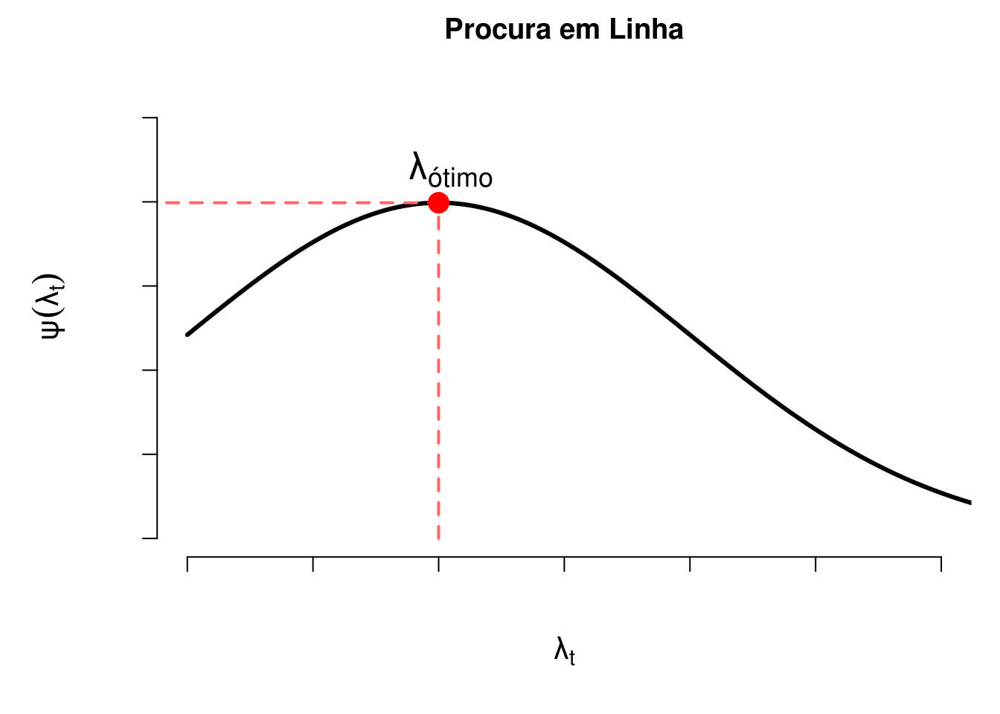

# Tópicos em Estatística Computacional

## Geração de Números Pseudo-Aleatórios

O conteúdo para esse tópico entra-se em PDF e poderá ser acessado [**aqui**](files/computacional.pdf). Em um futuro próximo, essa seção será reescrita e fará parte do corpo deste HTML.

### Método da Transformação Inversa (Caso Discreto)

O método da transformação inversa também poderá ser aplicado também para gerar observações de v.a.'s discretas. Seja $X$ uma v.a. discreta, tal que

$$... < x_{i-1} < x_i < x_{i+1} <\, ...\,.$$
As observações acima são pontos de descontinuidade de $F_X(x)$. Então, a transformação inversa é $F_X^{-1} = x_i$, quando $F_X(x_{i-1}) < u \leq F_X(x_i)$. O algoritmo que segue poderá ser utilizado para gerar observações de $X$.

**Algoritmo**:

  1. Gere um número pseudo-leatório $u$ de uma v.a. $U \sim \mathcal{U}(0,1)$;
  2. Retorne $x_i$ como observação de $X$, tal que $F(x_{i-1}) < u \leq F(x_i)$.

Em outras palavras, gere $u$ de uma v.a. $U \sim \mathcal{U}(0,1)$ e compare na sequência:

  1. Se $u < p_0$, faça $X = x_0$ e pare;
  2. Se $u < p_0 + p_1$, faça $X = x_1$ e pare;
  3. Se $u < p_0 + p_1 + p_2$, faça $X = x_2$ e pare;
  4. etc;
  
em que $p_j = P(X = j)$.

**Exemplo**: Implemente, em R, uma função que retorna a quantidade de observações de uma v.a. $X$ com função de probabilidade:

$$P(X = 1) = 0.3, P(X = 2) = 0.2, P(X = 3) = 0.35, P(X = 4) = 0.15.$$

```r
random <- function(n = 1L){
  x <- 1L:4L
  probs <- c(0.3, 0.2, 0.35, 0.15)
  
  u <- runif(n = n, min = 0, max = 1)
  
  # Criando uma função para ser passada à um funcional.
  comp <- function(u){
    # Retorna a primeira ocorrência de TRUE
    match(TRUE, u < cumsum(probs))
  }
  
  purrr::map_dbl(.x = u, .f = ~ comp(.x))
  
}
set.seed(0)
random(n = 10L)
```

```
##  [1] 4 1 2 3 4 1 4 4 3 3
```

Em um estudo de simulação, poderemos ter interesse em gerar observações equiprováveis, em que a v.a. $X$ assume um número finito de observações, tal forma que:

$$P(X = j) = \frac{1}{n}, \,\, j = 1, 2, \ldots, n.$$
Porém, note que para esse caso, não precisaremos fazer muitas comparações, uma vez que sabemos que $x = j$ quando $u \leq \frac{j-1}{n}$. Sendo assim, tomamos $x = j$ quando $nu \leq j - 1$. 

Note que fazer $x = j$ quando $nu \leq j - 1$ equivale a fazer $x = \mathrm{Int}(nu) + 1$, em que $\mathrm{Int}(\cdot)$ retorna a parte inteira de um número. 

**Exemplo**: Seja $X \sim Bernoulli(p)$, em que $P(X = 0) = 1 - p$ e $P(X = 1) = p$, com $0\leq p \leq 1$. A função `rbernoulli(n = 1L, p)` retorna possíveis observações de $X$.


```r
rbernoulli <- function(n = 1L, p){
  u <- runif(n = n, min = 0, max = 1)
  cond <- (u < 1 - p)
  comp <- function(x){
    ifelse(x < 1 - p, 0L, 1L)
  }
  purrr::map_int(.x = u, .f = ~ comp(.x))
}
set.seed(0) # Fixando uma semente.
n <- 1e4 # Número de observações.
result <- rbernoulli(n = n, p = 0.6) # prob.  de sucesso = 0.6.
# Probabilidade de sucesso aproximada.
sum(result == 1)/n
```

```
## [1] 0.5973
```

### Método da aceitação e rejeição

Em situações em que não podemos fazer uso do método da inversão (impossível obter a função quantílica) e nem conhecemos uma transformação que envolve uma variável aleatória ao qual sebemos gerar observações, poderemos fazer uso do **método a aceitação e rejeição**.

Suponha que $X$ e $Y$ são variáveis aleatórias com função densidade de probabilidade (fdp) ou função de probabilidade (fp) $f$ e $g$, respectivamente. Além disso, suponha que existe uma constante $c$ de tal forma que

$$\frac{f(t)}{g(t)} \leq c,$$
para todo valor de $t$, com $f(t) > 0$. Para utilizar o método a aceitação e rejeição para gerar observações da v.a. $X$, utilizando o algoritmo mais abaixo, antes, encontre uma v.a. $Y$ com pdf ou fp $g$, tal que satisfaça a condição acima.

**Importante**:

\BeginKnitrBlock{rmdimportant}<div class="rmdimportant"><div class=text-justify>
É importante que a v.a. $Y$ escolhida seja de tal forma que você consiga gerar facilmente suas observações. Isso se deve ao fato do método da aceitação e rejeição ser computacionalmente mais intensivo que métodos mais diretos como o método da transformação ou o método da inversão que exige apenas a regração de números pseudo-aleatórios com distribuição uniforme.
</div></div>\EndKnitrBlock{rmdimportant}

**Algoritmo do Método da Aceitação e Rejeição**:

1 - Gere uma observação $y$ proveniente de uma v.a. $Y$ com fdp/fp $g$;

2 - Gere uma observação $u$ de uma v.a. $U\sim \mathcal{U} (0, 1)$;

3 - Se $u < \frac{f(y)}{cg(y)}$ aceite $x = y$; caso contrário rejeite $y$ como observação da v.a. $X$ e volte para o passo anterior.

**Prova**: Consideremos o caso discreto, ou seja, que $X$ e $Y$ são v.a.s com fp's $f$ e $g$, respectivamente. Pelo passo 3 do algoritmo acima, temos que $\{aceitar\} =  \{x = y\} = u < \frac{f(y)}{cg(y)}$. Isto é,

$$P(aceitar | Y = y) = \frac{P(aceitar \cap \{Y = y\})}{g(y)} = \frac{P(U \leq f(y)/cg(y)) \times g(y)}{g(y)} = \frac{f(y)}{cg(y)}.$$
Daí, pelo [**Teorema da Probabilidade Total**](https://pt.wikipedia.org/wiki/Lei_da_probabilidade_total), temos que:

$$P(aceitar) = \sum_y P(aceitar|Y=y)\times P(Y=y) = \sum_y \frac{f(y)}{cg(y)}\times g(y) = \frac{1}{c}.$$
Portanto, pelo método da aceitação e rejeição aceitamos ocorrência de $Y$ como sendo uma ocorrência de $X$ com probabilidade $1/c$. Além disso, pelo Teorema de Bayes, temos que

$$P(Y = y | aceitar) = \frac{P(aceitar|Y = y)\times g(y)}{P(aceitar)} = \frac{[f(y)/cg(y)] \times g(y)}{1/c} = f(y).$$
O resultado logo acima, mostra que aceitar $x = y$ pelo procedimento do algoritmo equivale a aceitar um valor proveniente de $X$ que tem fp $f$. Para o caso contínuo, a demonstração é similar.

**Importante**:

\BeginKnitrBlock{rmdimportant}<div class="rmdimportant"><div class=text-justify>
Perceba que para reduzir o custo computacional do método, deveremos escolher $c$ de tal forma que possamos maximizar $P(aceitar)$. Sendo assim, escolher um valor exageradamente grande da constante $c$ irá reduzir a probabilidade de aceitar uma observação de $Y$ como sendo observação da v.a. $X$.
</div></div>\EndKnitrBlock{rmdimportant}

**Nota**:

\BeginKnitrBlock{rmdnote}<div class="rmdnote"><div class=text-justify>
Computacionalmente, é conveniente considerar $Y$ como sendo uma v.a. com distribuição uniforme no suporte de $f$, uma vez que gerar observações de uma distribuição uniforme é algo simples em qualquer computador. Para o caso discreto, considerar $Y$ com distribuição uniforme discreta poderá ser uma boa alternativa.
</div></div>\EndKnitrBlock{rmdnote}

## Exercício {-}

1. Quais as propriedades de um bom gerador de números pseudo-aleatórios? Disserte sobre cada uma delas.

2. Implemente o gerador **Midsquare** idealizado pelo matemático John von Neumann. Por que o gerador **Midsquare** não é um bom gerador? Explique.

3. Defina matematicamente o gerador congruencial linear. Implemente uma função em R que implementa esse gerador.

4. O gerador **Randu** é definido por $x_{i + 1} = 65539 \times x_i\,\mathrm{mod}\,31$. O **Randu** é um gerador congruencial misto ou multiplicativo?

5. Por que o gerador **Randu** é um dos peiores geradores de números pseudo-aleatório já criado? Explique.

6. Defina um gerador congruencial de período completo para geração de números pseudo-aleatórios com distribuição uniforme no intervalo $(0,1)$

7. Explique o método da transformação para geração de números pseudo aleatório. Apresente um exemplo.

8. Defina o método da inversão para geração de números pseudo-aleatórios. Sempre será possível utilizar esse método? Explique.

9. Implemente uma função para geração de números pseudo-aleatórios com distribuição normal padrão. A função deverá implementar o método de Box-Müller e o método polar. Ao final obtenha um histograma com os números gerados (mil valores) e realize um teste de normalidade. Realize um teste de normalidade.

10. Seja $X$ uma variável aleatória em um espaço de probabilidade $(\Omega, \mathcal{A},\mathcal{P})$ e suponha que $X \sim \mathcal{U}(0,1)$. Obtenha a distribuição de $Y = -\log(X)$.

11. Com base na distribuição da variável aleatória (v.a.) $Y$ do exercício acima, implemente uma função em R que gere observações de $Y$.

12. Conhecendo a distribuição da v.a. $X$, implemente para cada um dos itens que seguem, uma função para geração de observações da v.a. $Y$:

    * $X \sim \mathrm{Exp}(\lambda),$ com $x \geq 0$ e $\lambda > 0$ e  $Y = \sum_{i = 1}^n X_i \sim \Gamma(n, \lambda)$;

    * $X \sim \mathrm{Exp}(\lambda)$, com $x \geq 0$ e $\lambda>0$ e $Y = \mu - \beta\log(\lambda X) \sim \mathrm{Gumbel}(\mu,\beta)$, com $\mu \in \Bbb{R}$ e $\beta>0$;

    * $X \sim \mathcal{U}(0,1)$ (contínua) e $Y = m + s[-\log(X)]^{-1/\alpha} \sim$ Fréchet$(\alpha,s,m)$, com $x, \alpha,s > 0$ e $m \in  \Bbb{R}$.

13. Cite algumas das propriedades do gerador **Mersenne Twister**. Qual o seu período de ocorrência?

14. Explique o algoritmo do método da aceitação e rejeição.

15. Utilizando o método da aceitação e rejeição, implemente uma função que gere valores aleatório provenientes da distribuição da v.a. $X$ tal que

$$P(X = 1) = 0.3, P(X = 2) = 0.2, P(X = 3) = 0.35, P(X = 4) = 0.15.$$

16. Implemente duas funções que geram observações da v.a. $X$ utilizando o método da transformação para v.a. discretas e pelo método da aceitação e rejeição. Qual método é mais eficiente computacionalmente? Por que?

\begin{eqnarray}
P(X = 0) &=& 0.01, P(X = 1) = 0.04, P(X = 2) = 0.12,\nonumber\\
P(X = 3) &=& 0.27, P(X = 4) = 0.44, P(X = 5) = 0.62, \nonumber\\
P(X = 6) &=& 0.76, P(X = 7) = 0.87, P(X = 8) = 0.93, \nonumber\\
P(X = 9) &=& 0.97, P(X = 10) = 0.99, P(X = 11) = 0.99, \nonumber\\
P(X = 12) &=& 1.\nonumber
\end{eqnarray}

17. Implemente a função `rdisc(n = 1L, x, probs)` que retorna números pseudo-aleatórios de uma v.a. discreta $X$ que assume uma quantidade finita de observações. Os argumentos de `rdisc` estão especificados abaixo:
  
    * `n`: número de observações a serem geradas;
    
    * `x`: vetor com as possíveis observações da v.a. $X$;
    
    * `probs`: vetor com as probabilidades das observações passadas à `x`.
  
18. Implemente uma função para o método da aceitação e rejeição (`ar_fp(n, x, prob)`), para o caso em que deseja-se gerar observações de uma v.a. $X$ discreta. O argumento `n` refere-se à quantidade de observações a serem geradas, `x` é um vetor de valores assumidos por $X$ e `prob` é um vetor de probabilidades de cada observação de $X$. A função `ar_fp(n, x, prob)` deverá escolher um valor adequado para $c$.

19. Seja $X$ uma v.a. contínua com fdp $f(x) = 6x(x-1)$, com $0 < x < 1$. Implemente a função `rf(n, c = 1.5)` que gera números pseudo-aleatórios como observações de $X$, pelo método da aceitação e rejeição, em que `n` é a quantidade de números a serem gerados e `c` é o valor da constante (0.5 por padrão) no algoritmo do método da aceitação e rejeição. **Dica**: considere $Y \sim \mathcal{U}(0,1)$.

<!-- rf <- function(n = 1L, c = 6){ -->
<!--   f <- function(x) 6 * x * (1 - x) -->
<!--   i <- 1L -->
<!--   n_rejeicao <- 0L -->
<!--   vetor <- numeric(n) -->
<!--   while (i < n){ -->
<!--     u <- runif(n = 1L, min = 0, max = 1) -->
<!--     y <- runif(n = 1L, min = 0, max = 1) -->
<!--     if (u <= f(y)/c){ -->
<!--       vetor[i] <- y -->
<!--       i <- i + 1L -->
<!--     }  -->
<!--     else{ -->
<!--       n_rejeicao <- n_rejeicao + 1L -->
<!--     } -->
<!--   } -->

<!--   list(valores = vetor, rejeicao = n_rejeicao) -->
<!-- } -->

<!-- set.seed(0) -->
<!-- n <- 2e4 -->
<!-- c <- 20 -->
<!-- result <- rf(n = n, c = c) -->

<!-- # Probabilidade de aceitar: -->
<!-- 1/c -->

<!-- # Aproximacao da probabilidade de aceitar: -->
<!-- 1 - result$rejeicao/(n + result$rejeicao) -->

20. Considerando a função `rf(n, c)` implementada no exercício anterior, quantos passos serão necessários para que possamos gerar 10 mil observações proveniente da distribuição de $X$, considerando `c = 6`? Respectivamente, quantos passos serão necessários para serem gerados a mesma quantidade de observações de $X$ considerando `c = 0.5`? **Dica**: antes de chamar a função implementada, fixe a semente fazendo `set.seed(0)`.

## Otimização Não-Linear

Na estatísticas, em muitas simtuações práticas, temos o interesse de maximizar ou minimizar uma função objetivo. Por exemplo, na inferência esatística, é comum o nosso interesse na obtenção dos estimadores de máxima verossimilhança de parâmetros que indexam modelos ou distribuições de probabilidade. Um outro problema comum na estatística, mais precisamente na área de regressão é o de minimizar a soma dos quadrados de um conjunto de erros, em um modelo de regressão não-linear, por meio de mínimos quadrados não-lineares.

**Nota**:

\BeginKnitrBlock{rmdnote}<div class="rmdnote"><div class=text-justify>
Aqui, o termo **otimizar** estará se referindo à **minimiar** ou **maximizar** uma função objetivo. Dessa forma, por meio do contexto em que o termo esteja sendo utilizado, a ideia estará implícita. Além disso, por uma simples modificação na função objetivo, um algoritmo utilizado para maximizar uma função poderá ser convertido em um algoritmo para minimização de uma função.
</div></div>\EndKnitrBlock{rmdnote}

Suponha que temos interesse em maximizar uma função objetivo, seja ela $\psi(\pmb{\Theta}): \pmb{\Theta} \rightarrow  \mathbb{R}$, em que $\pmb{\Theta}$ é um subspaço do $\mathbb{R}^p$. Dessa forma, queremos encontrar o vetor $\pmb{\theta}$ ($p \times 1$) que maximiza a função objetivo $\psi(\cdot)$. Ou seja, queremos encontar

$$ \underset{\pmb{\theta}\, \in\, \pmb{\Theta}}{\mathrm{arg\,max}}\,\psi(\pmb{\theta}).$$

A maioria das situações práticas nos levam à problemas com a condição de primeira ordem,

$$\frac{\partial\,\psi(\pmb{\theta})}{\partial\,\pmb{\theta}} = \pmb{0},$$

resulta em um sistema de equações não-lineares que não apresenta solução em forma fechada. Nesses casos, a solução do problema de minimizar $\psi(\pmb{\theta})$ é obtida utilizando-se de métodos/algoritmos iterativos. 

### Metódos Gradiente

A classe de métodos mais utilizadas em situações em que a condição de primeira ordem resulta em um sistema não-lineare que não possue forma fechada é denominada de **classe de métodos gradiente**. Nessa classe de métodos, a atualização de $\pmb{\theta}$ para um vetor que mais se aproxima do ponto que minimiza $\pmb\psi(\cdot)$ (função objetivo) é dada de forma iterativa. Dessa forma, seja $\pmb{\theta}_0$ o ponto inicial (chute inicial) na $t$-ésima iteração. Se o valor de $\pmb{\theta}$ que maximiza globalmente a função $\psi(\cdot)$ não tiver sido alcançado, calcula-se o vetor direcional (vetor gradiente) de $\psi(\cdot)$, denotado aqui por $\pmb\Delta_t$ ($p \times 1$) e o "tamanho do passo" $\lambda_t$. Assim, o próximo valor de $\pmb\theta$ será atualizado para:

$$\pmb\theta_{t+1} = \pmb\theta_t + \lambda_t \pmb \Delta_t.$$

**Importante**:

\BeginKnitrBlock{rmdimportant}<div class="rmdimportant"><div class=text-justify>
O vetor gradiente fornece a direção e o sentido de deslocamento, apartir de um ponto especificado, de subida que fornece um incremento em uma grandeza. No nosso caso, $\pmb\Delta_t$ ($p \times 1$) irá indicar o sentido de subida, em que poderemos atualizar o valor de $\pmb \theta$ para um ponto que maximiza $\psi(\cdot)$. Dessa forma, $-\pmb\Delta_t$ fornecerá a direção e o sentido de atualização de $\pmb\theta$ que nos levam à pontos que minimizam $\psi(\cdot)$.
</div></div>\EndKnitrBlock{rmdimportant}

Note também que, em cada iteração do algoritmo, temos $\pmb \theta_t$ e $\pmb \Delta_t$ são conhecidos, uma vez que $\pmb \theta_t$ é o ponto $\pmb \theta$ atualizado na iteração $t-1$ e $\pmb \Delta_t$ é o vetor gradiente da função objetivo avaliado em $\pmb \theta_t$. 

Dado o conhecimento dessas quantidade, perceba que precisamos obter o "tamanho do passo" $\lambda_t$. Assim, iremos recair em um problema de otimização secundário, denominado de **procura em linha**. Sendo assim, busca-se $\lambda_t$ de tal forma que

$$\frac{\partial \pmb\,\psi(\pmb \theta_t + \lambda_t\pmb\Delta_t)}{\partial \lambda_t} = \delta(\pmb \theta_t + \lambda_t\pmb\Delta_t)^{'}\pmb \Delta_t = 0,$$
em que  $\delta(\pmb \theta_t + \lambda_t\pmb\Delta_t)^{'}$ é o vetor gradiente tansposto ($1 \times p$) da função objetivo avaliado no ponto $\pmb \theta_t + \lambda_t\pmb\Delta_t.$    

<div class="figure" style="text-align: center">

<p class="caption">(\#fig:unnamed-chunk-8)Poblema de **procura em linha**, em que a função objetivo é função penas do tamanho do passo.</p>
</div>


**Observação**:

\BeginKnitrBlock{rmdobservation}<div class="rmdobservation"><div class=text-justify>
É importante observar que o processo de busca em linha em um algoritmo de otimização não-linear tornará esse algoritmo computacionalmente intensivo. Dessa forma, muitos algoritmos adotam um conjunto de regras *ad hoc* que são computacionalmente menos custosas. Essa classe de algoritmos é o que demominamos de **classe de métodos gradiente**.
</div></div>\EndKnitrBlock{rmdobservation}

Na classe de métodos gradiente, fazemos

$$\pmb \Delta_t = M_t\delta_t,$$
em que $M_t$ ($p \times p$) é uma matriz positiva-definida e $\delta_t$ ($p \times 1$) é o gradiente de $\pmb\psi$, ambos na $t$-ésima iteração. Para deixar claro, temos que $\delta_t$ = $\delta_t(\pmb \theta_t) = \partial \, \psi(\pmb \theta_t)/\partial\, \pmb \theta_t$. 

A motivação por trás dos métodos gradientes, ao em tomar $\pmb \Delta_t = M_t\delta_t$, poderá ser entendida ao considerar uma aproximação para $\psi(\pmb \theta_t + \lambda_t\pmb\Delta_t)$ por uma [**série de Taylor**](https://pt.wikipedia.org/wiki/S%C3%A9rie_de_Taylor) de primeira ordem, em torno do ponto $\lambda_t = 0$. Assim, temos que,

$$\psi(\pmb \theta_t + \lambda_t\pmb\Delta_t) \approx \psi(\pmb \theta_t) + \lambda_t \delta_t^{'}\pmb \Delta_t,$$
em que $\delta_t^{'}$ é o vetor gradiente transposto ($1 \times p$). Para reduzir a notação, tome $\psi(\pmb \theta_t + \lambda_t\pmb\Delta_t) = \psi_{t+1}$. Assim, temos que 

$$\psi_{t+1} - \psi_{t} \approx \lambda_t \delta_t^{'}\pmb \Delta_t.$$

Assim, considerando $\pmb \Delta_t = M_t\delta_t$, temos que

$$\psi_{t+1} - \psi_{t} \approx \lambda_t \delta_t^{'}M_t\delta_t.$$

Para $\delta_t$ diferente de zero e $\lambda_t$ suficientemente pequeno, se $\psi(\pmb\theta)$ não assume o valor máximo da função, podemos sempre encontrar um tamanho de passo tal que uma iteração adicional no algoritmo irá incrementar o valor da função, ou seja, se aproximará um pouco mais do máximo global da função objetivo.

Perceba que sempre temos que $\psi_{t+1} - \psi_{t} \geq 0$. Isso sempre será verdade, uma vez que $M_t$ é uma matriz positiva-definida, o que implica que $\delta_t^{'}M_t\delta_t > 0$. Além disso, na situação de $\psi(\pmb\theta)$ não encontar-se no ponto máximo, como mencionado no parágrafo anterior, sempre haverá um tamanho de passo $\lambda_t$, por menor que ele seja.

#### Steepest Ascent

O algoritmo **steepest ascent** ("subida mais inclinada") é o mais simples dos métodos gradientes. A ideia do algoritmo **steepest ascent** é considerar 

$$M_t = I,$$
em que $I$ é a matriz identidade ($p \times p$). Dessa forma, temos que $\pmb \Delta_t = \delta_t$, em todos os passos iterativos. Daí, a atualização de $\pmb \theta$ é dada por:

$$\pmb \theta_{t+1} = \theta + \lambda_t\delta_t.$$

**Nota**:

\BeginKnitrBlock{rmdnote}<div class="rmdnote"><div class=text-justify>
Esse algoritmo tende a ser pouco utilizado na prática, uma vez que apresenta convergência lenta. Esse método é muito semelhante ao algoritmo gradiente descendente [**steepest descent**](https://en.wikipedia.org/wiki/Gradient_descent), utilizado para minimização. Não confunda **steepest descent** citado aqui com um método de aproximação de integrais que leva o mesmo nome.
</div></div>\EndKnitrBlock{rmdnote}

#### Newton-Raphson

O método de **Newton-Raphson**, muitas vezes apenas chamado de método de **Newton**, considera a atualização de $\pmb \theta$ na forma 

$$\pmb \theta_{t+1} = \pmb \theta_t -H_t^{-1}\delta_t,$$
em que 

$$H = H(\theta) = \frac{\partial^2 \psi(\pmb \theta)}{\partial \pmb \theta \partial \pmb \theta^{'}},$$
ou seja, temos que $H$ é a matriz [**hessiana**](https://pt.wikipedia.org/wiki/Hessiano). No método de **Newton-Rapshon**, temos que $\lambda_t = 1$ e $M_t = -H_t^{-1}$, em todas iterações.

**Observação**:

\BeginKnitrBlock{rmdobservation}<div class="rmdobservation"><div class=text-justify>
A matriz hessiana nos permite identificar a concavidade de uma função multiparamétrica, desde que estas sejam duplamente diferenciável. Em um problema de maximização de uma função objetivo, temos que a matriz hessiana é negativa definida em uma região muito próxima ao ponto que maximiza a função. Dessa forma, $-H^{-1}$ é uma matriz positiva definida na mesma região, isto é, se $\pmb a$ é um vetor qualquer ($p \times 1$) e $H^{-1}$ é uma matriz ($p \times p$), então $-\pmb a^{'} H^{-1} \pmb a < 0$. 

Seja $H$ uma matriz hessiana como apresentada acima. Abaixo estão listadas algumas propriedades da de $H$. Dessa forma,  Então

   * $\pmb a^{'} H \pmb a > 0$ (positiva-definida): A função é estritamente convexa;
   
   * $\pmb a^{'} H \pmb a < 0$ (negativa-definida): A função é estritiamente concava. Essa é a propriedade que estamos considerando, visto que estamos em um problema de maximização de uma função objetivo;
   
   * $\pmb a^{'} H \pmb a \geq 0$ (positiva-definida): A função é parcialmente convexa;

   * $\pmb a^{'} H \pmb a \leq 0$ (positiva-definida): A função é parcialmente concava;
   
   * $H$ é uma matriz simétrica;
   
   * A inversa de uma matriz positiva-definida é também uma matriz positiva-definida;
   
   * Você poderá entender a matriz hessiana como a primeira derivada do vetor gradiente da função objetivo.
</div></div>\EndKnitrBlock{rmdobservation}

O método de **Newton-Raphson** normalmente é utilizado para encontar os zeros de uma função. Quando aplicado sobre a condição de primeira ordem, o método de **Newton-Raphson** nos conduzirá aos pontos críticos da função. Como fazemos uso do vetor gradiente, estaremos sempre a caminhar para os pontos de máximo de $\psi(\cdot)$. Dessa forma, os pontos críticos são os pontos de máximo da função objetivo.

Para que possamos entender melhor a ideia do método, considere uma [**expansão de Taylor**](https://pt.wikipedia.org/wiki/S%C3%A9rie_de_Taylor) da condição de primeira ordem em torno de um ponto qualquer $\pmb \theta_0$. Assim, temos que 

$$\frac{\partial\,\psi(\pmb \theta)}{\partial\, \pmb \theta} \approx f(\pmb \theta_0) + H(\pmb \theta_0) (\pmb \theta - \pmb\theta_0).$$

Resolvendo o sistema para $\pmb\theta$ e fazendo $\pmb \theta = \pmb \theta_{t+1}$ e $\pmb \theta_0 = \pmb \theta_t$, obteremos o esquema iterativo do algoritmo apresentado ascima.

A forma mais usual do algoritmo de **Newton-Rapshon** introduz o mecanismo de "procura em linha". Dessa forma, o esquema iterativo é dada por 

$$\pmb \theta_{t+1} = \pmb \theta_t -\lambda_tH_t^{-1}\delta_t.$$
**Nota**:

\BeginKnitrBlock{rmdnote}<div class="rmdnote"><div class=text-justify>
O método de **Newton-Raphson** apesar de funcionar bem em diversas situações, poderá fornecer estimativas ruins em alguns casos. Por exemplo, um problema comum é quando $\pmb \theta_t$ é um ponto distante do ponto que maximiza $\psi(\cdot)$, uma vez que nesses pontos, a matriz $M_t = -H^{-1}$ pode não ser positiva-definida.
</div></div>\EndKnitrBlock{rmdnote}

#### BHHH

O método **BHHH** (**B**erndt-**H**all-**H**all-**H**ausman), foi proposto no artigo Berndt, E. R., Hall, B. H., Hall, R. E., & Hausman, J. A. (1974). **Estimation and inference in nonlinear structural models**. In Annals of Economic and Social Measurement, Volume 3, p. 653-665. O método é muito semelhante ao método de Newton-Raphson, com a diferença que trocamos a matriz $H_t$ pelo auto produto dos vetores gradientes $\delta_t\delta_t^{'}$

**Nota**:

\BeginKnitrBlock{rmdnote}<div class="rmdnote"><div class=text-justify>
A vantagem do método **BHHH** está no fato de não necessitarmos calcular segundas derivadas. Trata-se de um método muito utilizado em aplicações ecnonométricas. O método **BHHH** poderá enfrentar o mesmo problema de convergência que o método de **Newton-Raphson**. 
</div></div>\EndKnitrBlock{rmdnote}

#### Métodos quasi-Newton

A classe de algoritmos quasi-Newton é composta por algoritmos que são bastante eficientes do ponto de vista de convergência e também do ponto de vista computacional, visto que esses algoritmos não requerem o cálculo de segundas derivadas. Nessa classe de algoritmos, é utilizado uma sequência de matrizes tal que

$$M_{t+1} = M_{t} + N_t,$$
sendo $N_t$ uma matriz positiva-definida. Assim, se $M_0$ é positiva-definida, $M_t$ na $t$-ésima iteração sempre será positiva-definida. A ideia básica desses métodos é construir uma aproximação para $-H(\pmb \theta)^{-1}$, de tal forma que 

$$\lim_{t \to \infty} M_t = -H^{-1}.$$

Há diversos algoritmos que pertencem à classe de métodos quasi-Newton. Por exemplo, o método **DFP** (**D**avidon, **F**letcher e **P**owell) atualiza $M_{t+1}$ fazendo


$$M_{t+1} = M_{t} + \frac{\pmb \gamma_t \pmb \gamma_t^{'}}{\pmb \gamma_t^{'}\kappa_t} + \frac{M_t\kappa_t\kappa_t^{'}M_t}{\kappa_t^{'}M_t\pmb \gamma_t},$$

em que $\pmb \gamma_t = \pmb \theta_{t+1} - \pmb \theta_t$ (diferença de pontos) e $\kappa_t = \delta(\pmb \theta_{t+1}) - \delta(\pmb \theta_t)$ (diferenças de gradientes avaliados em pontos). 

O algoritmo quasi-Newton mais utilizado é o **BFGS** (**B**royden-**F**letcher-**G**oldfarb-**S**hanno). O algoritmo **BFGS** tem a atualização semelhante ao **DFP**, com a diferença que é subtraído o termo $a_tb_tb_t^{'}$, em que $a_t =  \kappa_t^{'}M_t\kappa_t$ e 

$$b_t = \frac{\pmb\gamma_t}{\pmb\gamma_t^{'}\kappa_t} - \frac{M_t\kappa_t}{\kappa_t^{'}M_t \kappa_t}.$$

Sendo assim, temos que no método **BFGS**, a atualização de $M_t$ de dará por:

$$M_{t+1} = M_{t} + \frac{\pmb \gamma_t \pmb \gamma_t^{'}}{\pmb \gamma_t^{'}\kappa_t} + \frac{M_t\kappa_t\kappa_t^{'}M_t}{\kappa_t^{'}M_t\pmb \gamma_t} - a_tb_tb_t^{'}.$$

**Nota**:

\BeginKnitrBlock{rmdnote}<div class="rmdnote"><div class=text-justify>
O termo quasi-Newton é empregado para se referir ao fato de que esses métodos não fazem uso da matriz hessiana. Porém, esses métodos utilizam uma apriximação iterativa de uma matriz $M_t$ que converge para a matriz de segundas derivadas. Dessa forma, não entenda o termo quasi-Newton como se esses métodos fossem inferiores aos métodos de **Newton-Raphson**. Na verdade, os métodos quasi-Newton normalmente apresentam desempenho superior.
</div></div>\EndKnitrBlock{rmdnote}

## Exercício {-}

1. Defina matematicamente o método gradiente para maximização de uma função $\psi(\pmb{\Theta}): \pmb{\Theta} \rightarrow  \mathbb{R}$, em que $\pmb{\Theta}$ é um subespaço do $\mathbb{R}^p$.

2. Qual a desvantagem do uso do processo de busca em linha em algoritmos de otimização não-linear?

3. Defina os métodos quasi-Newton e o que os diferenciam dos de Newton? Qual as vantagens que a maioria desses métodos apresentam com relação aos métodos de Newton?

4. Enuncie os métodos **Steepest Ascent**, **Newton-Raphson** e **BHHH**. Esses são métodos de Newton ou quasi-Newton? Explique.

