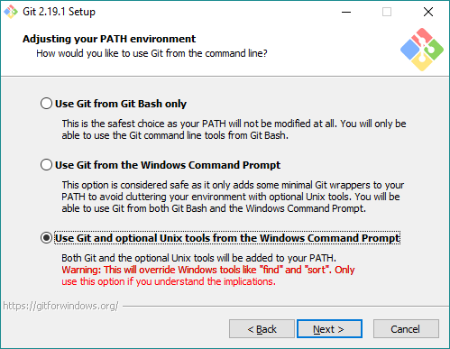
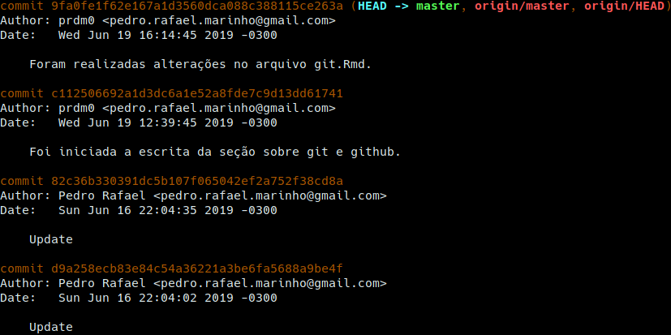

# Versionamento de código

```{r echo=FALSE, out.width='65%', fig.align = "center"}
knitr::include_graphics("images/versoes_git.png")
```

Na estatística, bem como em diversas outras áreas, a todo momento estamos editando documentos, como por exemplo, códigos de programação, artigos, relatórios, aulas, apresentações, livros, dentre inúmeros outros possíveis. Nesses processos de edições dos mais variádos documentos, quase sempre sentimos a necessidade de versionar as alterações, uma vez que se não houver um versionamento e se desejarmos voltar à um estado de edição anterior, estariamos sobre uma tarefa extremamente difícil ou mesmo impossível, a depender do número de passos anteriores ao qual desejamos voltar.

Quando não dominamos nenhum sistema de controle de versão, normalmente o que fazemos para ter a possibilidade de voltar para uma dada versão de edição é armazenar diversas cópias do projeto em diretórios distintos. Versionar dessa forma pode servir quando temos poucas versões, porém, mesmo assim, é comum os desarranjos e atrapalhos no gerenciamento de diversos diretórios. Quando há o domínio de um sistema de controle de versão evitamos esse tipo de problema, uma vez que continuaremos trabalhando sobre um mesmo diretório que terá seus estados modificados quando solicitado, isto é, será possível voltar para a distribuição de arquivos e conteúdos anteriores, mesmo se nesse processo de edição alguns arquivos foram deletados, renomeados ou fortemente modificados.


**Importante**:

```{block2, type='rmdimportant'}
<div class=text-justify>
Não se preocupe se você voltar à estados anteriores e desistir. Você poderá retornar à estados mais recentes (incluindo o último) sem nenhum problema. **Deixe o trabalho sujo com o sistema de versionamento**.  

Além disso, para nós estatísticos que vivemos codificando e constantemente alterando códigos de programação, versionar de forma eficiente é algo crucial.
</div>
```

## Git

Visando ajudar o desenvolvedor na tarefa de versionamento de projetos/códigos, a ferramenta [**git**](https://git-scm.com/) foi desenvolvida, escrita utilizando a linguagem C, por [**Linus Torvalds**](images/linus_torvalds.jpg) (criador do Linux) e atualmente mantido por [**Jun Hamano**](images/ju_hamano.jpeg), um engenheiro de sofware japonês. No [**git**](https://git-scm.com/), cada diretório de trabalho é um repositório com histórico completo das versões e não depende de acesso à um servidor ou rede central. Essa é uma das características que torna o git uma ferramenta rápida, além, é claro, de ser escrito em C, que reduz a sobrecarga de tempos de execução que é algo normalmente comum em linguagens de nível superior.

Inicialmente essa ferramenta visava ajudar os desenvolvedores do kernel do Linux na tarefa de versionar, de forma eficiente, as mudanças no kernel que antes eram versionadas por meio do [**BitKeeper**](http://www.bitkeeper.org/), um software proprietário desenvolvido pela  BitMover Inc, Califórnia. Isso era um dilema entre os desenvolvedores do Linux, uma vez que ao contrário do [**BitKeeper**](http://www.bitkeeper.org/), o Linux é conhecido por suas [**iniciativas Open Source**](https://opensource.org/). À época, o projeto Linux tinha acesso gratuito ao [**BitKeeper**](http://www.bitkeeper.org/). Porém, com a acusação de programadores do kernel Linux estarem utilizando engenharia reversa, o acesso gratuito foi removido. Esse foi o fato que forçou Linus Torvalds a desenvolver o git.


Além do git, atualmente existem algumas ferramentas para versionamento de códigos. Entre tais ferramentas, enumero duas que considero as mais conhecidas:

1. [**mercurial**](https://www.mercurial-scm.org): Trata-se de um sistema de versionamento, assim como o git, com [**iniciativas Open Source**](https://opensource.org/). Na internet é fácil encontrar diversos comparativos, em que muitos usuários citam como uma de suas vantagens a facilidade. O [**mercurial**](https://www.mercurial-scm.org) é o sistema de versionamento mais popular no [**Bitbucket**](https://bitbucket.org/product/), uma plataforma de hospedagem de código fonte que não é tão utilizada quanto o [**GitHub**](https://github.com/) e o [**GitLab**](https://about.gitlab.com/); 
  
2. [**subversion**](http://subversion.apache.org/): Trata-se de um sistema de versionamento distribuido sobre os termos da [**Apache License**](https://pt.wikipedia.org/wiki/Licen%C3%A7a_Apache) e que foi desenvolvido pela [**Apache Software Foundation**](https://pt.wikipedia.org/wiki/Apache_Software_Foundation). Assim como o [**mercurial**](https://www.mercurial-scm.org), o [**subversion**](http://subversion.apache.org/) não é tão popular quanto o [**git**](https://git-scm.com/).


Por se tratar do sistema de versionamento mais amplamente utilizado (mais popular) em versionamentos locais e remotos (a exemplo do [**GitHub**](https://github.com/) e [**GitLab**](https://about.gitlab.com/) que são plataformas de hospedagem de código, em que é possível facilmente enviar códigos versionados usando git), trataremos  apenas do uso do [**git**](https://git-scm.com/).

**Nota**:

```{block2, type='rmdnote'}
<div class=text-justify>
A ferramenta [**git**](https://git-scm.com/) poderá ser facilmente instalada em Linux/Unix, Windows e macOS. Clique [**aqui**](https://git-scm.com/downloads) e faça o download da versão desejada e instale em seu sistema operacional. Há diversos vídeos na internet ensinando a configurar o [**git**](https://git-scm.com/) em sistemas Windows. 
</div>
```

Após a instalação do [**git**](https://git-scm.com/) em seu sistema operacional, abaixo listarei algumas funções interessantes para o uso do [**git**](https://git-scm.com/) via o prompt de comando (terminal). O terminal ao qual você deverá trabalhar com o git é algo parecido com as imagens abaixo:

```{r, echo=FALSE, fig.height = 3, fig.width = 8, fig.align='center', warning = FALSE, message = FALSE, error = FALSE, fig.show = 'hold',  fig.cap = 'A imagem mais a esquerda refere-se ao terminal bash no linux e a mais a direita refere-se terminal bash instalado no Windows para o uso do git. Essas imagens são meramente ilustrativas e poderão variar um pouco a depender do sitema operacional.'}
library(cowplot)
library(ggplot2)
linux <- ggdraw() + draw_image("images/terminal_linux_git.png", scale = 0.9) + draw_label("No Linux", colour = rgb(1,1,1))
windows <- ggdraw() + draw_image("images/terminal_windows_git.png", scale = 0.85) + draw_label("No Windows", colour = rgb(1,1,1))
plot_grid(linux,windows)
```

**Observação**:

```{block2, type='rmdobservation'}
<div class=text-justify>
  
Para usuários de sistemas operacionais baseados em Arch Linux, por exemplo, usuários do [**Manjaro Linux**](https://manjaro.org/), a instalação do [**git**](https://git-scm.com/) é bastante fácil. No terminal do Linux, basta fazer: </br></br>


`sudo pacman -S git`
  
Caso você tenha optado em utilizar alguma distribuição GNU/Linux que não é derivada do Arch, muito provavelmente você não seguiu as considerações da distribuição Linux sugeridas na Seção [**Algumas distribuições**][Algumas distribuições], em que sugiro o uso do [**Manjaro Linux**](https://manjaro.org/) ou de distribuições GNU/Linux derivadas do [**Arch**](https://www.archlinux.org/). Dessa forma, busque na distribuição GNU/Linux escolhida o comando para a instalação do [**git**](https://git-scm.com/).

> **Nota**: Se você está utilizando alguma distribuição GNU/Linux baseada em Debian/Ubuntu, você poderá instalar o [**git**](https://git-scm.com/) fazendo `sud apt-get install git`. Outros a respetio da instalação do git poderão ser encontrados [**aqui**](https://git-scm.com/book/pt-br/v2/Come%C3%A7ando-Instalando-o-Git).

No Linux, o [**terminal bach**](https://pt.wikipedia.org/wiki/Bash), que é instalado por padrão, será o terminal que utilizaremos o [**git**](https://git-scm.com/). Não há nenhuma necessidade de utilização de termais complementares. No [**terminal bach**](https://pt.wikipedia.org/wiki/Bash), para facilitar, você pode chamar simplesmente de "terminal do linux" é onde configuramos o sistema operacional, instalamos programas, removemos programas, programamos, compilamos, **utilizamos o git**, etc. É incrível a flexibilidade e a quantidade de coisas que podemos fazer no terminal do Linux.

Usuários do sistema operacional Windows poderão instalar facilmente o [**git**](https://git-scm.com/) considerando o executável fornecido [**aqui**](https://gitforwindows.org/index.html). Se o seu sistema for 64 bits, vá ao final da página e faça o download do arquivo **Git-x-64-bit.exe**, em que **x** dá lugar a versão do [**git**](https://git-scm.com/).

Para esses usuários, durante o processo de instalação, no passo ***Adjusting your PATH environment***, é importante selecionar a última opção, conforme a imagem abaixo: 

```{r echo=FALSE, out.width='55%', fig.align = "center"}

```

Após a instalação do [**git**](https://git-scm.com/), em seu sistema operacional, abra o terminal e execute o comando `git --version`. Em caso de retorno da versão instalada do [**git**](https://git-scm.com/), muito provavelmente a instalação ocorreu corretamente.
</div>


Após instalar corretamente o git, a primeira coisa que você precisa fazer é configurar o seu nome de usuário e endereço de e-mail. Isso é de grande importância, uma vez que cada ***commit*** (compromentimento), a informação do usuário que fez alguma atualização do documento/projeto é utilizada. Ou seja, trata-se de uma espécie de "carimbar" o autor da modificação. Sendo assim, no terminal, faça:

```
git config --global user.name "seu nome ou sigla"
git config --global user.email seu_email
```


**Nota**:

```{block2, type='rmdnote'}
<div class=text-justify>
A configuração acima só precisará ser realiazada uma única vez, uma vez que foi utilizado a opção `--global` no momento de definir o usuário e senha. Além disso, você sempre poderá realizar essas configurações, sem a necessidade de instalar novamente o git, caso deseje trocar o nome do usuário e e-mail utilizado.
</div>
```

Após instalar e configurar corretamente o [**git**](https://git-scm.com/) em seu sistema operacional, considere os comandos enumerados adiante. Esses comandos devem ser realizados no diretório ao qual queremos versionar com o [**git**](https://git-scm.com/). Dessa forma, você deverá, no terminal estar no diretório a ser versionado. 

**Importante**:

```{block2, type='rmdimportant'}
<div class=text-justify>
Os comandos `cd`, `cd ..`, `ls`, `cp`, `mkdir`, `rm` e `mv` são comandos úteis do terminal de linux e que normalmente precisamos deles quando estamos trabalhando com o [**git**](https://git-scm.com/). Muito provavelmente, esses comandos serão reconhecidos no terminal do git quando instalado no Windows. **Esses comandos foram apresentados em sala de aula**.
</div>
```
  

**Comando úteis do git**:  
  
  1. `git help <verbo>`: Esse é o comando mais importante do [**git**](https://git-scm.com/). Com ele você encontrará informações a respeito de um `<verbo>`, em que `<verbo>` deverá ser substituído por um comando [**git**](https://git-scm.com/) válido. Por exemplo, faça `git help help` para obter informações sobre o comando `help` de [**git**](https://git-scm.com/). Outras variantes de `git help <verbo>` pode ser:
      
      * `git <verbo> --help` 
    
      * `man git-<verbo>`


  2. `git --version`: Como mencionado anteriormente, esse comando retornará a versão do git que encontra-se instalada no seu sistema operacional.

  2. `git config --list`: Esse comando lista as configurações do git que você está utilizando, ou seja, retornará o nome do usuário e e-mail que você configurou ao final da insatalação do git.

  3. `git config --global core.excludesfile .gitignore`: O arquivo **.gitignore** trata-se de um arquivo oculto (inicia-se com um ponto) e normalmente é colocado no diretório ao qual estamos querendo versionar. Dentro desse arquivo colocamos os nomes dos arquivos do diretório que estamos versionando e que desejamos não considerar no versionamento. O conteúdo desse arquivo de nome **.gitignore** poderia ser algo como:
  
      ```{git},
      codigo1.R
      codigo2.cpp
      .diretorioOculto
      .ArquivoOculto.Rmd
      meulivro.pdf
      figura.png
      ```
      Com o arquivo **.gitignore** acima estaríamos dizendo para o git ingnorar um código R de nome **codigo1.R**, um código em C++ de nome **codigo2.cpp**, o diretório oculto de nome **.diretórioOculto**, um arquivo oculto R Markdown de nome **.ArquivoOculto.Rmd**, um livro em formato PDF de nome **meulivro.pdf** e uma figura no formato png de nome **figura.png**.
      
      **Nota**: 
      
      ```{block2, type='rmdnote'}
      <div class=text-justify>
      Normalmente não utilizamos o comando `git config --global core.excludesfile .gitignore`, uma vez que esse comando irá sempre ignorar do versionamento qualquer um desses arquivos/diretórios que encontram-se listado em **.gitignore**. Algo mais útil seria apenas criar o arquivo **.gitignore** com a lista de diretórios e arquivos ao qual queremos desconsiderar no versionamento do nosso projeto.
      </div>
      ```

  3. `git init`: No terminal, no diretório ao qual se quer versionar, esse comanto irá inicializar o versionamento do repositório. Por exemplo, o código abaixo mostra que estamos versionando o repositório de nome **DocVersionado**:
  
      ```
      cd /home/usuario/DocVersionado
      git init
      ```

  4. `git status`: verifica o status das modificações dos arquivos e diretórios no interior de **DocVersionado**. Serão listados os arquivos que foram modificados, deletados e acrescentados no projeto.
  
  5. `git add .`: adiciona todas as modificações que foram realizadas no ***Working Directory*** na ***Staging Area***. 
  
  6. `git commit -m "comentário útil"`:  Ao utilizar o comando `git add .`, as modificações ainda não foram versionadas, ou seja, não foram adicionadas no ***Git Directory***. Para que as modificações adocionadas na ***Staging Area*** sejam versionadas, será preciso utilizar o comando `git commit -m "comentário útil"`, em que `"comentário útil"`, como o próprio nome diz, é um comentário útil a respeito das modificações realizadas no projeto.

      ```{block2, type='rmdnote'}
      <div class=text-justify>
      Cada ***commit*** realizado é internamente identificado por uma chave. Será por meio dessa chave que conseguiremos retroagir ou progredir no histórico do versionamento do nosso projeto.
      </div>
      ```
  
  7. `git log`: exibe os históricos com todas as modificações realizadas, comentários dos ***commits*** realizados, as chaves de cada ***commit***, horário da realização da introdução das modificações e informações do usuário que realizou as alterações. Algo parecido com a imagem abaixo:
  
      ```{r echo=FALSE, out.width='75%', fig.align = "center"}
      
      ```
  
  8. `git log --stat`: trás informações detalhadas das modificações realizadas em todos os arquivos e diretórios versionados dentro de um projeto. Com esse comando é possível inclusive ver a quantidade de alterações (deleções e inserções).
  

  9. `git log --pretty=oneline`: retorna informações resumidas de todos os ***commits*** realizados. Na maioria das vezes é o comnando mais utilizado para obter as chaves a chave de um dado ***commit***, uma vez que não desejamos poluir o terminal com informações que muitas vezes podem ser desnecessárias. Você poderá utiliar o comando `clear` ou as teclas de atalho **Ctrl + L** para limpar o terminal. A imagem abaixo mostra cada ***commit*** em uma linha (chave e comentário):
  
      ```{r echo=FALSE, out.width='85%', fig.align = "center"}
      knitr::include_graphics("images/figura_commit_resumido.png")
      ```
  
  10. `git checkout chave`: modifica o projeto para o estado do ***commit*** referente à chave fornecida. Se deserjarmos voltar ao último ***commit***, devemos fazer `git checkout master`. As chaves poderão ser fornecidas utilizando as diferentes variações do comando `git log` paresentadas acima. 

</br></br>

**(OUTROS DETALHES FORAM ABORDADOS EM AULA)**

## GitHub

**(CONTEÚDO ABORDADO EM AULA)**

