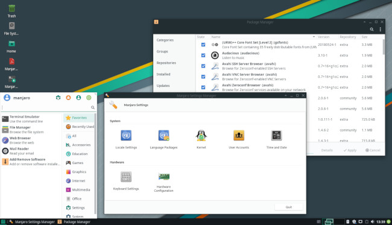
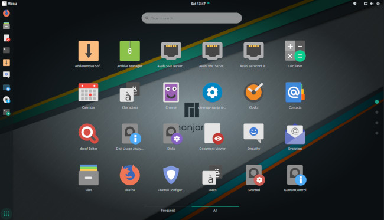

# O Evangelho do GNU/Linux

Nesse Capítulo tentarei convencê-lo, sem imposições, que o uso de alguma distribuição GNU/Linux poderá ser um caminho coerente e que trará facilidades para quem deseja um sistema operacional flexível, fácil de manter e livre. Tentarei aqui expressar minhas experiências no uso do Linux, de uma forma geral, e na estatística. Ao final, listarei algumas distribuições GNU/Linux que considero interessantes.

```{r echo=FALSE, out.width='90%', fig.align = "center"}
knitr::include_graphics("images/linux_class.jpg")
```

</br>**Observação**:

```{block2, type='rmdobservation'}
<div class=text-justify>
Você é livre para escolher o sistema operacional (SO) que deseja trabalhar. Porém, em situações em que seja necessário dissertar sobre alguma configuração específica do sistema (**não serão muitas**), as explicações apresentadas levarão em consideração, na maioria dos casos, sistemas GNU/Linux. Se você for meu aluno, tentarei esforçar-me um pouco mais.
</div>
```

## Um breve histórico

Em meados de 1970, o Unix foi (**ainda é**) um dos sistemas operacionais mais amplamente utilizados em [**mainframes**](https://pt.wikipedia.org/wiki/Mainframe) devido à sua ampla confiabilidade, distribuição e suporte. Muitos desses sistemas Unix tratavam-se de sistemas proprietários. Entre os sistemas Unix mais populares e livres estava o **Berkley Software Distribution** (**BSD**) cujo desenvolvimento (1977 a 1995) era realizado pela **Computer Systems Research Group** (**CSRG**), vinculado à Universidade da Califórnia, em Berkely. 

**Nota**:

```{block2, type='rmdnote'}
<div class=text-justify>
Nos dias de hoje, o termo **BSD** é utilizado para designar qualquer sistema operacional do tipo Unix (sistemas **Unix-like**). Muitas vezes o termo **Unix-like** é substituído por **UN\*X** ou **\*nix**. Tratam-se de sistemas operacionais baseados em Unix, mas que não necessariamente estão de acordo com a especificação [**Single UNIX**](http://www.unix.org/what_is_unix/single_unix_specification.html).
</div>
```

O sistema Linux (**kernel**) foi baseado no Unix, sendo este o sistema **Unix-like** mais popular dentre diversos outros que são razoavelmente conhecidos pelo público em geral e bastante conhecidos por profissionais que tem alguma afinidade com a computação.

A maioria dos sistemas BSD's, disponíveis na atualidade, possuem o código fonte aberto, porém fazem o uso da licença [**BSD**](https://opensource.org/licenses/bsd-license.html) que é menos restritiva, permitindo, por exemplo, que apenas os arquivos binários sejam distribuídos. Trata-se de uma licença atraente para aplicativos embarcados, em que empresas não estão obrigadas a disponibilizar o código fonte das suas aplicações, quando estes forem solicitados. 

Devido a licença [**BSD**](https://opensource.org/licenses/bsd-license.html) ser menos restritivas que a licença [**GNU General Public License**](https://www.gnu.org/licenses/gpl-3.0.html), utilizada pelo Linux, por diversos outros programas e bibliotecas de código aberto, alguns sistemas BSD's conhecidos possuem código proprietário. No caso dos sistemas BSD's proprietários, muito provavelmente se você solicitar os códigos às empresas que os construíram o seu pedido não será atendido. Entre os sistemas operacionais BSD's de código fechado mais conhecidos, destacam-se dois:

1 - O sistema [**Solaris**](https://pt.wikipedia.org/wiki/Solaris), em que nas suas primeiras versões era chamado de **SunOS**. Esse sistema BSD foi desenvolvido pela [**Sun Microsystems**](https://pt.wikipedia.org/wiki/Sun_Microsystems), que em 2009, foi adquirida pela [**Oracle Corporation**](https://www.oracle.com/br/corporate/). Detalhes a respeito do sistema [**Solaris**](https://pt.wikipedia.org/wiki/Solaris) podem ser encontrados no site da [**Oracle**](https://www.oracle.com/solaris/).
    
2 - O [**macOS**](https://www.apple.com/macos/server/), sistema operacional produzido pela empresa [**Apple**](https://www.apple.com/). Muito provavelmente o [**macOS**](https://www.apple.com/macos/server/) é um dos **\*nix** mais conhecidos. Porém, o [**macOS**](https://www.apple.com/macos/server/) está longe de ser o sistema **\*nix** mais amplamente utilizados em [**supercomputadores**](https://pt.wikipedia.org/wiki/Supercomputador).

Saindo do território dos sistemas BSD's proprietários, abaixo listo alguns dos mais conhecidos sistemas BSD's, em que os códigos dos projetos são abertos, isto é, com [**iniciativas Open Source**](https://opensource.org/):

1 - [**FreeBSD**](https://www.freebsd.org/): Trata-se de um sistema moderno, livre e que é bastante utilizado em servidores, desktops e plataformas embarcadas. O [**FreeBSD**](https://www.freebsd.org/) é talvez o sistema BSD, de código livre, que é mais amplamente utilizado entre os sistemas dessa lista. A melhor forma de acompanhar as novidades do [**FreeBSD**](https://www.freebsd.org/) é ler o [**FreeBSD Journal**](https://www.freebsdfoundation.org/journal/), um jornal livre dos desenvolvedores do [**FreeBSD**](https://www.freebsd.org/). Seu mascote genérico é o [**BSD daemon**](https://en.wikipedia.org/wiki/BSD_Daemon), apelidado de **Beastie**.  

2 - [**NetBSD**](https://www.netbsd.org/): Trata-se de uma derivação do sistema 4.4BSD da Universidade da California, Berkley e do 386BSD, às vezes chamado de Jolix. Assim como o FreeBSD, o NetBSD é um sistema que pode rodar em diversas arquiteturas de computadores. O seu logo é uma [**bandeirola**](https://www.netbsd.org/gallery/logos.html).

3 - [**OpenBSD**](https://www.openbsd.org/): Trata-se de um projeto baseado no sistema 4.4BSD. O projeto OpenBSD desenvolveu aplicações como o [**OpenSSH**](https://www.openssh.com/) que é a principal ferramenta de conectividade para login remoto utilizando o protocolo [**Secure Shell (SSH)**]("https://pt.wikipedia.org/wiki/Secure_Shell"). O seu mascote é o [**Puffy**](https://en.wikipedia.org/wiki/OpenBSD).

4 - [**DragonFly BSD**](https://www.dragonflybsd.org/): Os seus desenvolvedores afirmam que trata-se de um sistema operacional pertencente à mesma classe de outros sistemas baseados em BSD e Linux, porém inclue recursos que o diferenciam de outros sistemas operacionais. Por exemplo, o [**DragonFly BSD**](https://www.dragonflybsd.org/) possue o HAMMER, um moderno sistema de arquivos de alta peformance. O mascote do projeto é uma [**libélula**](https://www.dragonflybsd.org/images/).

**Observação**:

```{block2, type='rmdobservation'}
<div class=text-justify>
Linux é uma marca registrada de Linus Torvalds. Você poderá ver essa informação [**aqui**](https://www.freebsd.org/doc/pt_BR.ISO8859-1/articles/explaining-bsd/article.html). Além disso, Linux é um **\*nix**, **UN\*X** ou **Unix-like** (como queira chamar), mas Linux não é um BSD, nem um BSD é um Linux. Por exemplo, a biblioteca C do BSD é baseada nos códigos de Berkeley e não na [**GNU C Library**](https://pt.wikipedia.org/wiki/GNU_C_Library). Dessa forma, diferentemente dos diversos sistemas BSD's, o Linux  utiliza-se de alguns recursos fornecidos pelo [**GNU C**](https://gcc.gnu.org/). 
</div>
```

O sistema operacional Linux foi inicialmente desenvolvido pelo engenheiro de software [**Linus Torvalds**](https://github.com/torvalds) em 1991. Atualmente o Linux conta com diversos desenvolvedores espalhados pelo mundo, em que Linus Torvads é o principal desenvolvedor. Não é difícil adivinhar o porquê do nome **Linux**.

```{r linus, echo=FALSE, out.width='70%', fig.align = "center", fig.cap = "Linus Torvalds em uma conferência para o [**TED**](https://pt.wikipedia.org/wiki/TED_(confer%C3%AAncia)) intitulada [**A mente por trás do Linux**](https://www.ted.com/talks/linus_torvalds_the_mind_behind_linux?language=pt-br), 2016."}

```

Nessa época, inícios dos anos 90, [**Linus Torvalds**](https://github.com/torvalds) era discente na Universidade de Helsinque, Finlândia como estudante de ciência da computação. Sua dissertação de mestrado intitulada [**Linux: a Portable Operating System**](https://www.cs.helsinki.fi/u/kutvonen/index_files/linus.pdf) (56 páginas) foi defendida no Departamento de Ciência da Computação da Universidade de Helsinque, em 31 de janeiro de 1997. A dissertação introduz problemas de protabilidade do kernel Linux em diferentes arquiteturas de computadores. O autor comenta que quem acompanhou os primórdios do desenvolvimento do kernel Linux, o título de sua dissertação poderia soar como ironia, uma vez que o projeto original do Linux não estava realmente preocupado com a portabilidade do sistema em diversas arquiteturas de processadores. À época, a preocupação maior do projeto era com a execução do Linux em computadores com processadores Motorola 68k [**Amiga**](https://pt.wikipedia.org/wiki/Amiga) e [**Atari**](https://pt.wikipedia.org/wiki/Motorola_680x0), ambos de 32 bits. Isso restringia o uso de Linux em algumas arquiteturas de PCs doméstricos da época.

Segundo [**Torvalds**](https://www.cs.helsinki.fi/u/kutvonen/index_files/linus.pdf), a implementação do Linux foi baseada em três questões principais. São elas:

1 - **Simplicidade**: Muito embora o kernel de um sistema operacional é algo complexo, e isso não é diferente no Linux, a implementação mais simples possível é um dos pilares do projeto.

2 - **Eficiência**: Uma vez que o kernel está envolvido com quase todas as atividades de uma máquina (PCs, mainframes, entre outros), a implementação do kernel Linux busca a eficiência, ou seja, o kernel nunca poderá ser visto como uma restrição de desempenho.

3 - **Compatibilidade**: O que está ocorrendo por baixo do kernel de um sistema operacional poderá ser de interesse para pesquisadores na área de sistemas operacionais. Dessa forma, um sistema operacional não poderá impor "surpresas" ao usuário comum ou mesmo à um programador. O Linux é um sistema operacional robusto e disponível para funcionar em diversas arquiteturas e sem "surpresas".

> "Embora o projeto Linux tenha sido intimamente associado a mim pessoalmente, em parte devido ao nome, gostaria de deixar         bem   claro que o sistema operacional Linux é um grande projeto feito cooperativamente por muitas pessoas em todo o             mundo. Mesmo se você desconsiderar todos os programas em nível de usuário que são parte integrante de qualquer sistema Linux,    apenas o kernel contém código de centenas de pessoas ao redor do mundo. Obrigado a todos vocês."

>

> --- Linus Torvalds, [**Linux: a Portable Operating System**](https://www.cs.helsinki.fi/u/kutvonen/index_files/linus.pdf), página 3. 

A todo momento, nessa nossa conversa, a expressão **kernel** foi utilizada junto com o termo Linux. Isso normalmente é feito para deixar claro que o Linux é um programa que gerencia os seus hardwares e o funcionamento dos programas que você utiliza no seu dia a dia, caso você esteja utilizando uma distribuição Linux, é claro. Porém, se você ainda não está utilizando o Linux nesse momento, saiba que o seu sistema operacional possui um kernel, sendo este a parte mais importante do sistema.

```{r logotux, echo=FALSE, out.width='30%', fig.align = "center", fig.cap = "[**Tux**](https://pt.wikipedia.org/wiki/Tux), logo desenvolvido pelo programador [**Larry Ewing**](https://pt.wikipedia.org/wiki/Larry_Ewing) e idealizado por Linus Torvalds como mascote do projeto Linux."}
knitr::include_graphics("images/logo_tux.png")
```

Para que um sistema operacional venha ser utilizado pela maioria das pessoas, em que nesse grupo nos incluímos, este deverá conter diversos outros programas e recursos além do kernel propriamente dito. Para nós que trabalhamos com estatística, por exemplo, precisamos de ter a nossa disposição outras linguagens de programação além de C, como R, C++, Java, Go, Lua, Rust, Ruby, Julia, Python, entre outras linguagens, além de IDEs (**Integrated Development Environment**) para desenvolvimento dos nossos programas, softwares para escrita de relatórios, sistemas de gerenciamento de banco de dados, sistermas de versionamento, entre diversos outros programas de interesse. 

Anterior ao início do desenvolvimento do Linux (kernel), [**Richard Matthew Stallman**](https://pt.wikipedia.org/wiki/Richard_Matthew_Stallman), conhecido por muitos programadores pela sigla **rms**, tinha anunciado no final de 1983 o projeto do sistema operacional GNU ([**Projeto GNU**](https://www.gnu.org/gnu/gnu-history.pt-br.html)). 

```{r logognu, echo=FALSE, out.width='30%', fig.align = "center", fig.cap = "Logo do projeto GNU, lançado em 27 de setembro de 1983, por Richard Stallman [**Richard Matthew Stallman**](https://pt.wikipedia.org/wiki/Richard_Matthew_Stallman) (**rms**)."}
knitr::include_graphics("images/logo_gnu.png")
```

O desenvolvimento do sistema operacional GNU (sistema tipo Unix, Unix-like) teve início em 1984 com o auxílio de diversos programadores. Nesse projeto, os programadores iniciaram o desenvolvimento das ferramentas principais de um sistema operacional em paralelo ao desenvolvimento de editores de textos, compiladores da linguagem C, clientes de e-mail, interfaces gráficas, entre outras aplicações de interesses para o usuário final. 

```{r echo=FALSE, out.width='55%', fig.align = "center", fig.cap = "[**Richard Matthew Stallman**](https://pt.wikipedia.org/wiki/Richard_Matthew_Stallman) (**rms**), fundador do movimento de software livre, do [**projeto GNU**](https://www.gnu.org/) e da [**Free Software Fundation**](https://www.fsf.org/) em uma de suas palestras."}
knitr::include_graphics("images/stallman.jpg")
```

Por volta de 1990, o sistema operacional GNU já estava quase todo completo mas faltava uma peça fundamental e indispensável em qualquer SO - **o kernel**. Nessa época, já havia-se um microkernel de nome [**GNU Hurd**](https://en.wikipedia.org/wiki/GNU_Hurd). Então, após a construção das aplicações principais, o foco seria em concentrar esforços no melhoramento do kernel Hurd. Porém, por volta de 1992, quando o kernel Linux foi anunciado como software livre, este pareceu ser mais viável a se juntar ao sistema GNU. Dessa forma, a combinação do kernel Linux com o quase completo sistema GNU resultou em um sistema opracional completo e assim sugiu o **GNU/Linux**.

**Nota**:

```{block2, type='rmdnote'}
<div class=text-justify>
No início do desenvolvimento do Linux (kernel), por volta de 1991, o compilador GCC do projeto GNU já estava pronto (lançamento em 23 de maio de 1987) e este compunha umas das diversas ferramentas construídas para o sistema GNU. Linus Torvalds utilizada e ainda utiliza o GCC como compilador de C para o desenvolvimento do kernel Linux. Como já dito anteriormente, o Linux utiliza alguns recursos fornecidos do [**GNU C**](https://gcc.gnu.org/). Assim, note a grande importância do projeto GNU e do próprio Richard Stallman para o projeto Linux.

Originalmente o GCC suportava apenas a linguagem C e à época era denominado de **GNU C Compiler** (compilador C GNU). Atualmente o GCC tem suporte à diversas linguagens de programação e pode ser utilizado para compilar em diversas arquiteturas de computadores. Abaixo enumero algumas linguagens de programação em que atualmente é possível compilar utilizando o GCC:

1- [**C**](https://pt.wikipedia.org/wiki/C_(linguagem_de_programa%C3%A7%C3%A3o)): linguagem de programação compilada de propósito geral, estruturada, imperativa, procedural criada em 1972 por Dennis Ritchie na empresa AT&T Bell Labs para desenvolvimento do sistema operacional Unix.

2- [**C++**](https://pt.wikipedia.org/wiki/C%2B%2B): linguagem de programação compilada, multi-paradigma e de uso geral desenvolvida por Bjarne Stroustrup, um famoso cientística da computação dinamarquês e professor catedrático da Universidade do Texas. C++, inicialmente denominada de C com classes (**C with Classes**) surgiu em 1983 no [**Bell Labs**](https://pt.wikipedia.org/wiki/Bell_Labs).

3- [**Fortran**](https://pt.wikipedia.org/wiki/Fortran): família de linguagens de programação conhecida globalmente como Fortran. Fortran foi desenvolvida a partir da década de 1950 e continua a ser usada hoje em dia. O nome é um acrônimo da expressão **IBM Mathematical FORmula TRANslation System**. Fortran foi muito utilizada na área de computação científica e ainda continua sendo bastante utiliza pelo pessoal da "velha guarda".

4- [**Object-C**](https://pt.wikipedia.org/wiki/Objective-C): linguagem de programação orientada a objeto inspirada nas linguagens [**Smalltalk**](https://pt.wikipedia.org/wiki/Smalltalk) e [**C**](https://pt.wikipedia.org/wiki/C_(linguagem_de_programa%C3%A7%C3%A3o)). 

5- [**Java**](https://pt.wikipedia.org/wiki/Java_(linguagem_de_programa%C3%A7%C3%A3o)): linguagem de programação orientada a objetos desenvolvida na década de 90, por uma equipe de programadores chefiada por James Gosling, na empresa Sun Microsystems. Em 2008 o Java foi adquirido pela empresa [**Oracle Corporation**](https://www.oracle.com/br/corporate/).

6- [**Go**](https://golang.org/): linguagem de programação criada pela Google e lançada como código livre em novembro de 2009.

7- [**D**](https://pt.wikipedia.org/wiki/D_(linguagem_de_programa%C3%A7%C3%A3o)): linguagem de programação de uso geral projetada por Walter Bright da Digital Mars. É baseada majoritariamente em [**C++**](https://pt.wikipedia.org/wiki/C%2B%2B), apesar de não ser apenas uma variante. A versão estável da primeira especificação foi lançada em janeiro de 2007.

8- [**Ada**](https://pt.wikipedia.org/wiki/Ada_(linguagem_de_programa%C3%A7%C3%A3o)): linguagem de programação estruturada e de tipagem estática. É uma linguagem imperativa, orientada a objetos e de alto nível, originada de [**Pascal**](https://pt.wikipedia.org/wiki/Pascal_(linguagem_de_programa%C3%A7%C3%A3o)), [**Simula**](https://pt.wikipedia.org/wiki/Simula) e outras linguagens.
</div>
```

```{r echo=FALSE, out.width='30%', fig.align = "center", fig.cap = "Logo do **GNU Compiler Collection**, denominado de [**GCC**](https://gcc.gnu.org/) produzidos pelo projeto GNU, em que o ovo faz alusão à origem do ([**Projeto GNU**](https://www.gnu.org/gnu/gnu-history.pt-br.html))."}
knitr::include_graphics("images/logo_gcc.png")
```

O logo do GCC acima é interessante e resume um pouco do que foi dito. Uma das primeiras ferramentas para se construir programas de computador, principalmente em uma época dominada por linguagens compiladas, é um compilador. Sendo assim, foi por meio do GCC que surgiu todas as aplicações do projeto GNU. O logo representa o nascimento de um [**gnu**](https://pt.wikipedia.org/wiki/Gnu), mamífero nativo do continente africano que é utilizado como símbolo/logo (Figura \@ref(fig:logognu)) do projeto GNU.


**Observação**:

```{block2, type='rmdobservation'}
<div class=text-justify>
O compilador GCC está em amplo desenvolvimento, incorporando novas ferramentas, tecnologias e suporte à novas linguagens de programação. 
</div>
```

Voltando ao Linux, no seu desenvolvimento existem colaborações de diversos programadores ao redor do mundo, em que [**Linus Torvalds**](https://github.com/torvalds) é o pricipal desenvolvedor e gerencia o rumo que o projeto deverá seguir. 

**Nota**:

```{block2, type='rmdnote'}
<div class=text-justify>
[**Aqui**](https://github.com/torvalds) você poderá acessar a conta oficial do Linus Torvalds no [**GitHub**](https://pt.wikipedia.org/wiki/GitHub). Você poderá acompanhar todas as modificações e quando estas foram incluídas no projeto Linux. Mais adiante, nesse material, trataremos a respeito do uso do [**git**](https://git-scm.com/)/[**GitHub**](https://pt.wikipedia.org/wiki/GitHub). Por sinal, o [**git**](https://git-scm.com/) foi criado pelo Linus Torvalds.
</div>
```

Diversas distribuições de GNU/Linux são mantidas de acordo com suas características particulares, combinações de softwares, interfaces gráficas, estruturas de diretórios, sistemas de configurações, comunidades, entre outras. Dessa forma, entenda as distribuições Linux com uma combinação de versões de kernel Linux (agora chamaremos apenas de Linux) com diversas ferramentas/softwares do projeto GNU e outros softwares e bibliotecas podendo ser proprietários ou não. Porém, em sua essência, as distribuições Linux são livres para serem modificadas. O que normalmente poderá haver de proprietário em algumas distribuições Linux refere-se à drives, como por exemplo os drives de placas de vídeos, impressoras ou de algum hardware que você esteja utilizando. 

É bastante comum que diversas empresas disponibilizem versões com iniciativas [**Open Source**](https://opensource.org/) de seus drives. Quando não fazem isso, sendo assim mais restritivas, estas empresas disponibilizam versões de softwares que são free (de graça para uso) mas de código fechado. Porém, quando se utiliza alguma distribuição GNU/Linu,x não é algo comum a dependência de softwares proprietários, uma vez que a a comunidade Linux é muito grande e já desenvolveu diversas alternativas com iniciativas [**Open Source**](https://opensource.org/) para softwares proprietários.

## Vantagens em utilizar GNU/Linux

O uso de alguma distribuição GNU/Linux taz diversas facilidades para o usuário comum, aquele que utiliza o computador no seu dia a dia ou para nós que programamos e temos interesse com a estatística, em especial na área de estatística computacional. Essas facilidades estão fortimente relacionadas com a desenvoltura que um sistema GNU/Linux tem de ser configurado e adaptado para as necessidades do usuário.

Há diversas outras vantagens em inclinar-se para o uso de alguma distribuição GNU/Linux, como por exemplo a sua robustez, confiabilidade e seu gerenciamento eficiente de memória. Essa última característica do Linux é algo de grande importância para os estatísticos ou programadores que trabalham com estatística, uma vez que é comum termos que carregar objetos (matrizes, tabelas, vetores, etc) que ocupam muito espaço na memória do computador. 

Abaixo enumero, sob minha ótica, as vantagens que um "não convertido" poderá considerar na hora de meditar sobre a necessidade de considerar uma distribuição GNU/Linux:

1 - Imagine que você precisa comprar um carro e que uma de suas opções refere-se à um carro com o motor totalmente lacrado, ou seja, suponha que jamais você irá conseguir ver o que está abaixo do capô. No início, muito provavelmente tudo funcionará bem, ao menos aparentemente. O carro irá parecer ágil, seguro e com o som do funcionamento do motor aparentemente perfeito. Porém, a medida que você vai utilizando o carro, problemas irão aparecendo, sons estranhos, motor aquecenendo, etc. Em distribuições GNU/Linux o capô é aberto, ou seja, se utilizam de iniciativas [**Open Source**](https://opensource.org/).

2 - Por consequência do item 1, você não precisa pagar para utilizar uma distribuição GNU/Linux. Dessa forma, você será um profissional que uma empresa poderá querer, uma vez que ela não precisará pagar licenças anuais de um sistema operacional para você utilizar.

3 - As distribuições GNU/Linux são normalmente menos vulneráveis à vírus e malwares, não havendo assim, em minha opinião, a necessidade de instalação de anti-vírus, muito embora estes existam para sistemas GNU/Linux. 

4 - A medida que os sistemas operacionais evoluem, seus requisitos de hardwares aumentam de forma exponencial. Existem inúmeras distribuições GNU/Linux disponíveis. Algumas dessas distribuições irão exigir muito pouco dos seus hardwares. Dessa forma, você poderá dar vida à uma máquina antiga.

5 - É muito fácil, em uma distribuição GNU/Linux, manter o SO e os seus programas atualizados. Não há a necessidade de dilapidar o seu tempo para manter o sistema e softwares atualizados. Dependendo da distribuição GNU/Linux escolhida, o programa utilizado para essa tarefa poderá ser diferente. Seja qual for, eles normalmente cumprem o papel ao qual foram destinados.

6 - Linux é instalado na maioria dos servidores, demonstrando que trata-se de uma ótima escolha. Além disso, à medida que diversos aplicativos estão migrando para plataforma nas nuvens, a quantidade de aplicações, que hoje já é muito grande, está ficando ainda maior.

7 - Linux está em todo lugar e muito provavelmente está, de alguma forma, no seu celular ou TV, caso estes utilizem o sistema [**Android**](https://pt.wikipedia.org/wiki/Android). O [**Android**](https://pt.wikipedia.org/wiki/Android) desenvolvido pela Google é baseado no kernel do Linux.

8 - A quantidade de usuários do GNU/Linux capacitados é muito grande. Nas comunidades você muito provavelmente encontrará alguém disposto para te ajudar com alguma dúvida/problema relacionado ao sistema/programação.

9 - Para nós que precisamos constantemente realizar simulações científicas, poderá surgir a necessidade da utilização de  computadores eficientes ([**supercomputadores**](https://pt.wikipedia.org/wiki/Supercomputador)) em que você irá acessar a distância. Normalmente esses supercomputadores rodam alguma distribuição GNU/Linux. Acessar e submeter suas simulações nessas máquinas de alta performance é algo muito mais simples e sem  grandes dores de cabeça quando usamos o GNU/Linux (alguma distribuição Linux). No Brasil há diversos [**CENAPAD**](https://www.lncc.br/sinapad/cenapads.php) (Centro Nacional de Processamento de Alto Desempenho), em que você poderá submeter uma proposta de projeto e usufruir do poder computacional dessas máquinas. Após conseguir uma conta, você terá que ler a documentação de como utilizar o sistema para submeter seus jobs (suas simulações), ou seja, isso exigirá que você esteja familiarizado com o uso de sistemas GNU/Linux. 


## Algumas distribuições

Como mencionado anteriormente, as distribuições GNU/Linux fornecem diversas experiências/"sabores" no uso de Linux, variando no que diz respeito ao tamanho das comunidades, interfaces gráficas, pré-configurações realizadas, repositórios de programas, entre diversas outras características. Porém, todas as distribuições GNU/Linux tem em comum o uso do kernel Linux, podendo variar as versões e as frequências de atualizações do kernel e dos demais programas.


**Nota**:

```{block2, type='rmdnote'}
<div class=text-justify>
Algumas distribuições GNU/Linux são mais papulares que outras. Isso não diz muito sobre a qualidade da distribuição, uma vez que todas elas utilizam um kernel robusto - o kernel Linux. O nível de popularidade de uma distribuição Linux normalmente está diretamente relacionado ao nível de facilidade que você terá em conseguir soluções para possíveis problemas que sempre nos deparamos ao utilizar qualquer SO.
</div>
```

Abaixo listo algumas distribuições GNU/Linux populares:

1 - [**Debian**](https://www.debian.org/index.pt.html): é uma distribuição GNU/Linux lançada em 1993. A distribuição Debian também tem grande importância história devido ao fato de ter influenciado diversas distribuições GNU/Linux, entre elas Ubuntu e Mint.

2 - [**Arch**](https://www.archlinux.org/): Trata-se de uma distribuição GNU/Linux bastante flexível e com uma comunidade muito ativa. O Arch Linux foi lançado em 2002 e inicialmente desenvolvido por Judd Vinet. Porém, atualmente o projeto Arch Linux é mantido por [**diversos programadores**](https://www.archlinux.org/people/developers/) espalhados pelo mundo. Outras grandes características da distribuição Arch além de ter uma comunidade intensa é a qualidade de suas documentações, em que muito provavelmente você encontrará uma instrução para tudo o que você precisa. Além disso, um ponto importante refere-se ao seu gerenciador de pacote ([**pacman**](https://wiki.archlinux.org/index.php/Pacman_(Portugu%C3%AAs))) que é bastante organizado e fácil de utilizar. Arch é uma distribuição [**Rolling Release**](https://pt.wikipedia.org/wiki/Rolling_release), ou seja, ao contrário das distribuições **Fixed Relase** que divulgam novos lançamentos importantes em intervalos regulares de tempo, uma distribuição [**Rolling Release**](https://pt.wikipedia.org/wiki/Rolling_release) tem atualizações passadas de forma mais contínua.

2 - [**Fedora**](https://getfedora.org/pt_BR/): Trata-se de uma distribuição GNU/Linux lançada em 2003 e financiada principalmente pela [**Red Hat**](https://www.redhat.com/pt-br). 

3 - [**Ubuntu**](https://www.ubuntu.com/): É uma distribuição Linux muito conhecida, baseada no [**Debian**](https://www.debian.org/index.pt.html) e que foi desenvolvida pela [**Canonical Ltd**](https://www.canonical.com/). A distribuição [**Ubuntu**](https://www.ubuntu.com/) diferencia da distribuição [**Debian**](https://www.debian.org/index.pt.html) em torno da filosofia de sua concepção e periodicidade de atualizações.

5 - [**Manjaro**](https://manjaro.org/): Trata-se de uma das distribuições GNU/Linux lançada em 2011, bastante robusta e baseada no Arch Linux. Todas as características destacadas para o Arch Linux são características também presente no [**Manjaro**](https://manjaro.org/). Ao contrário do Arch Linux, em que um usuário iniciante no Linux poderia sentir dificuldades em utilizar, o [**Manjaro**](https://manjaro.org/) é uma distribuição Linux fácil de instalar e utilizar. Em um ambiente de trabalho poderemos não querer gastar muitos esforços para instalar uma distribuição GNU/Linux. 

Uma lista de algumas distribuções populares de sistemas **\*nix** podem ser obtida no [**DistroWatch.com**](https://distrowatch.com/?language=PT). Porém, note que há diversas outras distribuições GNU/Linux sendo criadas ou mesmo já criadas mas que não estão listadas no site. Como sugestão de uma boa distribuição Linux a se considerar, sugiro que testem a distribuiçao [**Manjaro**](https://manjaro.org/). Muito provavelmente vocês irão desejar possuir uma distribuição bem atualizada e com as versões mais recentes de programas, linguagens e bibliotecas.

A distribuição [**Manjaro**](https://manjaro.org/download/) é distribuída oficialmente com as interfaces gráficas [**XFCE**](https://pt.wikipedia.org/wiki/Xfce), [**KDE**](https://pt.wikipedia.org/wiki/KDE) e [**GNOME**](https://pt.wikipedia.org/wiki/GNOME). Abaixo apresento algumas figuras do Manjaro utilizando as interfaces gráficas [**XFCE**](https://pt.wikipedia.org/wiki/Xfce), [**KDE**](https://pt.wikipedia.org/wiki/KDE) e [**GNOME**](https://pt.wikipedia.org/wiki/GNOME), respectivamente.

**Manjaro com XFCE**

```{r echo=FALSE, out.width='80%', fig.align = "center", fig.cap = "Distribuição Manjaro utilizando [**XFCE**](https://pt.wikipedia.org/wiki/Xfce) como interface gráfica."}

```

**Manjaro com KDE**

```{r echo=FALSE, out.width='80%', fig.align = "center", fig.cap = "Distribuição Manjaro utilizando [**KDE**](https://pt.wikipedia.org/wiki/KDE) como interface gráfica."}
knitr::include_graphics("images/manjaro_kde.jpg")
```

**Manjaro com GNOME**

```{r echo=FALSE, out.width='80%', fig.align = "center", fig.cap = "Distribuição Manjaro utilizando [**GNOME**](https://pt.wikipedia.org/wiki/GNOME) como interface gráfica."}

```


Você poderá baixar a iso de instalação da distribuição [**Manjaro**](https://manjaro.org/), com algumas dessas interfaces gráficas, clicando [**aqui**](https://manjaro.org/download/). Há diversos vídeos no YouTube ensinando a baixar, instalar e configurar o Manjaro. Busque pelo termo **Instalando Manjaro Linux** ou clique [**aqui**](https://www.youtube.com/results?search_query=Instalando+Manjaro+Linux).

**Nota**:

```{block2, type='rmdnote'}
<div class=text-justify>
Além dessas interfaces gráficas, o Manjaro é mantido pela comunidade com outras interfaces gráficas, a exemplo das interfaces [**MATE**](https://manjaro.org/img/editions/mate-full.jpg), [**Cinnamon**](https://manjaro.org/download/cinnamon/) e [**Deepin**](https://manjaro.org/download/deepin/). Aconselho que venha considerar o download da versão com a interface [**GNOME**](https://pt.wikipedia.org/wiki/GNOME), **mas esse é um gosto pessoal meu**. Independente da interface que você deseja utilizar, você continua utilizando o Manjaro com o kernel Linux. **É isso o que realmente importa**!
  
Entre diversas comunidades disponíveis, você poderá considerar a comunidade [**Manjaro Brasil**](http://www.manjaro-linux.com.br/forum/portal.php). Trata-se de uma comunidade ativa e receptiva. Essa comunidade é um exemplo de um bom lugar para você sanar suas dúvidas e fazer perguntas sobre Linux e especialmente a respeito do Manjaro. 

Além dos diversos sites que te ajudam a aprender o Linux, você poderá procurar por vídeos no YouTube a respeito do assunto. Por exemplo, procure pelos termos **Instalando manjaro**, **Comandos no manjaro**, **Utilizando pacman instalar programas**, etc. Vasculhar a internet é uma ótima maneira para entender o Linux e a distribuição de sua escolha. 
</div>
```